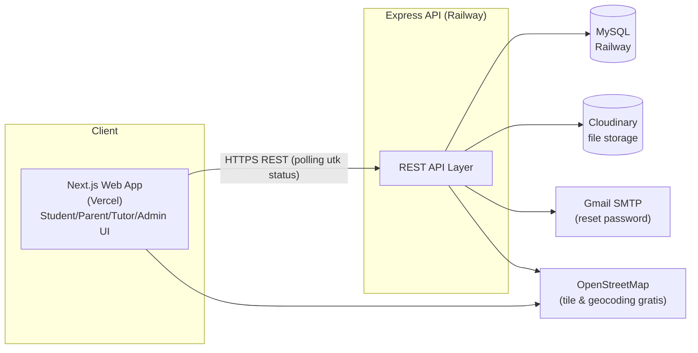
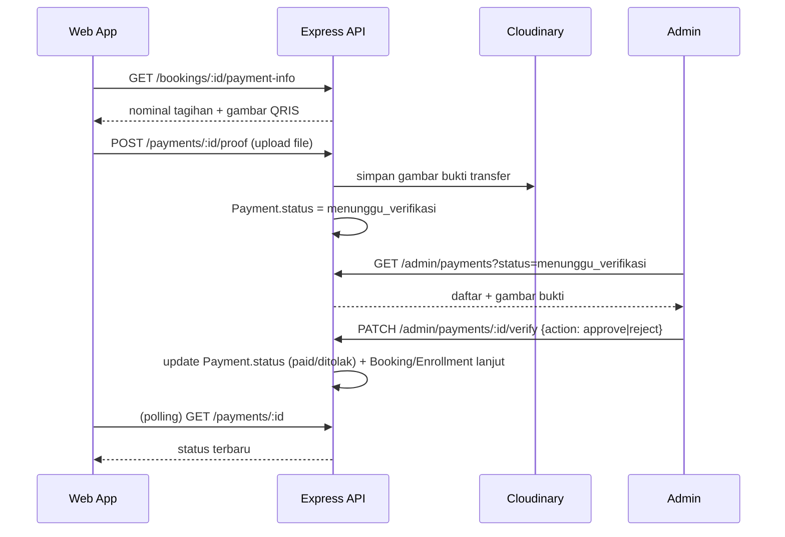
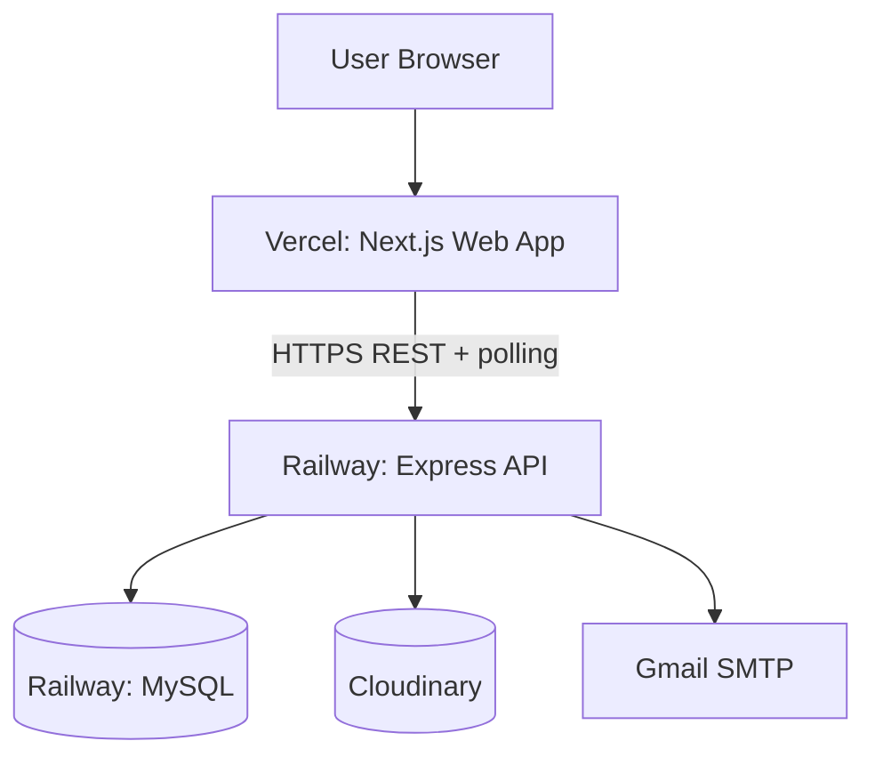

# System Architecture — Learnly

Status: Draft v1.1 (disederhanakan)
Terkait: [03-tech-stack.md](03-tech-stack.md), [05-erd.md](05-erd.md), [06-api-spec.md](06-api-spec.md)

## 1. Gaya Arsitektur

**Monolith sederhana**: satu Express app (REST API) + satu Next.js app, dua deployment terpisah (Railway & Vercel), tanpa servis infra tambahan (tanpa Redis/queue/WebSocket server). Backend tetap disusun **layered** (route → controller → service → repository) — ini bukan over-engineering, justru yang membuat kode mudah dibaca & dites meski proyeknya kecil.

## 2. Diagram Konteks (High-Level)



Tidak ada payment gateway maupun message broker di diagram ini — pembayaran ditangani sebagai data (upload bukti + status) langsung di REST API & MySQL (lihat [03-tech-stack.md](03-tech-stack.md) §2.1).

## 3. Komponen Backend (Layered Architecture)

```
Route  →  Controller  →  Service  →  Repository  →  Prisma/MySQL
```

| Layer | Tanggung Jawab |
|---|---|
| **Route** | Definisi endpoint, middleware (auth, RBAC, validasi Zod) |
| **Controller** | Parsing request/response HTTP saja |
| **Service** | Business logic (state machine booking, kalkulasi biaya, kebijakan refund manual, kalkulasi progres kursus) |
| **Repository** | Akses data via Prisma Client |

Proses seperti generate sertifikat PDF atau kirim email dipanggil **langsung** dari service (synchronous), tanpa lapisan queue — cukup untuk volume data skala tugas (lihat [03-tech-stack.md](03-tech-stack.md) §2.3).

## 4. Struktur Folder

```
learnly/
├── web/                             # Next.js (Vercel)
│   ├── app/
│   │   ├── (public)/                # landing, katalog tutor & kursus, detail
│   │   ├── (auth)/                  # login, register, reset password
│   │   ├── (student)/               # dashboard siswa/parent
│   │   ├── (tutor)/                 # dashboard tutor
│   │   └── (admin)/                 # dashboard admin (termasuk verifikasi pembayaran)
│   ├── components/
│   ├── lib/                         # api-client, map-provider
│   └── hooks/
│
├── api/                             # Express (Railway)
│   ├── src/
│   │   ├── modules/
│   │   │   ├── health/              # GET /health (cek koneksi DB) — contoh pola layer
│   │   │   ├── auth/
│   │   │   ├── users/
│   │   │   ├── tutors/
│   │   │   ├── search/
│   │   │   ├── bookings/
│   │   │   ├── tracking/            # update status + endpoint polling
│   │   │   ├── checkin/
│   │   │   ├── courses/
│   │   │   ├── reports/
│   │   │   ├── payments/            # upload bukti + verifikasi admin (manual)
│   │   │   ├── reviews/
│   │   │   └── admin/
│   │   ├── middlewares/             # auth.middleware, rbac.middleware, error-handler
│   │   ├── lib/                     # prisma client, cloudinary client, mailer, pdf generator
│   │   ├── config/                  # env loader & validation
│   │   └── app.ts / server.ts
│   └── prisma/
│       ├── schema.prisma
│       └── migrations/
│
└── docs/
```

## 5. Alur Autentikasi & RBAC

1. Login → BE verifikasi credential → issue `access_token` (JWT, exp 15 menit) + `refresh_token` (httpOnly cookie, exp 7–30 hari, hash disimpan di tabel `refresh_tokens` agar dapat direvoke).
2. Request terproteksi menyertakan `Authorization: Bearer <access_token>`.
3. Middleware `auth.middleware` verifikasi token; `rbac.middleware(...allowedRoles)` memvalidasi role.
4. Access token kedaluwarsa → FE panggil `/auth/refresh` (pakai cookie) untuk token baru.
5. Registrasi langsung membuat akun **aktif** (tanpa verifikasi email wajib, lihat [03-tech-stack.md](03-tech-stack.md) §2.6).

## 6. Alur "Real-time" Tracking Status (Polling)

1. Tutor mengubah status booking via `PATCH /bookings/:id/status`.
2. Service memvalidasi transisi status (state machine), menyimpan ke DB + `booking_status_history`.
3. Halaman detail booking di sisi siswa/orang tua melakukan polling `GET /bookings/:id` setiap 5 detik (TanStack Query `refetchInterval`) selama status belum `sesi_selesai`/`dibatalkan`.
4. Tidak ada server push — sederhana, cukup andal untuk skala tugas, dan tidak butuh infra tambahan (lihat [03-tech-stack.md](03-tech-stack.md) §2.2 untuk opsi upgrade ke WebSocket di masa depan).

## 7. Alur Pembayaran Manual (Ringkas)


Detail lengkap ada di [07-ssd.md](07-ssd.md).

## 8. Deployment Architecture



- **Frontend**: Vercel, auto-deploy dari `main` (root directory `web/`).
- **Backend**: Railway, auto-deploy dari `main` (root directory `api/`), satu instance saja (tidak perlu horizontal scaling untuk skala tugas).
- **Database**: MySQL plugin bawaan Railway, dalam project yang sama agar koneksi internal (private network) gratis & cepat.
- **CI**: cukup lint + build check di GitHub Actions (opsional) sebelum push — deploy sepenuhnya diserahkan ke auto-deploy Vercel/Railway, tanpa pipeline custom.

## 9. Catatan Upgrade di Masa Depan (Bukan Kebutuhan Sekarang)

Jika suatu saat proyek ini dikembangkan lebih lanjut (di luar skala tugas):

- Polling → WebSocket (Socket.IO) jika butuh update sungguh-sungguh real-time.
- Proses synchronous → job queue (BullMQ + Redis) jika volume sertifikat/email jadi besar.
- Pembayaran manual → payment gateway (Midtrans/Xendit) jika perlu skala transaksi nyata & otomatisasi rekonsiliasi.
- Single instance → multi-instance + load balancer jika traffic bertambah signifikan.

Ini murni catatan arah, **tidak dikerjakan di scope proyek saat ini**.
