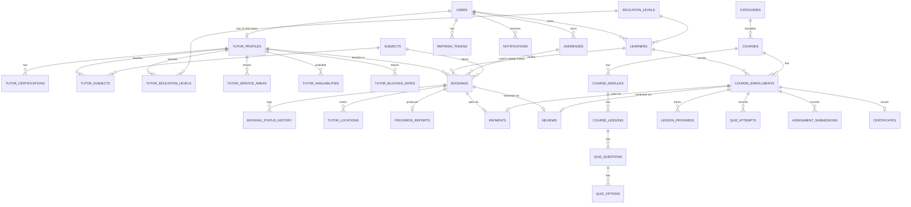

# Entity Relationship Diagram & Skema Database — Learnly

Status: Draft v1.1 (skema `payments` disederhanakan menjadi verifikasi manual, lihat [03-tech-stack.md](03-tech-stack.md))
Terkait: [02-srs.md](02-srs.md), [04-architecture.md](04-architecture.md)

Database: **MySQL 8.x**. Skema di bawah adalah acuan untuk `prisma/schema.prisma`; DDL SQL disertakan sebagai referensi eksplisit yang tidak ambigu untuk implementasi.

## 1. Diagram Relasi (Mermaid ERD — disederhanakan)

> Catatan: tidak semua kolom ditampilkan di diagram (dibatasi keterbacaan mermaid); kolom lengkap ada di §3 (DDL).



## 2. Deskripsi Entitas Kunci

| Entitas | Deskripsi |
|---|---|
| `users` | Akun login: role `student` (mandiri/dewasa), `parent`, `tutor`, `admin`. |
| `learners` | Representasi "peserta didik yang belajar" — dapat berupa akun `student` mandiri (`is_self=true`) atau anak yang dikelola `parent` (`is_self=false`). Semua booking & enrollment mengacu ke `learners`, bukan langsung ke `users`, agar orang tua dengan banyak anak dapat dimodelkan konsisten (FR-AUTH-06). |
| `tutor_profiles` | Data profil & status verifikasi tutor, 1:1 dengan `users` (role=tutor). |
| `subjects`, `education_levels`, `categories` | Master data (dikelola admin, FR-ADMIN-03). |
| `tutor_service_areas` | Wilayah layanan tatap muka tutor: berbasis nama area ATAU titik pusat+radius. |
| `addresses` | Buku alamat milik `users` (parent/student mandiri), dipakai saat booking tatap muka. |
| `bookings` | Entitas sentral sesi tutor (online & tatap muka), menyimpan snapshot tarif & status mesin status (FR-TRACK-01). |
| `booking_status_history` | Audit trail perubahan status booking. |
| `tutor_locations` | Log titik lokasi tutor selama status `tutor_dalam_perjalanan` (opsional, dapat di-purge berkala). |
| `progress_reports` | Laporan perkembangan 1:1 per booking (diisi saat check-out). |
| `courses` → `course_modules` → `course_lessons` | Struktur konten kursus online. |
| `course_enrollments` | Kepesertaan `learners` pada `courses`, menyimpan progres agregat. |
| `payments` | Ledger pembayaran polymorphic (`payable_type` = `booking` atau `course_enrollment`). Pembayaran **manual**: user upload `proof_image_url` (bukti transfer/QRIS) → admin verifikasi (`verified_by_user_id`, `verified_at`) → status `paid`/`ditolak`. Tidak ada integrasi payment gateway (lihat [03-tech-stack.md](03-tech-stack.md) §2.1). |
| `reviews` | Rating & ulasan polymorphic (`reviewable_type` = `tutor_booking` atau `course`). |

## 3. DDL MySQL (Referensi Skema)

```sql
-- =========================
-- USERS & AUTH
-- =========================
CREATE TABLE users (
  id                BIGINT UNSIGNED AUTO_INCREMENT PRIMARY KEY,
  email             VARCHAR(191) NOT NULL UNIQUE,
  password_hash     VARCHAR(255) NOT NULL,
  full_name         VARCHAR(191) NOT NULL,
  phone             VARCHAR(30) NULL,
  role              ENUM('student','parent','tutor','admin') NOT NULL,
  status            ENUM('active','suspended') NOT NULL DEFAULT 'active',
  email_verified_at DATETIME NULL,
  created_at        DATETIME NOT NULL DEFAULT CURRENT_TIMESTAMP,
  updated_at        DATETIME NOT NULL DEFAULT CURRENT_TIMESTAMP ON UPDATE CURRENT_TIMESTAMP,
  INDEX idx_users_role (role)
) ENGINE=InnoDB;

CREATE TABLE refresh_tokens (
  id          BIGINT UNSIGNED AUTO_INCREMENT PRIMARY KEY,
  user_id     BIGINT UNSIGNED NOT NULL,
  token_hash  VARCHAR(255) NOT NULL,
  expires_at  DATETIME NOT NULL,
  revoked_at  DATETIME NULL,
  created_at  DATETIME NOT NULL DEFAULT CURRENT_TIMESTAMP,
  FOREIGN KEY (user_id) REFERENCES users(id) ON DELETE CASCADE,
  INDEX idx_refresh_user (user_id)
) ENGINE=InnoDB;

-- =========================
-- MASTER DATA
-- =========================
CREATE TABLE education_levels (
  id    BIGINT UNSIGNED AUTO_INCREMENT PRIMARY KEY,
  name  VARCHAR(100) NOT NULL,
  slug  VARCHAR(100) NOT NULL UNIQUE
) ENGINE=InnoDB;

CREATE TABLE subjects (
  id    BIGINT UNSIGNED AUTO_INCREMENT PRIMARY KEY,
  name  VARCHAR(100) NOT NULL,
  slug  VARCHAR(100) NOT NULL UNIQUE
) ENGINE=InnoDB;

CREATE TABLE categories (
  id    BIGINT UNSIGNED AUTO_INCREMENT PRIMARY KEY,
  name  VARCHAR(100) NOT NULL,
  slug  VARCHAR(100) NOT NULL UNIQUE
) ENGINE=InnoDB;

-- =========================
-- LEARNERS (student mandiri / anak dari parent)
-- =========================
CREATE TABLE learners (
  id                  BIGINT UNSIGNED AUTO_INCREMENT PRIMARY KEY,
  owner_user_id       BIGINT UNSIGNED NOT NULL,
  full_name           VARCHAR(191) NOT NULL,
  date_of_birth       DATE NULL,
  education_level_id  BIGINT UNSIGNED NULL,
  is_self             BOOLEAN NOT NULL DEFAULT FALSE,
  created_at          DATETIME NOT NULL DEFAULT CURRENT_TIMESTAMP,
  updated_at          DATETIME NOT NULL DEFAULT CURRENT_TIMESTAMP ON UPDATE CURRENT_TIMESTAMP,
  FOREIGN KEY (owner_user_id) REFERENCES users(id) ON DELETE CASCADE,
  FOREIGN KEY (education_level_id) REFERENCES education_levels(id),
  INDEX idx_learners_owner (owner_user_id)
) ENGINE=InnoDB;

CREATE TABLE addresses (
  id           BIGINT UNSIGNED AUTO_INCREMENT PRIMARY KEY,
  user_id      BIGINT UNSIGNED NOT NULL,
  label        VARCHAR(100) NOT NULL,
  full_address VARCHAR(500) NOT NULL,
  detail_note  VARCHAR(500) NULL,
  latitude     DECIMAL(10,7) NOT NULL,
  longitude    DECIMAL(10,7) NOT NULL,
  created_at   DATETIME NOT NULL DEFAULT CURRENT_TIMESTAMP,
  FOREIGN KEY (user_id) REFERENCES users(id) ON DELETE CASCADE,
  INDEX idx_addresses_user (user_id)
) ENGINE=InnoDB;

-- =========================
-- TUTOR PROFILE
-- =========================
CREATE TABLE tutor_profiles (
  id                    BIGINT UNSIGNED AUTO_INCREMENT PRIMARY KEY,
  user_id               BIGINT UNSIGNED NOT NULL UNIQUE,
  bio                   TEXT NULL,
  education_background  VARCHAR(255) NULL,
  teaching_experience_years SMALLINT UNSIGNED NULL,
  curriculum            VARCHAR(255) NULL,
  hourly_rate           DECIMAL(12,2) NOT NULL DEFAULT 0,
  teaching_mode         ENUM('online','tatap_muka','both') NOT NULL DEFAULT 'online',
  verification_status   ENUM('pending_verification','verified','rejected') NOT NULL DEFAULT 'pending_verification',
  verification_notes    VARCHAR(500) NULL,
  avg_rating            DECIMAL(3,2) NOT NULL DEFAULT 0,
  review_count          INT UNSIGNED NOT NULL DEFAULT 0,
  created_at            DATETIME NOT NULL DEFAULT CURRENT_TIMESTAMP,
  updated_at            DATETIME NOT NULL DEFAULT CURRENT_TIMESTAMP ON UPDATE CURRENT_TIMESTAMP,
  FOREIGN KEY (user_id) REFERENCES users(id) ON DELETE CASCADE,
  INDEX idx_tutor_verification (verification_status),
  INDEX idx_tutor_rate (hourly_rate)
) ENGINE=InnoDB;

CREATE TABLE tutor_certifications (
  id               BIGINT UNSIGNED AUTO_INCREMENT PRIMARY KEY,
  tutor_profile_id BIGINT UNSIGNED NOT NULL,
  title            VARCHAR(191) NOT NULL,
  issuer           VARCHAR(191) NULL,
  file_url         VARCHAR(500) NULL,
  issued_at        DATE NULL,
  FOREIGN KEY (tutor_profile_id) REFERENCES tutor_profiles(id) ON DELETE CASCADE
) ENGINE=InnoDB;

CREATE TABLE tutor_subjects (
  tutor_profile_id BIGINT UNSIGNED NOT NULL,
  subject_id       BIGINT UNSIGNED NOT NULL,
  PRIMARY KEY (tutor_profile_id, subject_id),
  FOREIGN KEY (tutor_profile_id) REFERENCES tutor_profiles(id) ON DELETE CASCADE,
  FOREIGN KEY (subject_id) REFERENCES subjects(id) ON DELETE CASCADE
) ENGINE=InnoDB;

CREATE TABLE tutor_education_levels (
  tutor_profile_id    BIGINT UNSIGNED NOT NULL,
  education_level_id  BIGINT UNSIGNED NOT NULL,
  PRIMARY KEY (tutor_profile_id, education_level_id),
  FOREIGN KEY (tutor_profile_id) REFERENCES tutor_profiles(id) ON DELETE CASCADE,
  FOREIGN KEY (education_level_id) REFERENCES education_levels(id) ON DELETE CASCADE
) ENGINE=InnoDB;

CREATE TABLE tutor_service_areas (
  id               BIGINT UNSIGNED AUTO_INCREMENT PRIMARY KEY,
  tutor_profile_id BIGINT UNSIGNED NOT NULL,
  area_type        ENUM('area_name','radius') NOT NULL,
  area_name        VARCHAR(191) NULL,
  center_latitude  DECIMAL(10,7) NULL,
  center_longitude DECIMAL(10,7) NULL,
  radius_km        DECIMAL(6,2) NULL,
  FOREIGN KEY (tutor_profile_id) REFERENCES tutor_profiles(id) ON DELETE CASCADE,
  INDEX idx_service_area_tutor (tutor_profile_id),
  INDEX idx_service_area_center (center_latitude, center_longitude)
) ENGINE=InnoDB;

CREATE TABLE tutor_availabilities (
  id               BIGINT UNSIGNED AUTO_INCREMENT PRIMARY KEY,
  tutor_profile_id BIGINT UNSIGNED NOT NULL,
  day_of_week      TINYINT UNSIGNED NOT NULL, -- 0=Sunday .. 6=Saturday
  start_time       TIME NOT NULL,
  end_time         TIME NOT NULL,
  FOREIGN KEY (tutor_profile_id) REFERENCES tutor_profiles(id) ON DELETE CASCADE,
  INDEX idx_availability_tutor (tutor_profile_id, day_of_week)
) ENGINE=InnoDB;

CREATE TABLE tutor_blocked_dates (
  id               BIGINT UNSIGNED AUTO_INCREMENT PRIMARY KEY,
  tutor_profile_id BIGINT UNSIGNED NOT NULL,
  blocked_date     DATE NOT NULL,
  reason           VARCHAR(255) NULL,
  FOREIGN KEY (tutor_profile_id) REFERENCES tutor_profiles(id) ON DELETE CASCADE,
  UNIQUE KEY uq_tutor_blocked_date (tutor_profile_id, blocked_date)
) ENGINE=InnoDB;

-- =========================
-- BOOKINGS
-- =========================
CREATE TABLE bookings (
  id                    BIGINT UNSIGNED AUTO_INCREMENT PRIMARY KEY,
  learner_id            BIGINT UNSIGNED NOT NULL,
  tutor_profile_id      BIGINT UNSIGNED NOT NULL,
  subject_id            BIGINT UNSIGNED NOT NULL,
  mode                  ENUM('online','tatap_muka') NOT NULL,
  scheduled_start_at    DATETIME NOT NULL,
  scheduled_end_at      DATETIME NOT NULL,
  duration_minutes      SMALLINT UNSIGNED NOT NULL,
  address_id            BIGINT UNSIGNED NULL,
  meeting_link          VARCHAR(500) NULL,
  status                ENUM(
                          'pending_confirmation','rejected','menunggu_pembayaran',
                          'dikonfirmasi','tutor_bersiap','tutor_dalam_perjalanan',
                          'tutor_tiba','sesi_berlangsung','sesi_selesai','dibatalkan'
                        ) NOT NULL DEFAULT 'pending_confirmation',
  hourly_rate_snapshot  DECIMAL(12,2) NOT NULL,
  service_fee           DECIMAL(12,2) NOT NULL DEFAULT 0,
  total_amount          DECIMAL(12,2) NOT NULL,
  qr_token              VARCHAR(191) NULL,
  checked_in_at         DATETIME NULL,
  checked_out_at        DATETIME NULL,
  cancel_reason         VARCHAR(500) NULL,
  cancelled_by          ENUM('student','tutor','system') NULL,
  created_at            DATETIME NOT NULL DEFAULT CURRENT_TIMESTAMP,
  updated_at            DATETIME NOT NULL DEFAULT CURRENT_TIMESTAMP ON UPDATE CURRENT_TIMESTAMP,
  FOREIGN KEY (learner_id) REFERENCES learners(id),
  FOREIGN KEY (tutor_profile_id) REFERENCES tutor_profiles(id),
  FOREIGN KEY (subject_id) REFERENCES subjects(id),
  FOREIGN KEY (address_id) REFERENCES addresses(id),
  INDEX idx_bookings_tutor_time (tutor_profile_id, scheduled_start_at),
  INDEX idx_bookings_learner (learner_id),
  INDEX idx_bookings_status (status)
) ENGINE=InnoDB;

CREATE TABLE booking_status_history (
  id               BIGINT UNSIGNED AUTO_INCREMENT PRIMARY KEY,
  booking_id       BIGINT UNSIGNED NOT NULL,
  status           VARCHAR(50) NOT NULL,
  changed_by_user_id BIGINT UNSIGNED NULL,
  changed_at       DATETIME NOT NULL DEFAULT CURRENT_TIMESTAMP,
  FOREIGN KEY (booking_id) REFERENCES bookings(id) ON DELETE CASCADE,
  INDEX idx_status_history_booking (booking_id)
) ENGINE=InnoDB;

CREATE TABLE tutor_locations (
  id          BIGINT UNSIGNED AUTO_INCREMENT PRIMARY KEY,
  booking_id  BIGINT UNSIGNED NOT NULL,
  latitude    DECIMAL(10,7) NOT NULL,
  longitude   DECIMAL(10,7) NOT NULL,
  recorded_at DATETIME NOT NULL DEFAULT CURRENT_TIMESTAMP,
  FOREIGN KEY (booking_id) REFERENCES bookings(id) ON DELETE CASCADE,
  INDEX idx_tutor_location_booking (booking_id, recorded_at)
) ENGINE=InnoDB;

CREATE TABLE progress_reports (
  id                  BIGINT UNSIGNED AUTO_INCREMENT PRIMARY KEY,
  booking_id          BIGINT UNSIGNED NOT NULL UNIQUE,
  materials_covered   TEXT NOT NULL,
  understanding_level TINYINT UNSIGNED NOT NULL, -- 1-5
  mastered_skills     TEXT NULL,
  areas_to_improve    TEXT NULL,
  homework_given      TEXT NULL,
  recommendation_notes TEXT NULL,
  created_at          DATETIME NOT NULL DEFAULT CURRENT_TIMESTAMP,
  FOREIGN KEY (booking_id) REFERENCES bookings(id) ON DELETE CASCADE
) ENGINE=InnoDB;

-- =========================
-- COURSES
-- =========================
CREATE TABLE courses (
  id                 BIGINT UNSIGNED AUTO_INCREMENT PRIMARY KEY,
  title              VARCHAR(191) NOT NULL,
  slug               VARCHAR(191) NOT NULL UNIQUE,
  description        TEXT NULL,
  category_id        BIGINT UNSIGNED NOT NULL,
  education_level_id BIGINT UNSIGNED NULL,
  level              ENUM('pemula','menengah','lanjut') NOT NULL DEFAULT 'pemula',
  price              DECIMAL(12,2) NOT NULL DEFAULT 0,
  is_free            BOOLEAN NOT NULL DEFAULT FALSE,
  thumbnail_url      VARCHAR(500) NULL,
  status             ENUM('draft','in_review','published','archived') NOT NULL DEFAULT 'draft',
  passing_grade      DECIMAL(5,2) NULL,
  issues_certificate BOOLEAN NOT NULL DEFAULT FALSE,
  created_by_user_id BIGINT UNSIGNED NOT NULL,
  avg_rating         DECIMAL(3,2) NOT NULL DEFAULT 0,
  review_count       INT UNSIGNED NOT NULL DEFAULT 0,
  created_at         DATETIME NOT NULL DEFAULT CURRENT_TIMESTAMP,
  updated_at         DATETIME NOT NULL DEFAULT CURRENT_TIMESTAMP ON UPDATE CURRENT_TIMESTAMP,
  FOREIGN KEY (category_id) REFERENCES categories(id),
  FOREIGN KEY (education_level_id) REFERENCES education_levels(id),
  FOREIGN KEY (created_by_user_id) REFERENCES users(id),
  INDEX idx_courses_status (status),
  INDEX idx_courses_category (category_id)
) ENGINE=InnoDB;

CREATE TABLE course_modules (
  id         BIGINT UNSIGNED AUTO_INCREMENT PRIMARY KEY,
  course_id  BIGINT UNSIGNED NOT NULL,
  title      VARCHAR(191) NOT NULL,
  order_index SMALLINT UNSIGNED NOT NULL DEFAULT 0,
  FOREIGN KEY (course_id) REFERENCES courses(id) ON DELETE CASCADE,
  INDEX idx_modules_course (course_id, order_index)
) ENGINE=InnoDB;

CREATE TABLE course_lessons (
  id               BIGINT UNSIGNED AUTO_INCREMENT PRIMARY KEY,
  module_id        BIGINT UNSIGNED NOT NULL,
  title            VARCHAR(191) NOT NULL,
  type             ENUM('video','article','quiz','assignment') NOT NULL,
  content_url      VARCHAR(500) NULL,
  content_body     LONGTEXT NULL,
  duration_seconds INT UNSIGNED NULL,
  order_index      SMALLINT UNSIGNED NOT NULL DEFAULT 0,
  FOREIGN KEY (module_id) REFERENCES course_modules(id) ON DELETE CASCADE,
  INDEX idx_lessons_module (module_id, order_index)
) ENGINE=InnoDB;

CREATE TABLE quiz_questions (
  id           BIGINT UNSIGNED AUTO_INCREMENT PRIMARY KEY,
  lesson_id    BIGINT UNSIGNED NOT NULL,
  question_text TEXT NOT NULL,
  order_index  SMALLINT UNSIGNED NOT NULL DEFAULT 0,
  FOREIGN KEY (lesson_id) REFERENCES course_lessons(id) ON DELETE CASCADE
) ENGINE=InnoDB;

CREATE TABLE quiz_options (
  id           BIGINT UNSIGNED AUTO_INCREMENT PRIMARY KEY,
  question_id  BIGINT UNSIGNED NOT NULL,
  option_text  VARCHAR(500) NOT NULL,
  is_correct   BOOLEAN NOT NULL DEFAULT FALSE,
  FOREIGN KEY (question_id) REFERENCES quiz_questions(id) ON DELETE CASCADE
) ENGINE=InnoDB;

CREATE TABLE course_enrollments (
  id               BIGINT UNSIGNED AUTO_INCREMENT PRIMARY KEY,
  course_id        BIGINT UNSIGNED NOT NULL,
  learner_id       BIGINT UNSIGNED NOT NULL,
  status           ENUM('active','completed') NOT NULL DEFAULT 'active',
  progress_percent DECIMAL(5,2) NOT NULL DEFAULT 0,
  enrolled_at      DATETIME NOT NULL DEFAULT CURRENT_TIMESTAMP,
  completed_at     DATETIME NULL,
  FOREIGN KEY (course_id) REFERENCES courses(id),
  FOREIGN KEY (learner_id) REFERENCES learners(id),
  UNIQUE KEY uq_enrollment (course_id, learner_id),
  INDEX idx_enrollment_learner (learner_id)
) ENGINE=InnoDB;

CREATE TABLE lesson_progress (
  id             BIGINT UNSIGNED AUTO_INCREMENT PRIMARY KEY,
  enrollment_id  BIGINT UNSIGNED NOT NULL,
  lesson_id      BIGINT UNSIGNED NOT NULL,
  status         ENUM('not_started','in_progress','completed') NOT NULL DEFAULT 'not_started',
  completed_at   DATETIME NULL,
  FOREIGN KEY (enrollment_id) REFERENCES course_enrollments(id) ON DELETE CASCADE,
  FOREIGN KEY (lesson_id) REFERENCES course_lessons(id) ON DELETE CASCADE,
  UNIQUE KEY uq_lesson_progress (enrollment_id, lesson_id)
) ENGINE=InnoDB;

CREATE TABLE quiz_attempts (
  id             BIGINT UNSIGNED AUTO_INCREMENT PRIMARY KEY,
  enrollment_id  BIGINT UNSIGNED NOT NULL,
  lesson_id      BIGINT UNSIGNED NOT NULL,
  score          DECIMAL(5,2) NOT NULL,
  passed         BOOLEAN NOT NULL,
  attempted_at   DATETIME NOT NULL DEFAULT CURRENT_TIMESTAMP,
  FOREIGN KEY (enrollment_id) REFERENCES course_enrollments(id) ON DELETE CASCADE,
  FOREIGN KEY (lesson_id) REFERENCES course_lessons(id) ON DELETE CASCADE
) ENGINE=InnoDB;

CREATE TABLE assignment_submissions (
  id              BIGINT UNSIGNED AUTO_INCREMENT PRIMARY KEY,
  enrollment_id   BIGINT UNSIGNED NOT NULL,
  lesson_id       BIGINT UNSIGNED NOT NULL,
  file_url        VARCHAR(500) NOT NULL,
  feedback        TEXT NULL,
  score           DECIMAL(5,2) NULL,
  graded_by_user_id BIGINT UNSIGNED NULL,
  submitted_at    DATETIME NOT NULL DEFAULT CURRENT_TIMESTAMP,
  graded_at       DATETIME NULL,
  FOREIGN KEY (enrollment_id) REFERENCES course_enrollments(id) ON DELETE CASCADE,
  FOREIGN KEY (lesson_id) REFERENCES course_lessons(id) ON DELETE CASCADE
) ENGINE=InnoDB;

CREATE TABLE certificates (
  id                  BIGINT UNSIGNED AUTO_INCREMENT PRIMARY KEY,
  enrollment_id       BIGINT UNSIGNED NOT NULL UNIQUE,
  certificate_number  VARCHAR(50) NOT NULL UNIQUE,
  file_url            VARCHAR(500) NOT NULL,
  issued_at           DATETIME NOT NULL DEFAULT CURRENT_TIMESTAMP,
  FOREIGN KEY (enrollment_id) REFERENCES course_enrollments(id) ON DELETE CASCADE
) ENGINE=InnoDB;

-- =========================
-- PAYMENTS (polymorphic)
-- =========================
CREATE TABLE payments (
  id                    BIGINT UNSIGNED AUTO_INCREMENT PRIMARY KEY,
  payable_type          ENUM('booking','course_enrollment') NOT NULL,
  payable_id            BIGINT UNSIGNED NOT NULL,
  user_id               BIGINT UNSIGNED NOT NULL,
  amount                DECIMAL(12,2) NOT NULL,
  method                ENUM('qris','transfer_manual') NOT NULL DEFAULT 'qris',
  proof_image_url       VARCHAR(500) NULL,
  status                ENUM('menunggu_pembayaran','menunggu_verifikasi','paid','ditolak','expired') NOT NULL DEFAULT 'menunggu_pembayaran',
  submitted_at          DATETIME NULL,
  verified_by_user_id   BIGINT UNSIGNED NULL,
  verified_at           DATETIME NULL,
  rejection_reason      VARCHAR(500) NULL,
  paid_at               DATETIME NULL,
  created_at            DATETIME NOT NULL DEFAULT CURRENT_TIMESTAMP,
  updated_at            DATETIME NOT NULL DEFAULT CURRENT_TIMESTAMP ON UPDATE CURRENT_TIMESTAMP,
  FOREIGN KEY (user_id) REFERENCES users(id),
  FOREIGN KEY (verified_by_user_id) REFERENCES users(id),
  INDEX idx_payments_payable (payable_type, payable_id),
  INDEX idx_payments_status (status)
) ENGINE=InnoDB;

-- =========================
-- REVIEWS (polymorphic)
-- =========================
CREATE TABLE reviews (
  id               BIGINT UNSIGNED AUTO_INCREMENT PRIMARY KEY,
  reviewable_type  ENUM('tutor_booking','course') NOT NULL,
  reviewable_id    BIGINT UNSIGNED NOT NULL,
  reviewer_user_id BIGINT UNSIGNED NOT NULL,
  rating           TINYINT UNSIGNED NOT NULL, -- 1-5
  comment          TEXT NULL,
  reply_text       TEXT NULL,
  replied_at       DATETIME NULL,
  is_hidden        BOOLEAN NOT NULL DEFAULT FALSE,
  created_at       DATETIME NOT NULL DEFAULT CURRENT_TIMESTAMP,
  FOREIGN KEY (reviewer_user_id) REFERENCES users(id),
  INDEX idx_reviews_reviewable (reviewable_type, reviewable_id)
) ENGINE=InnoDB;

-- =========================
-- NOTIFICATIONS & SETTINGS
-- =========================
CREATE TABLE notifications (
  id         BIGINT UNSIGNED AUTO_INCREMENT PRIMARY KEY,
  user_id    BIGINT UNSIGNED NOT NULL,
  type       VARCHAR(50) NOT NULL,
  title      VARCHAR(191) NOT NULL,
  body       VARCHAR(500) NULL,
  data       JSON NULL,
  read_at    DATETIME NULL,
  created_at DATETIME NOT NULL DEFAULT CURRENT_TIMESTAMP,
  FOREIGN KEY (user_id) REFERENCES users(id) ON DELETE CASCADE,
  INDEX idx_notifications_user (user_id, read_at)
) ENGINE=InnoDB;

CREATE TABLE platform_settings (
  `key`       VARCHAR(100) PRIMARY KEY,
  `value`     JSON NOT NULL,
  updated_at  DATETIME NOT NULL DEFAULT CURRENT_TIMESTAMP ON UPDATE CURRENT_TIMESTAMP
) ENGINE=InnoDB;
```

## 4. Catatan Query Pencarian Lokasi (Haversine)

Karena MySQL tanpa ekstensi spasial masih dapat menghitung jarak dengan formula Haversine langsung di SQL, contoh query pencarian tutor tatap muka terdekat (§FR-SEARCH-02):

```sql
SELECT tp.id, tp.hourly_rate, tp.avg_rating,
  ( 6371 * ACOS(
      COS(RADIANS(:lat)) * COS(RADIANS(tsa.center_latitude)) *
      COS(RADIANS(tsa.center_longitude) - RADIANS(:lng)) +
      SIN(RADIANS(:lat)) * SIN(RADIANS(tsa.center_latitude))
    ) ) AS distance_km
FROM tutor_profiles tp
JOIN tutor_service_areas tsa ON tsa.tutor_profile_id = tp.id AND tsa.area_type = 'radius'
WHERE tp.verification_status = 'verified'
HAVING distance_km <= tsa.radius_km
ORDER BY distance_km ASC
LIMIT 20;
```
Util `haversineDistanceKm()` yang setara juga dapat dibuat di `api/src/lib/` untuk dipakai di layer aplikasi (mis. kalkulasi ulang/validasi, atau jika nanti pindah ke in-memory filtering) — lihat struktur folder di [04-architecture.md](04-architecture.md) §4.

## 5. Konvensi Umum

- Seluruh primary key `BIGINT UNSIGNED AUTO_INCREMENT`.
- Seluruh tabel transaksional punya `created_at`; tabel yang dapat berubah state punya `updated_at`.
- Soft delete **tidak** dipakai secara default (hapus permanen untuk master data yang tidak direferensikan); entitas transaksional (booking, payment, review) **tidak pernah dihapus**, hanya berubah status — selaras NFR-SEC/FR-PAY-07 (audit trail).
- Semua foreign key memakai `ON DELETE CASCADE` hanya pada relasi kepemilikan murni (child data tanpa arti tanpa parent-nya, mis. `tutor_certifications`); relasi transaksional lintas entitas independen (mis. `bookings.tutor_profile_id`) **tidak** cascade delete — dicegah di level aplikasi (tidak boleh hapus tutor yang punya booking, hanya suspend).
