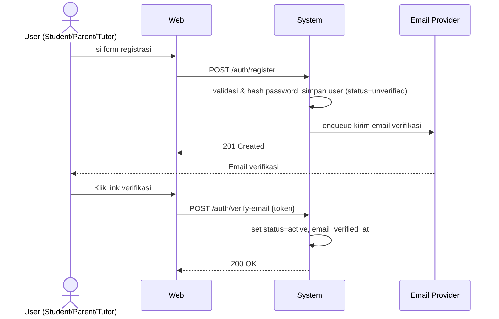
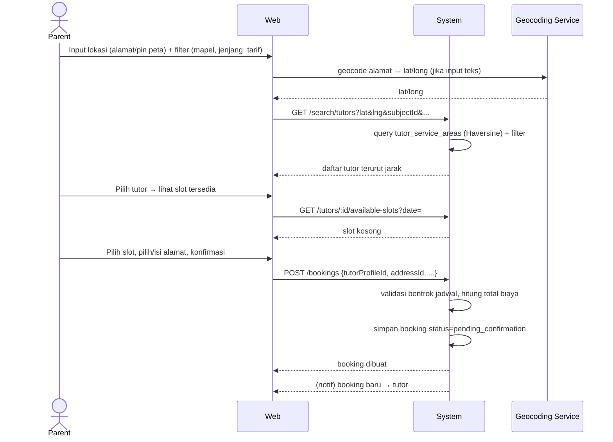
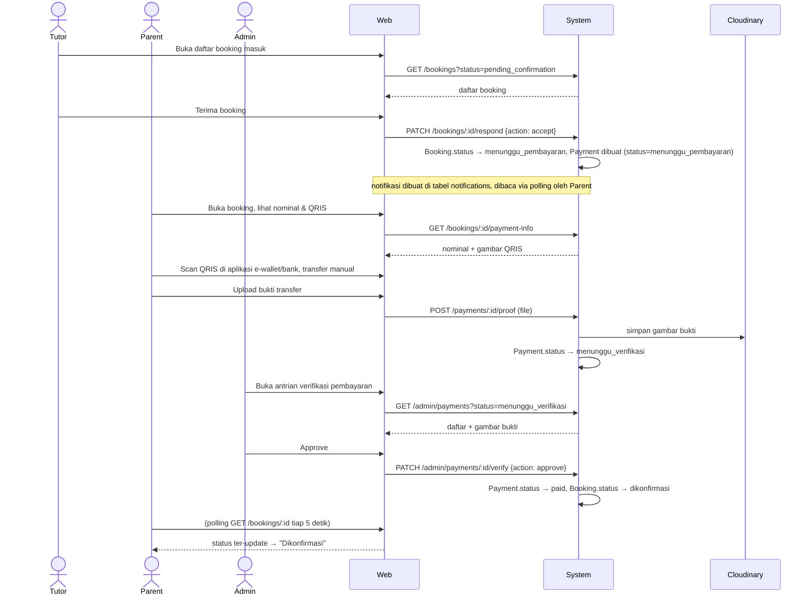
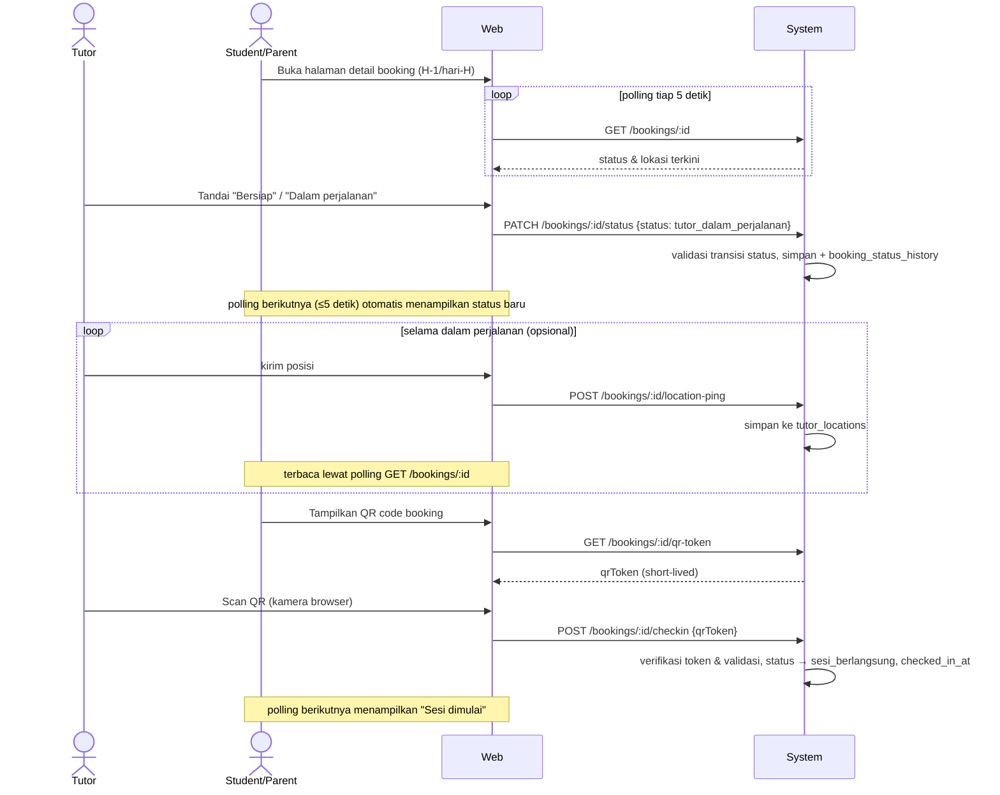
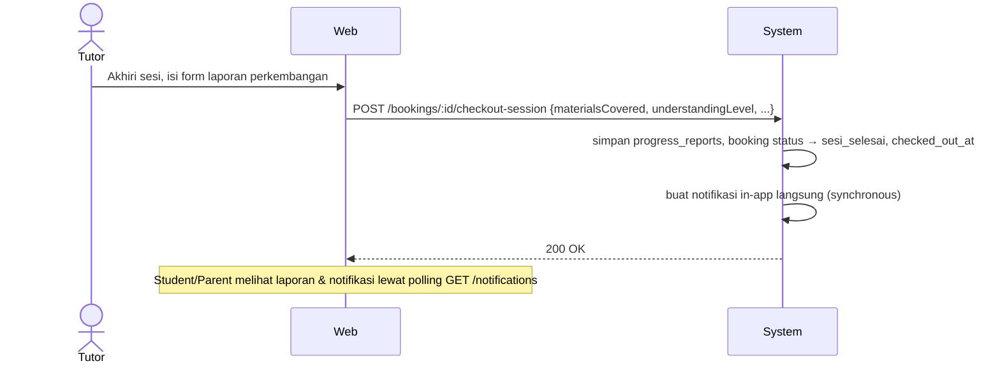
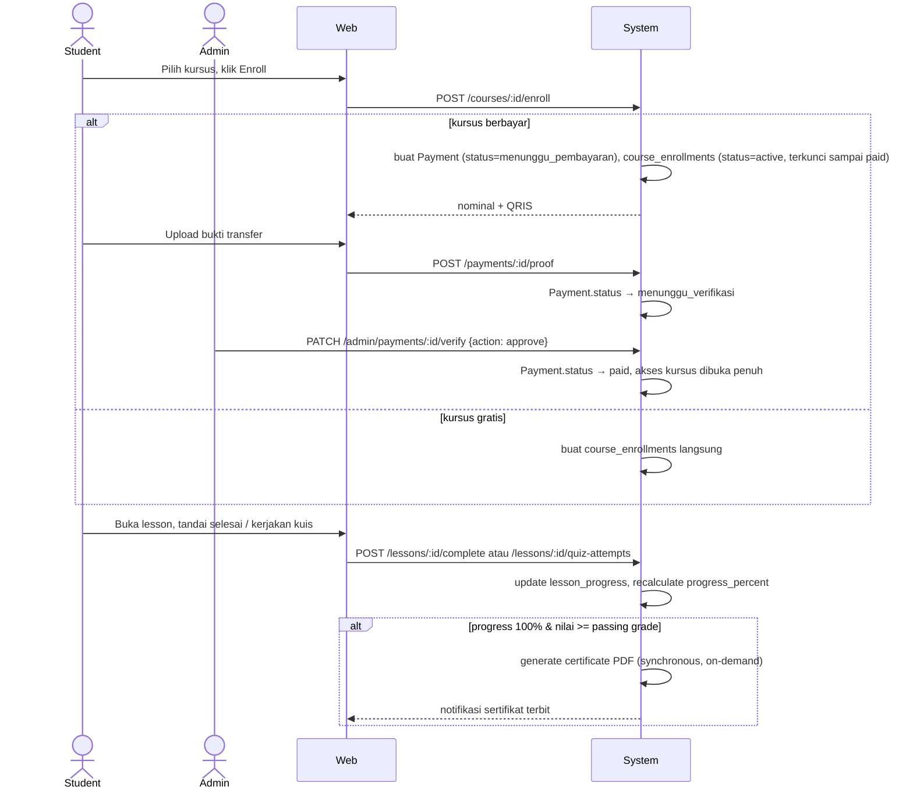
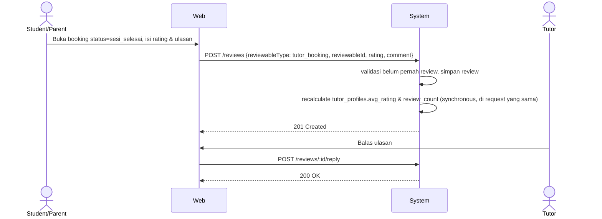

# System Sequence Diagrams (SSD) — Learnly

Status: Draft v1.1 (pembayaran manual QRIS + verifikasi admin, polling menggantikan WebSocket/job queue)
Terkait: [06-api-spec.md](06-api-spec.md), [02-srs.md](02-srs.md)

Diagram di bawah menggambarkan interaksi antara aktor, Web App (klien), API, dan sistem eksternal untuk alur-alur utama. Notasi: `System` mewakili keseluruhan Express API + DB (detail internal ada di [04-architecture.md](04-architecture.md)).

## 1. Registrasi & Verifikasi Akun

## 2. Pencarian & Booking Tutor Tatap Muka

## 3. Konfirmasi Tutor & Pembayaran Manual (QRIS + Verifikasi Admin)

## 4. Pelacakan Status & Check-in dengan QR (Sesi Tatap Muka)

## 5. Check-out & Laporan Perkembangan

## 6. Enrollment & Belajar Kursus Online (Berbayar)

## 7. Rating & Review Pasca Sesi

