# Panduan Siswa

Untuk siswa atau mahasiswa yang memesan les privat dan mengikuti kursus online **untuk dirinya sendiri**. Kalau kamu orang tua yang memesan untuk anak, baca [Panduan Orang Tua](02-orang-tua.md). Semua langkah di sana sama, ditambah pengelolaan anak.

Akun contoh: `putri@demo.learnly.id` · password `Demo#2026`.

Isi:

1. [Cara mendaftar & masuk](#cara-mendaftar--masuk)
2. [Cara mencari tutor](#cara-mencari-tutor)
3. [Cara memesan les online](#cara-memesan-les-online)
4. [Cara memesan les tatap muka](#cara-memesan-les-tatap-muka)
5. [Cara membayar](#cara-membayar)
6. [Cara memantau booking & menunjukkan QR check-in](#cara-memantau-booking--menunjukkan-qr-check-in)
7. [Cara membatalkan booking](#cara-membatalkan-booking)
8. [Cara membaca laporan & memberi ulasan](#cara-membaca-laporan--memberi-ulasan)
9. [Cara ikut kursus online](#cara-ikut-kursus-online)
10. [Cara membaca notifikasi](#cara-membaca-notifikasi)
11. [Kalau ada masalah](#kalau-ada-masalah)

---

## Cara mendaftar & masuk

### Mendaftar akun baru

1. Tekan **Daftar** di kanan atas.
2. Pilih **Siswa** (1), isi **Nama lengkap** (2), email, nomor HP (boleh dikosongkan), dan password dua kali. Tekan **Daftar** (3).

   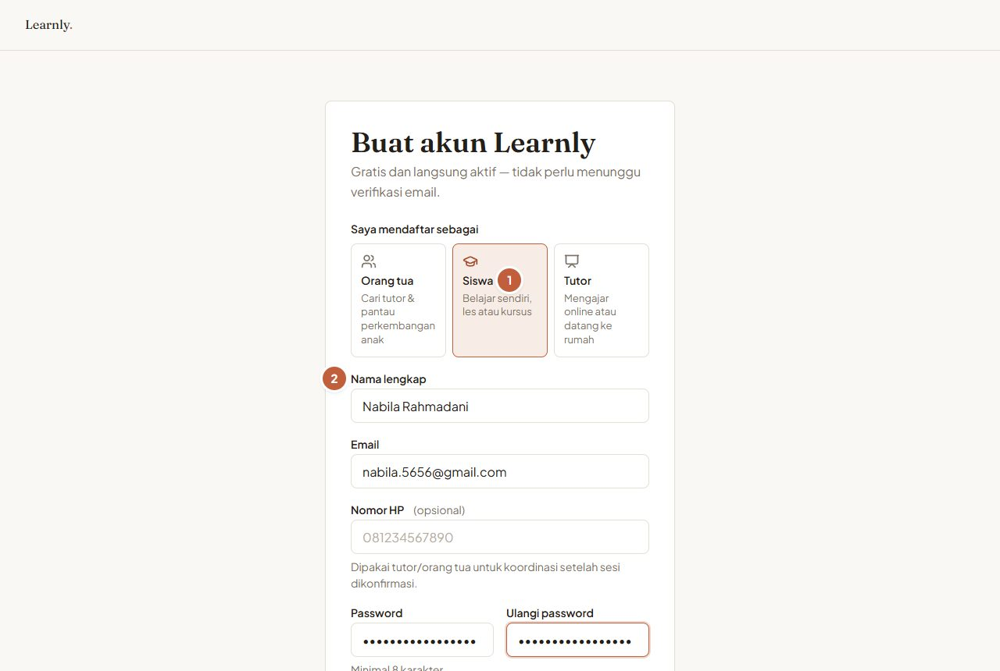
   *Form pendaftaran. Pilih peran "Siswa" untuk belajar sendiri.*

3. Akun langsung aktif. Kamu masuk ke **Beranda** yang masih kosong. Tekan **Cari tutor** untuk mulai.

   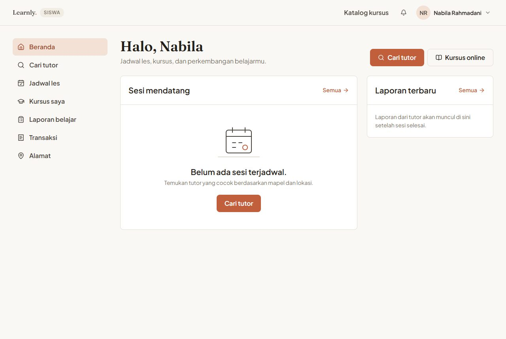
   *Beranda akun baru: belum ada sesi dan laporan.*

> **Tips:** Learnly mengirim email konfirmasi, tapi kamu tidak perlu menunggunya. Akun sudah bisa langsung dipakai.

### Masuk

1. Tekan **Masuk**, isi **Email** (1) dan password, lalu tekan **Masuk**.
2. Lupa password? Tekan **Lupa password?** (2).

   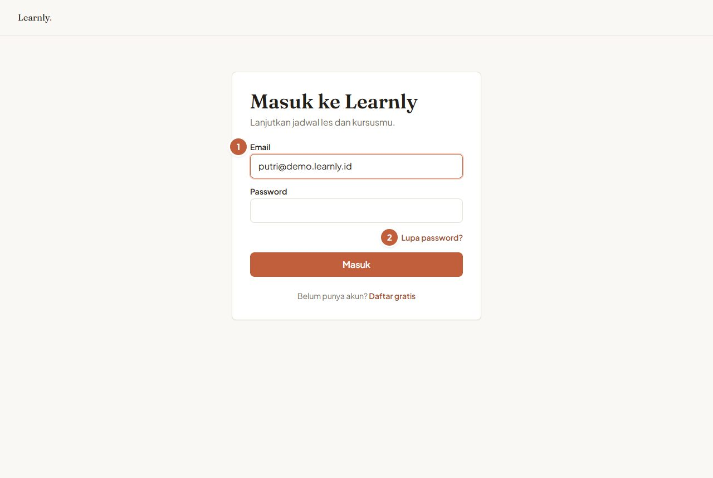
   *Halaman masuk.*

### Lupa password

1. Isi email akunmu, lalu tekan **Kirim link reset**.
2. Buka email dari Learnly, klik link di dalamnya (berlaku terbatas), lalu buat password baru.

   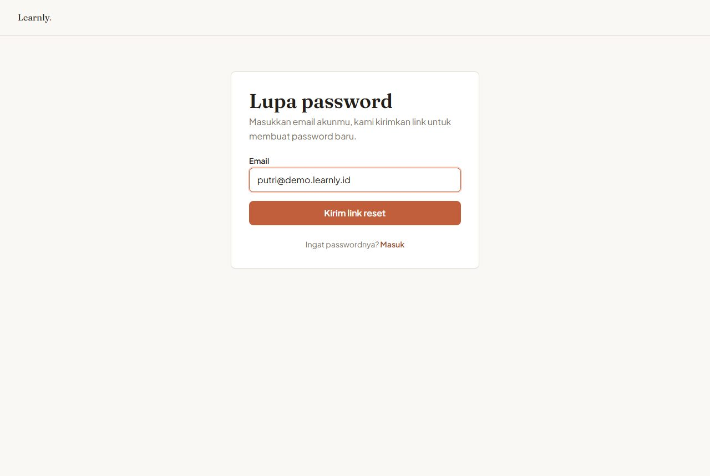
   *Minta link reset password.*

### Beranda

Setelah masuk, beranda menampilkan tombol **Cari tutor** (1), **Sesi mendatang** (2), dan **Laporan terbaru** dari tutor (3).

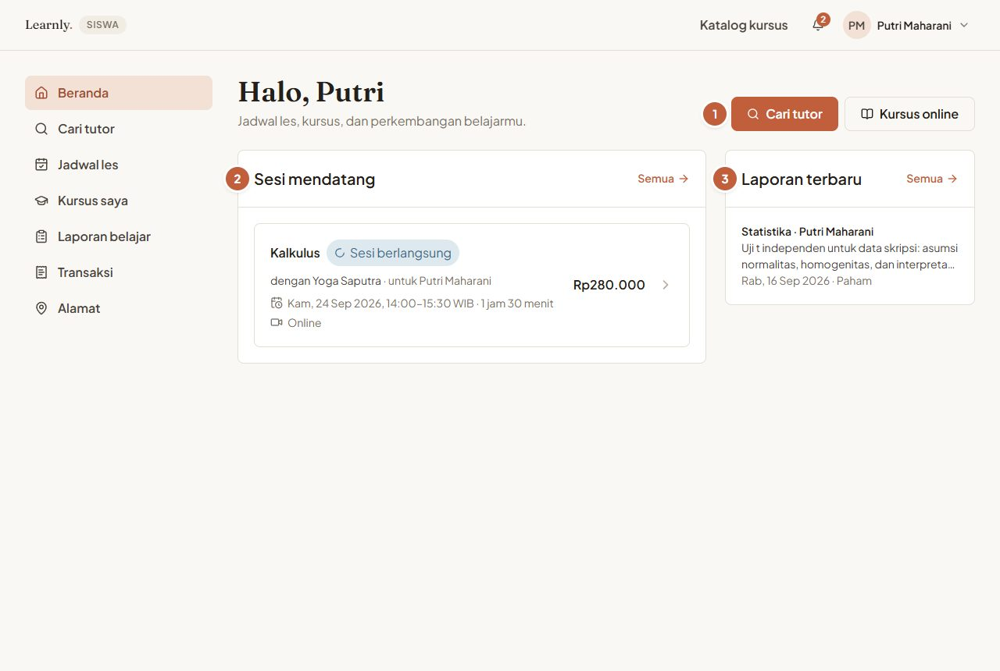
*Beranda: jadwal les terdekat dan laporan terakhir.*

---

## Cara mencari tutor

1. Buka **Cari tutor**. Di panel **Filter**, pilih **Mata pelajaran** (1).
2. Isi **Lokasi belajar** (2) dengan kecamatan atau kota, atau tekan ikon lokasi untuk memakai posisimu sekarang. Hasil lalu diurutkan dari yang **terdekat**, dan tiap kartu menampilkan jaraknya (3).

   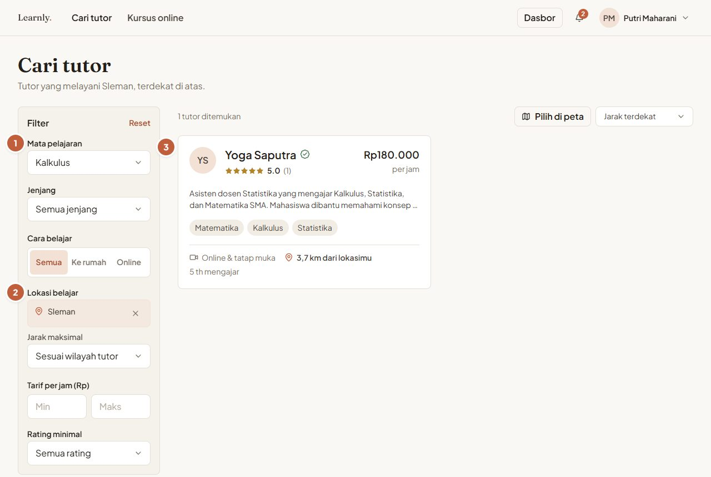
   *Filter mapel dan lokasi. Jarak ke tutor muncul di kartu.*

3. Tekan **Pilih di peta** untuk menampilkan peta. Klik di peta (1) untuk memindahkan titik belajarmu.

   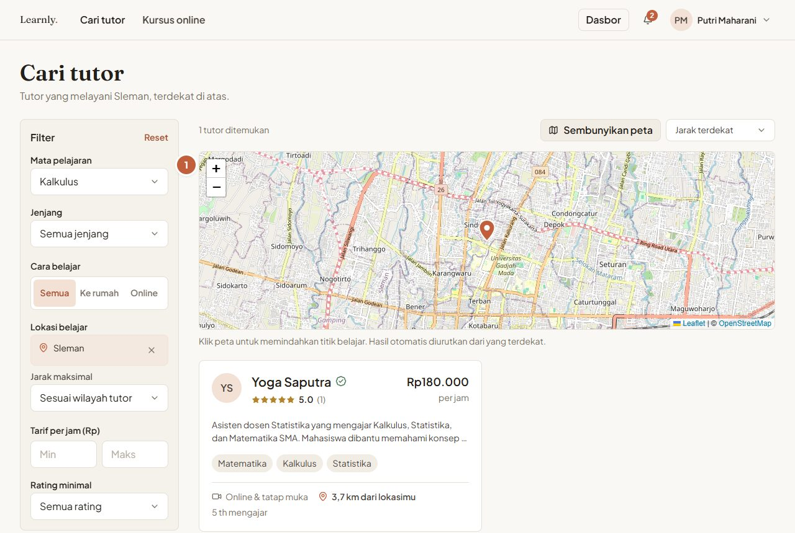
   *Klik peta untuk mengganti titik lokasi belajar.*

4. Filter lain: **Jenjang**, **Cara belajar** (Semua / Ke rumah / Online), **Jarak maksimal**, **Tarif per jam**, dan **Rating minimal**. Tekan **Reset** untuk menghapus semua filter.

> **Tips:** tutor **tatap muka** hanya muncul bila lokasimu masuk wilayah layanannya. Tutor **online** bisa dipilih dari kota mana pun.

---

## Cara memesan les online

1. Buka profil tutor, lalu pilih tab **Jadwal & booking**.
2. Pilih **tanggal** (1), **Durasi sesi** (2), dan **jam mulai** (3). Jam yang dicoret sudah terisi atau tidak cukup untuk durasi yang dipilih. Tekan **Lanjut pesan** (4).

   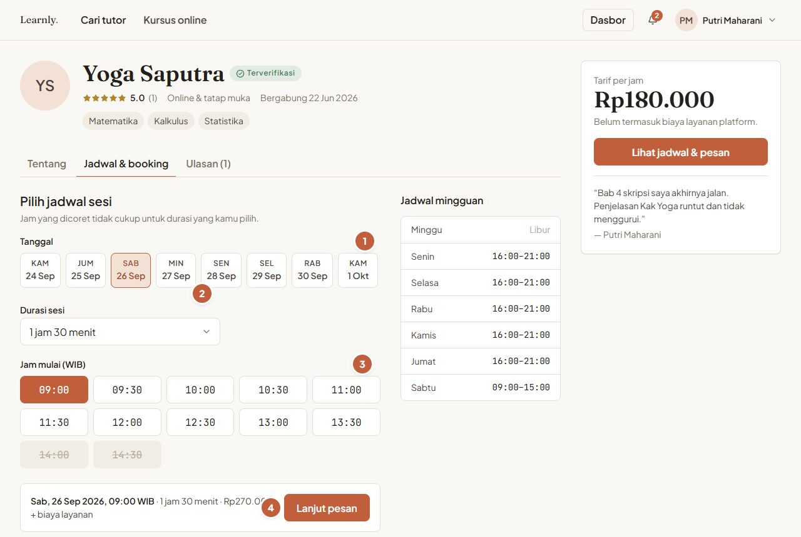
   *Pilih tanggal, durasi, dan jam mulai. Jadwal mingguan tutor terlihat di kanan.*

3. **Langkah 1 · Jadwal**: periksa jadwalnya. Di bagian **Siapa yang belajar?** (1), pilih **Mata pelajaran** (2). **Ringkasan booking** di kanan (3) selalu menunjukkan total biaya.

   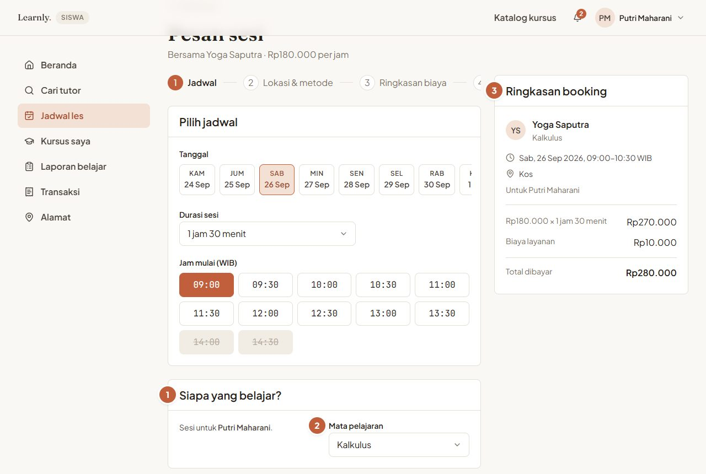
   *Langkah pertama: jadwal dan mata pelajaran.*

4. **Langkah 2 · Lokasi & metode**: pilih **Online** (1). Link meeting akan dikirim tutor sebelum sesi. Tekan **Lanjut**.

   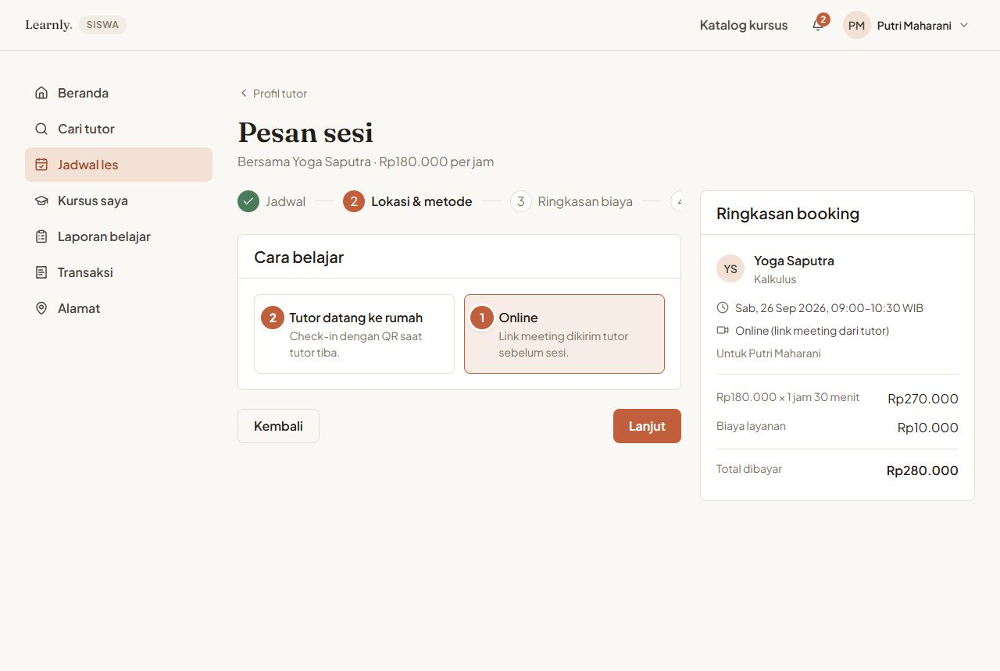
   *Pilih cara belajar: online atau tutor datang ke rumah.*

5. **Langkah 3 · Ringkasan biaya**: baca kotak **Sebelum mengirim** (1), periksa **Total dibayar** (2), lalu tekan **Kirim booking** (3).

   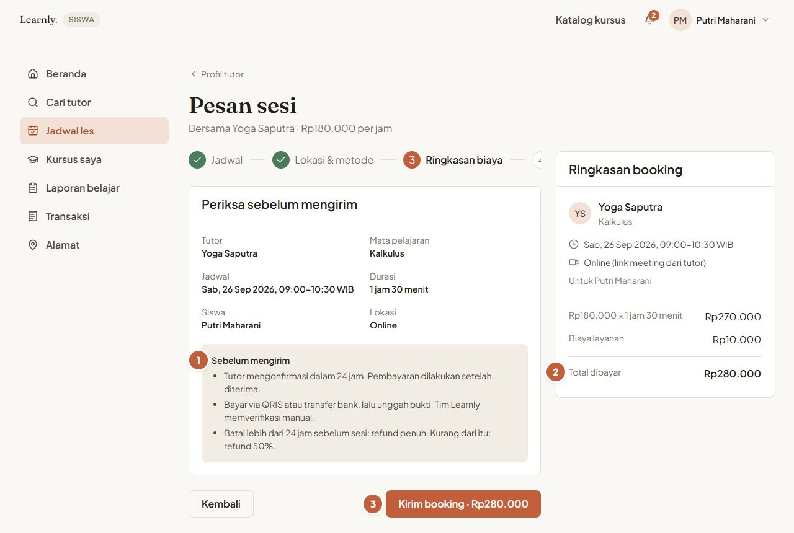
   *Periksa sekali lagi sebelum mengirim.*

6. Booking terkirim. Tutor punya waktu **24 jam** untuk menerima. Tekan **Pantau status booking** untuk melihat perkembangannya.

   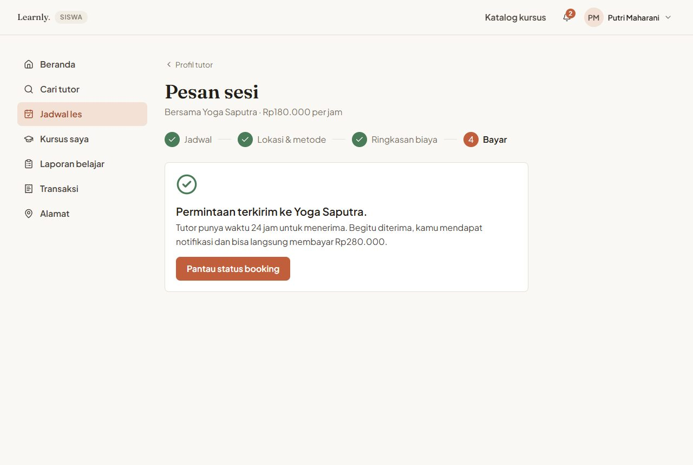
   *Permintaan terkirim ke tutor.*

---

## Cara memesan les tatap muka

Langkahnya sama dengan les online. Bedanya di **Langkah 2**:

1. Pilih **Tutor datang ke rumah** (1).
2. Pilih salah satu alamat tersimpan (2), atau tekan **Alamat baru** (3) untuk menambah alamat dan menandai titiknya di peta.

   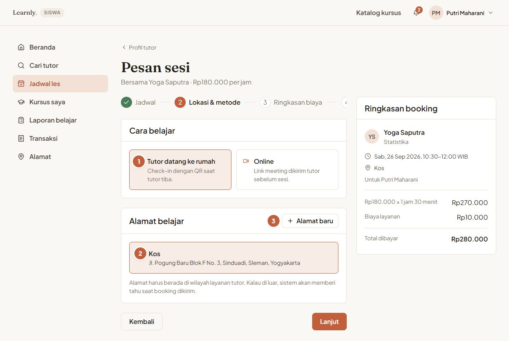
   *Pilih alamat belajar untuk sesi tatap muka.*

> **Tips:** tambahkan catatan alamat (warna pagar, patokan) di menu **Alamat** supaya tutor mudah menemukan rumahmu.

---

## Cara membayar

Pembayaran dibuka **setelah tutor menerima** booking. Kamu akan mendapat notifikasi.

1. Buka booking-nya. Progres (1) menunjukkan langkah **Pembayaran**. Tekan **Bayar sekarang** (2).

   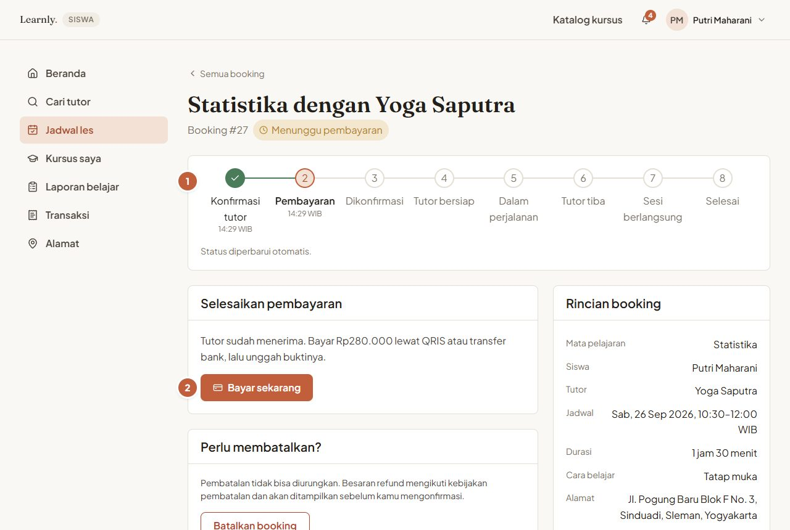
   *Tutor sudah menerima, dan tombol bayar muncul.*

2. Perhatikan batas waktu **Bayar dalam** (1). Kalau lewat, jadwal dilepas untuk siswa lain. Pindai **QRIS** (2) dengan aplikasi bank atau e-wallet, lalu bayar **persis** sebesar **Total dibayar** (3).

   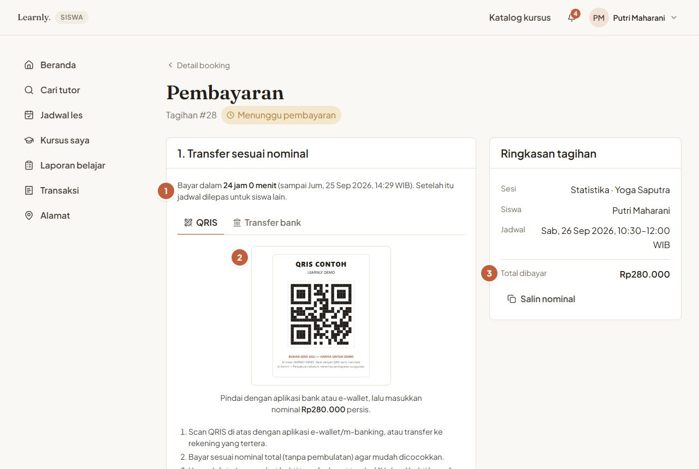
   *Tab QRIS. Di demo, QR bertanda "QRIS CONTOH" dan tidak bisa dipakai membayar sungguhan.*

3. Atau pilih tab **Transfer bank** dan transfer ke **Nomor rekening** (1) yang tertera. Tekan ikon salin untuk menyalin nomor.

   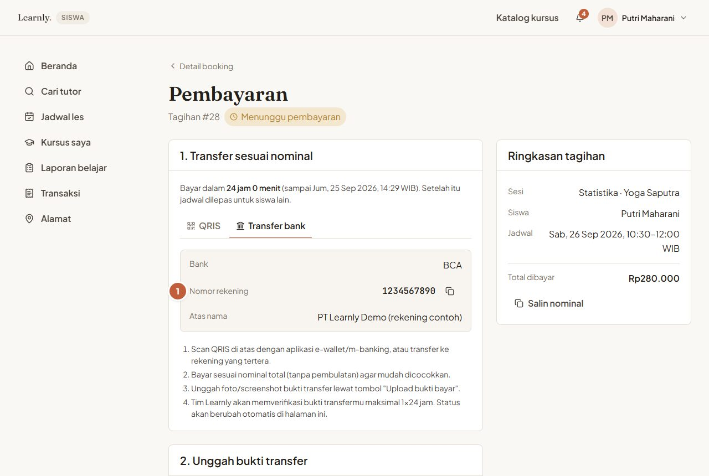
   *Tab transfer bank.*

   Tampilan di HP:

   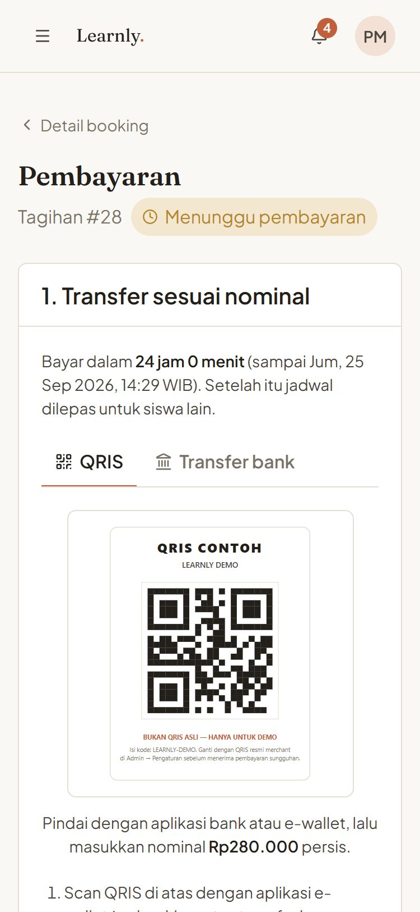

4. Setelah membayar, gulir ke **2. Unggah bukti transfer**. Pilih foto atau screenshot struk di **Bukti transfer** (1). Formatnya gambar atau PDF, maksimal 5 MB. Tekan **Kirim bukti pembayaran** (2).

   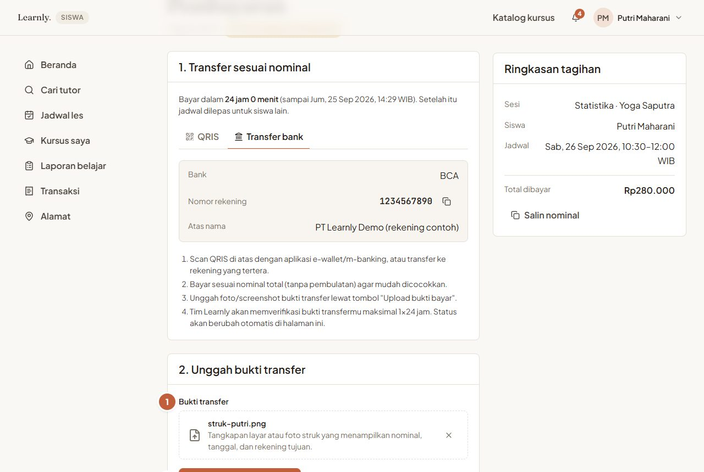
   *Unggah bukti transfer.*

5. Status berubah menjadi **Menunggu verifikasi** (1). Tim Learnly mencocokkan bukti dengan mutasi rekening, paling lama 1×24 jam. Halaman ini diperbarui otomatis.

   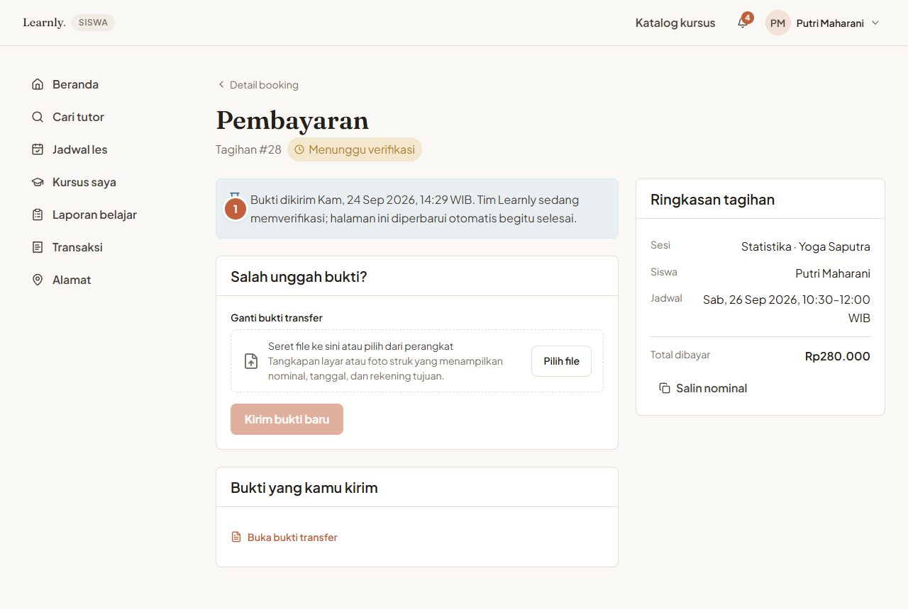
   *Bukti terkirim dan menunggu dicek admin.*

> **Tips:** transfer sesuai nominal tanpa pembulatan, dan pastikan struk memperlihatkan **nominal, tanggal, dan rekening tujuan**. Bukti yang tidak cocok akan ditolak dan booking-nya dibatalkan.

---

## Cara memantau booking & menunjukkan QR check-in

1. Semua booking ada di **Jadwal les**. Setelah pembayaran disetujui, status menjadi **Dikonfirmasi** (1).
2. Untuk sesi tatap muka, tekan **Tampilkan QR check-in** (2) saat tutor sudah tiba. **Rincian booking** (3) berisi jadwal, alamat, biaya, dan nomor tutor.

   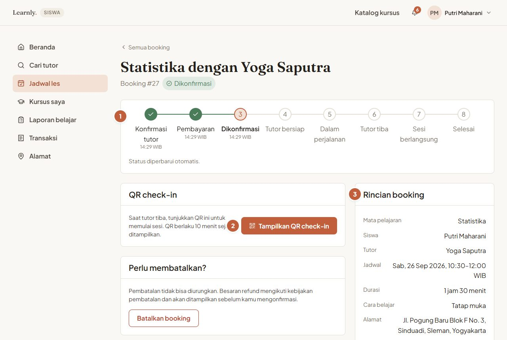
   *Booking dikonfirmasi, siap untuk hari-H.*

3. Tunjukkan QR (1) ke tutor untuk dipindai. QR **berlaku 10 menit** (2). Kalau habis, tekan **Muat ulang QR**. Kalau kamera tutor bermasalah, buka **Tutor tidak bisa memindai?** (3) lalu bacakan atau salin kodenya.

   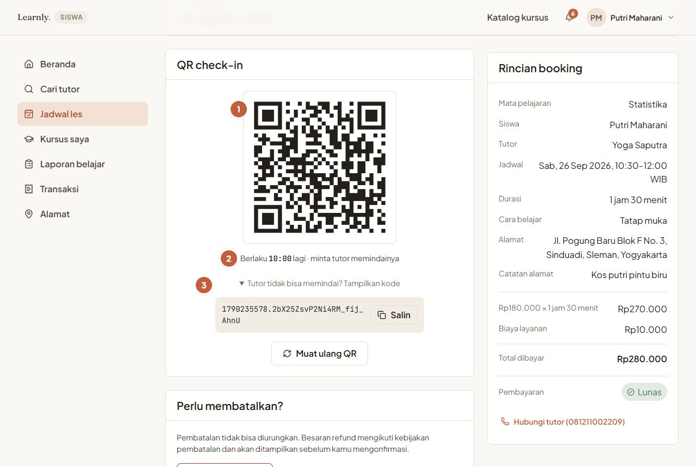
   *QR check-in dan kode cadangan.*

   Di HP, QR ditampilkan besar supaya mudah dipindai:

   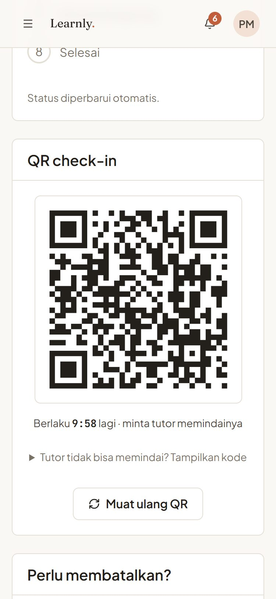

4. Saat tutor dalam perjalanan, progres menunjukkan **Tutor bersiap → Dalam perjalanan → Tutor tiba**, dan posisi tutor terlihat di peta (lihat [Panduan Orang Tua](02-orang-tua.md#cara-melacak-tutor-yang-sedang-menuju-rumah)).

   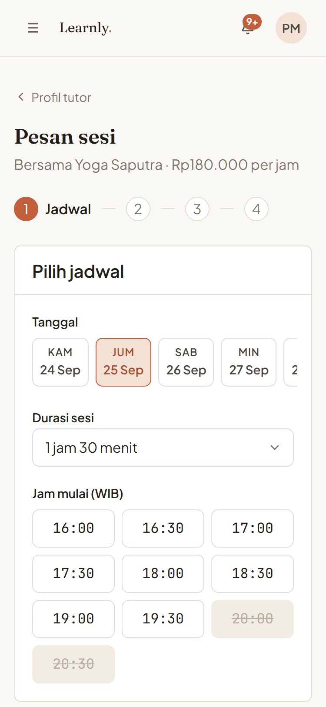
   *Detail booking di HP.*

Untuk sesi **online**, link meeting muncul di detail booking setelah tutor mengirimnya.

---

## Cara membatalkan booking

1. Buka booking, lalu tekan **Batalkan booking** di bagian **Perlu membatalkan?**.
2. Jendela konfirmasi menjelaskan akibatnya (1): berapa dana yang kembali, atau "belum ada pembayaran" bila belum dibayar. Isi **Alasan pembatalan** (2), lalu tekan **Ya, batalkan booking**.

   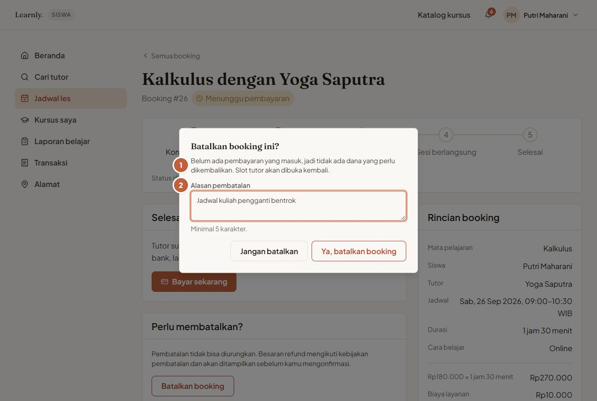
   *Konfirmasi pembatalan beserta alasannya.*

Aturan refund (bawaan, bisa diubah admin):

- Dibatalkan **lebih dari 24 jam** sebelum sesi: refund **penuh**.
- Kurang dari 24 jam: refund **50%**.
- Dibatalkan oleh **tutor**: selalu refund penuh.

Refund ditransfer manual oleh admin, dan kamu mendapat notifikasi saat dana sudah dikirim.

---

## Cara membaca laporan & memberi ulasan

1. Setelah sesi, tutor mengisi **Laporan perkembangan** (1): **Tingkat pemahaman** (2), materi, yang sudah dikuasai, yang perlu ditingkatkan, dan pekerjaan rumah.

   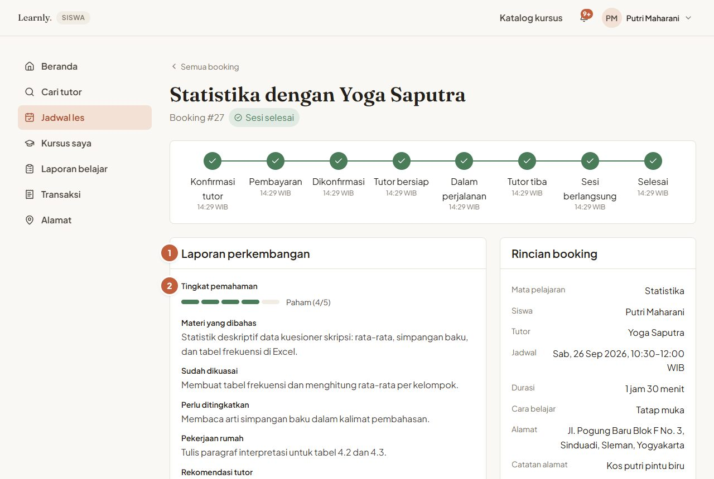
   *Laporan perkembangan di detail booking.*

2. Di bawahnya ada **Beri ulasan**. Pilih jumlah bintang (1), tulis pengalamanmu (2, opsional), lalu tekan **Kirim ulasan** (3). Ulasan masih bisa diubah selama 7 hari.

   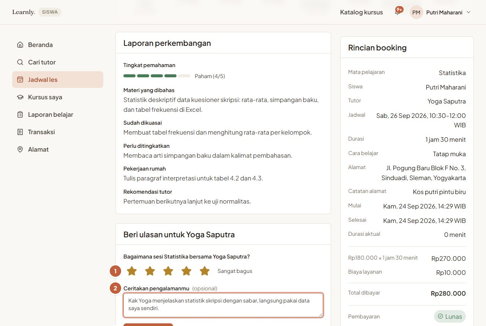
   *Rating dan ulasan untuk tutor.*

3. Semua laporan terkumpul di menu **Laporan belajar**. Saring per **Mata pelajaran** (1), lalu klik laporan untuk membukanya.

   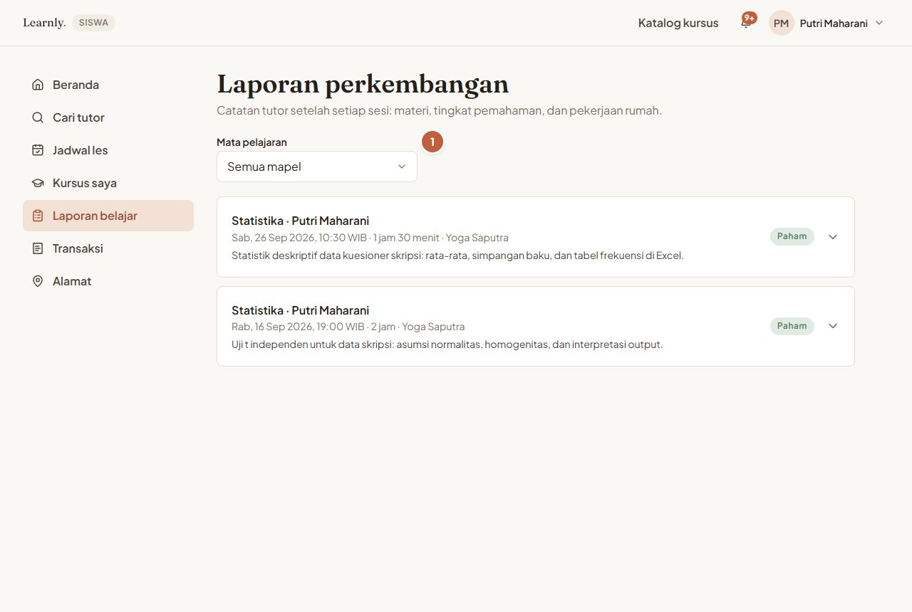
   *Riwayat laporan dari semua sesi.*

---

## Cara ikut kursus online

1. Buka **Katalog kursus** dan pilih kursus. Untuk kursus gratis, tekan **Daftar gratis** (1). Untuk kursus berbayar, kamu diarahkan ke halaman pembayaran yang sama seperti les. Kursus terbuka setelah admin memverifikasi pembayaran.

   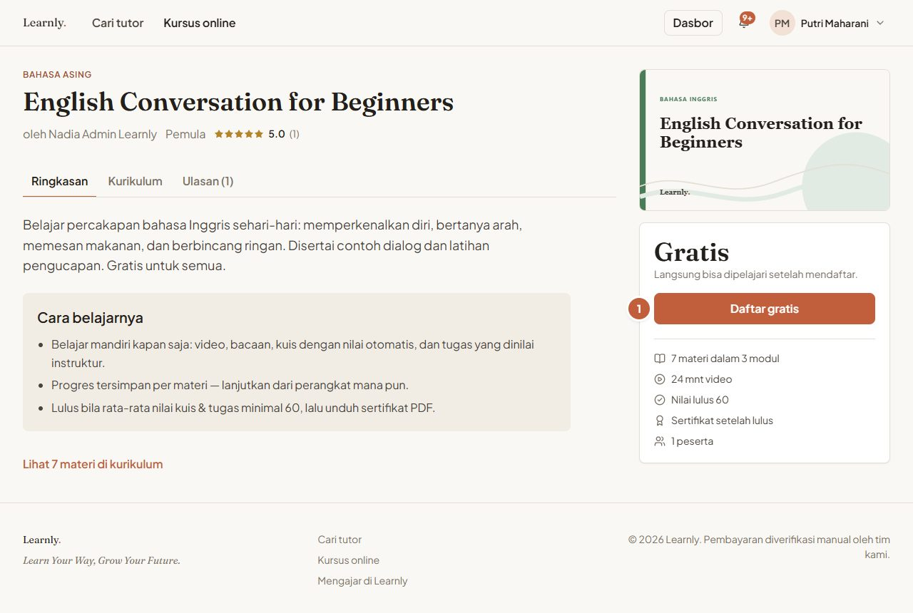
   *Detail kursus dan tombol daftar.*

2. Di halaman belajar, **daftar materi** ada di kiri (1). Setelah membaca, tekan **Tandai selesai** (2), lalu **Materi berikutnya** (3). Materi bacaan bisa punya lampiran **Unduh materi (PDF)**.

   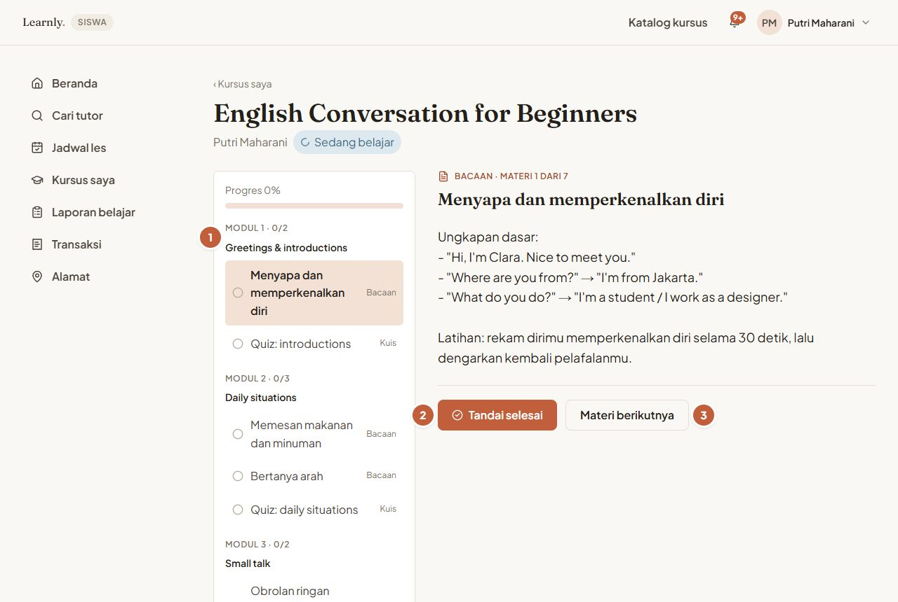
   *Materi bacaan dan progres di kiri.*

3. **Kuis**: pilih jawaban untuk setiap soal (1), lalu tekan **Kirim jawaban** (2).

   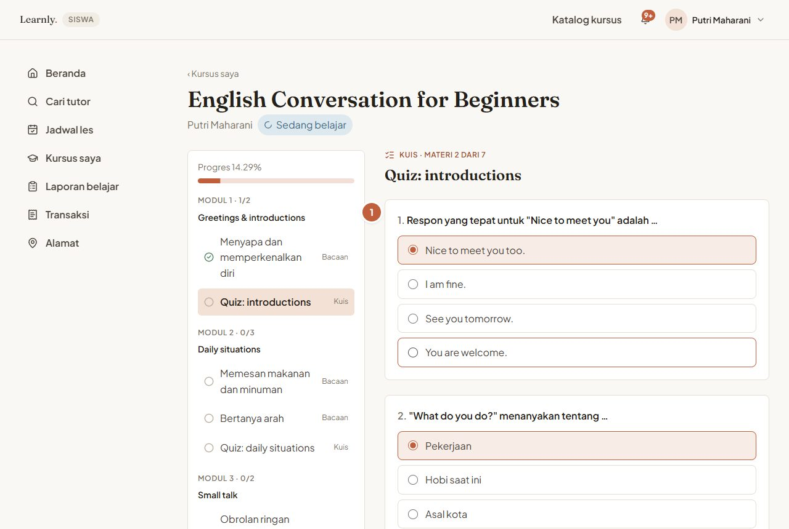
   *Mengerjakan kuis pilihan ganda.*

4. Nilai langsung keluar (1). Kamu bisa **Kerjakan ulang**, dan yang dipakai adalah nilai terbaikmu.

   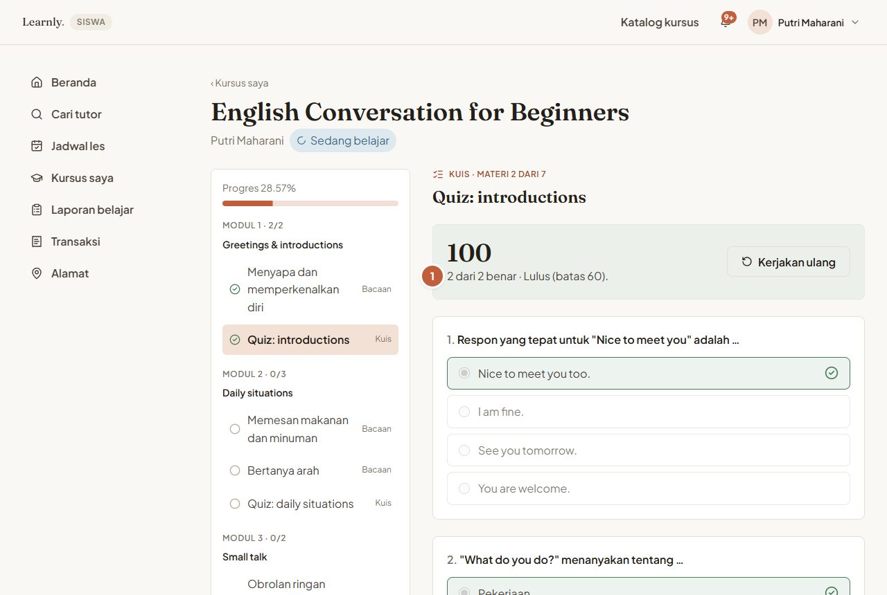
   *Hasil kuis beserta jawaban benar.*

5. **Tugas**: baca **Instruksi tugas** (1), pilih file di **File tugas** (2, PDF/gambar, maksimal 10 MB), lalu tekan **Kumpulkan tugas** (3). Instruktur menilai dan memberi catatan, dan kamu mendapat notifikasi saat nilai keluar.

   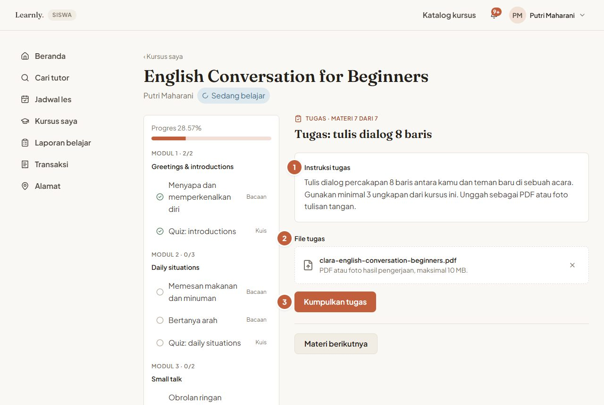
   *Mengumpulkan tugas.*

6. Menu **Kursus saya** menampilkan progres setiap kursus (1). Kursus yang sudah lulus punya tombol **Sertifikat** (2).

   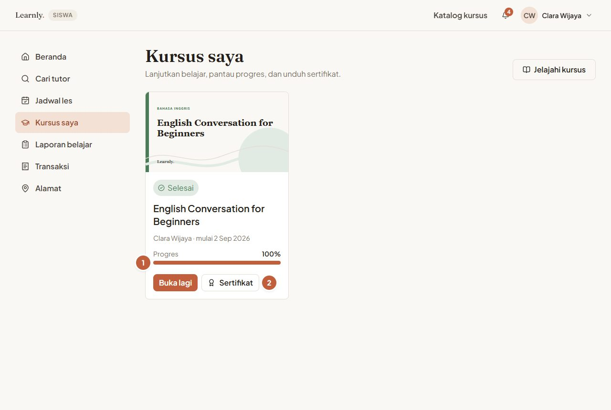
   *Daftar kursus dan progresnya.*

7. Kamu **lulus** bila semua materi selesai dan **Rata-rata nilai** (1) kuis dan tugas mencapai batas lulus. Tekan **Unduh sertifikat (PDF)** (2).

   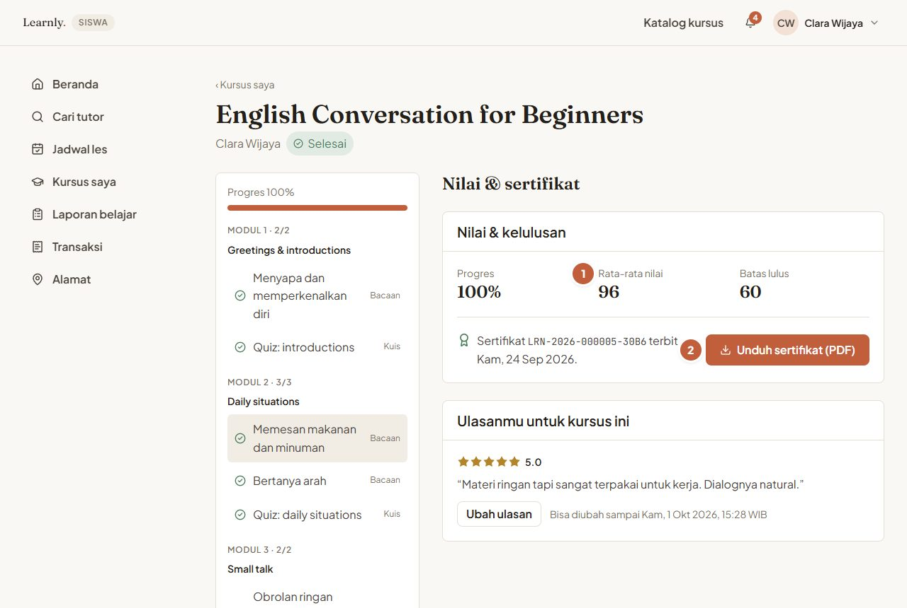
   *Nilai, kelulusan, dan unduh sertifikat.*

> **Catatan demo:** kursus demo berisi bacaan, PDF, kuis, dan tugas. Video tidak disertakan di data demo.

---

## Cara membaca notifikasi

1. Tekan ikon lonceng di kanan atas untuk melihat notifikasi terbaru. Tekan **Lihat semua notifikasi** (1) untuk membuka semuanya.

   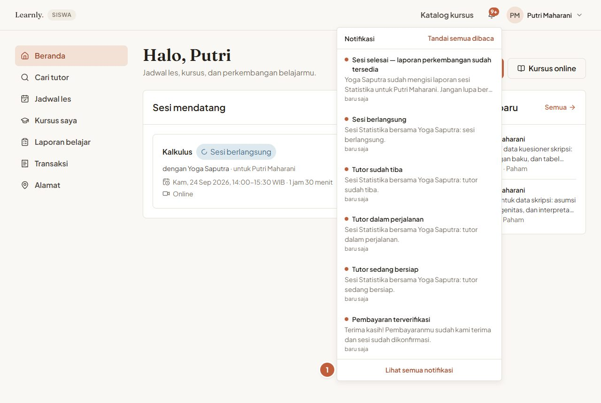
   *Daftar singkat notifikasi.*

2. Di halaman **Notifikasi**, tekan **Tandai semua dibaca** (1) atau pilih tab **Belum dibaca** (2). Klik notifikasi untuk membuka booking atau kursus terkait.

   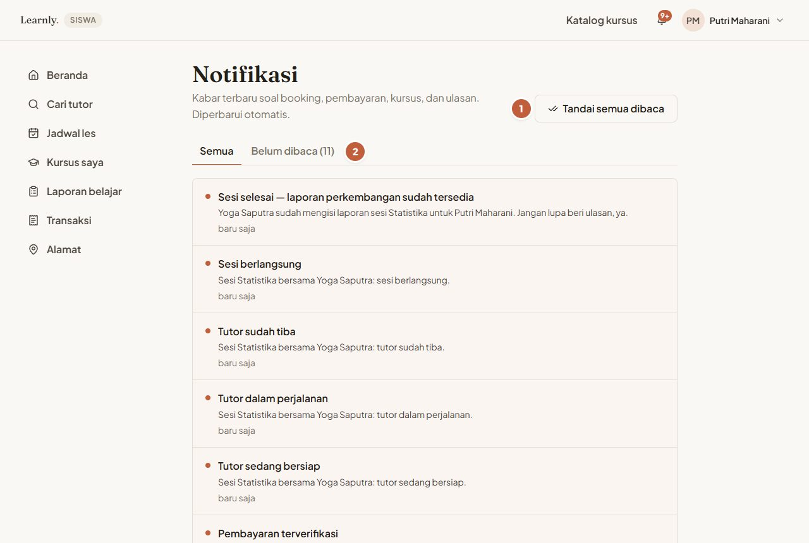
   *Semua notifikasi. Halaman diperbarui otomatis.*

---

## Kalau ada masalah

| Masalah | Yang bisa dilakukan |
| --- | --- |
| Tutor belum menjawab booking | Tunggu sampai 24 jam. Setelah itu booking otomatis batal tanpa biaya, dan kamu bisa memesan tutor lain. |
| Tombol **Bayar sekarang** tidak ada | Pembayaran baru terbuka setelah tutor menerima. Cek status di **Jadwal les**. |
| Bukti bayar ditolak | Baca alasannya di notifikasi. Booking terkait dibatalkan, jadi pesan ulang dan bayar sesuai nominal. Hubungi admin bila merasa sudah membayar dengan benar. |
| Batas waktu bayar lewat | Tagihan kedaluwarsa dan jadwal dilepas. Pesan ulang. |
| QR tidak bisa dipindai | Naikkan kecerahan layar, tekan **Muat ulang QR**, atau pakai kode di **Tutor tidak bisa memindai?**. |
| Link meeting belum muncul | Tutor mengirimnya sebelum sesi. Hubungi tutor lewat nomor di **Rincian booking**. |
| Unggah file gagal | Pastikan formatnya gambar/PDF dan ukurannya di bawah batas (bukti bayar 5 MB, tugas 10 MB). |
| Sertifikat belum muncul | Selesaikan semua materi, lalu pastikan tugas sudah dinilai instruktur dan rata-rata nilai mencapai batas lulus. |
| Lupa password | Pakai **Lupa password?** di halaman masuk. |
