# Panduan Orang Tua

Untuk orang tua yang memesan les privat dan kursus online **untuk anak**. Satu akun orang tua bisa mengelola beberapa anak. Setiap booking dan kursus selalu dicatat atas nama salah satu anak.

Hampir semua langkah sama dengan [Panduan Siswa](01-siswa.md): mencari tutor, memesan, membayar, QR check-in, membatalkan, ulasan, kursus, dan notifikasi. Panduan ini membahas bagian yang **khusus orang tua**. Untuk langkah lainnya, ikuti tautan ke Panduan Siswa.

Akun contoh: `sari@demo.learnly.id` (anak: Dimas, SMA, dan Alya, SMP) · password `Demo#2026`.

Isi:

1. [Cara mendaftar sebagai orang tua](#cara-mendaftar-sebagai-orang-tua)
2. [Cara menambah & mengelola anak](#cara-menambah--mengelola-anak)
3. [Cara menyimpan alamat belajar](#cara-menyimpan-alamat-belajar)
4. [Cara memesan les untuk anak](#cara-memesan-les-untuk-anak)
5. [Cara membayar tagihan](#cara-membayar-tagihan)
6. [Cara melacak tutor yang sedang menuju rumah](#cara-melacak-tutor-yang-sedang-menuju-rumah)
7. [Cara membaca laporan per anak](#cara-membaca-laporan-per-anak)
8. [Cara mendaftarkan anak ke kursus](#cara-mendaftarkan-anak-ke-kursus)
9. [Cara melihat riwayat transaksi](#cara-melihat-riwayat-transaksi)
10. [Kalau ada masalah](#kalau-ada-masalah)

---

## Cara mendaftar sebagai orang tua

1. Tekan **Daftar**, pilih **Orang tua** (1), isi nama, email, dan password, lalu tekan **Daftar**.

   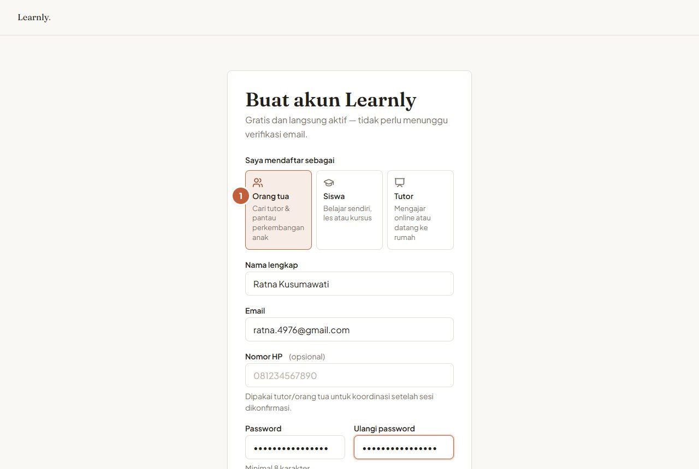
   *Pilih peran "Orang tua".*

2. Kamu langsung diarahkan ke **Profil anak** dengan sambutan. Tekan **Tambah anak** (1).

   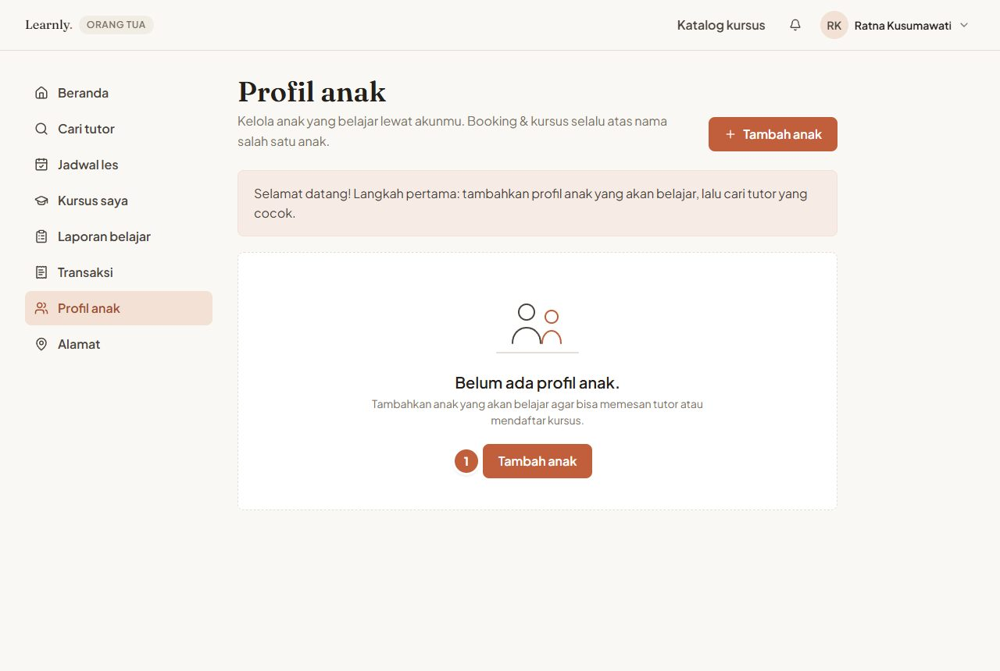
   *Langkah pertama: tambahkan profil anak.*

Cara masuk dan lupa password sama seperti di [Panduan Siswa](01-siswa.md#cara-mendaftar--masuk).

---

## Cara menambah & mengelola anak

1. Di **Profil anak**, tekan **Tambah anak**. Isi **Nama lengkap anak** (1), tanggal lahir, dan **Jenjang** (2). Tanggal lahir dan jenjang boleh dikosongkan. Tekan **Simpan** (3).

   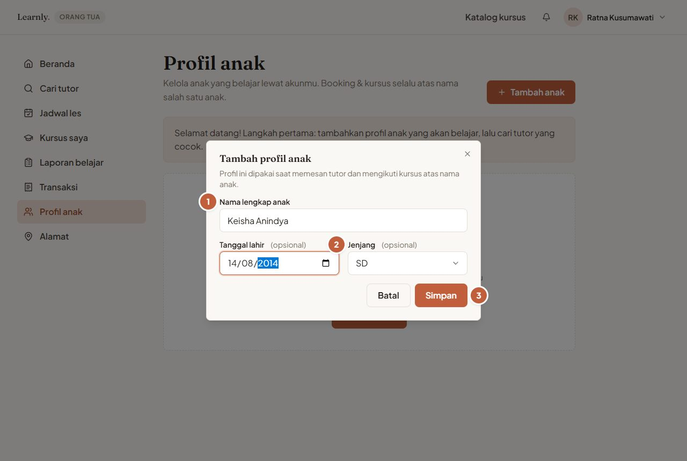
   *Form profil anak.*

2. Semua anak tampil sebagai kartu. Tekan **Tambah anak** (1) untuk anak berikutnya, ikon pensil (2) untuk mengubah, atau ikon tempat sampah (3) untuk menghapus.

   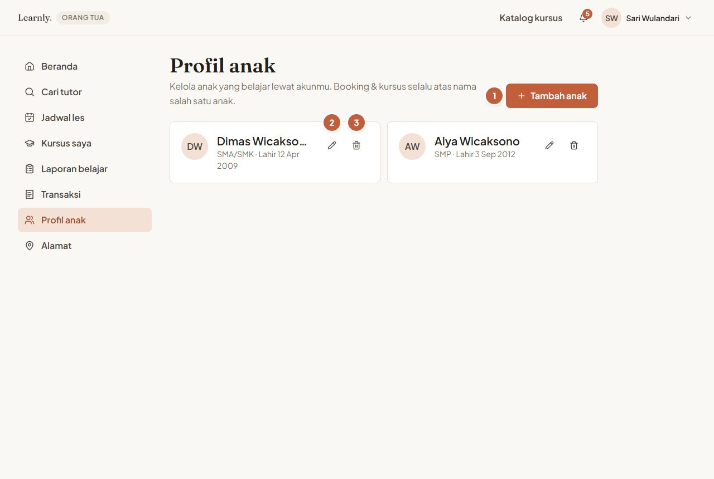
   *Daftar anak di akun orang tua.*

> **Tips:** isi jenjang dengan benar. Tutor memakainya untuk menyiapkan materi, dan pencarian tutor bisa disaring per jenjang.

---

## Cara menyimpan alamat belajar

Alamat tersimpan dipakai untuk les tatap muka, jadi kamu tidak perlu mengetik ulang setiap memesan.

1. Buka menu **Alamat**, lalu tekan **Tambah alamat** (1).

   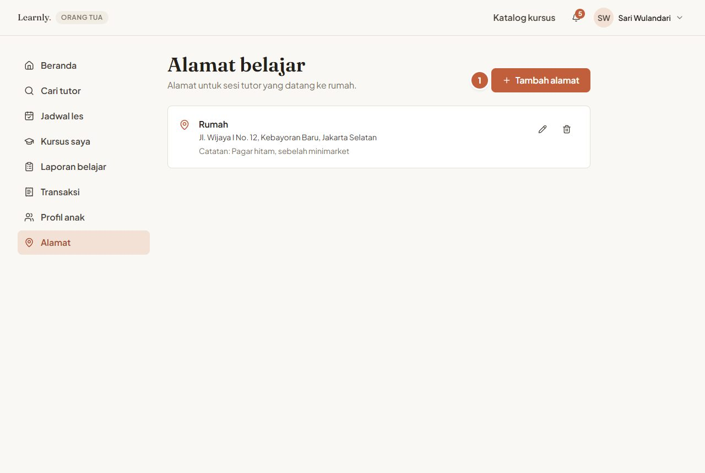
   *Alamat belajar yang tersimpan.*

2. Tentukan titik rumah di **peta** (1): klik peta, geser pin, cari nama jalan lewat kotak pencarian, atau tekan tombol lokasi (2) untuk memakai posisimu sekarang.
3. Isi **Nama alamat** (3, misalnya "Rumah Nenek"), **Alamat lengkap**, dan **Catatan untuk tutor**, lalu tekan **Simpan alamat**.

   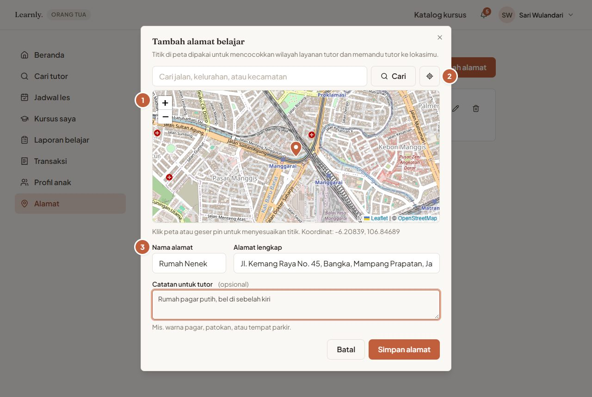
   *Titik di peta menentukan tutor mana yang melayani alamat ini.*

> **Tips:** titik di peta harus tepat. Learnly memakainya untuk mencocokkan wilayah layanan tutor dan menunjukkan arah ke tutor.

---

## Cara memesan les untuk anak

Ikuti [Cara memesan les online](01-siswa.md#cara-memesan-les-online) atau [tatap muka](01-siswa.md#cara-memesan-les-tatap-muka). Bedanya, di **Langkah 1** ada bagian **Siapa yang belajar?**. Pilih **Anak** (1) yang akan ikut les.

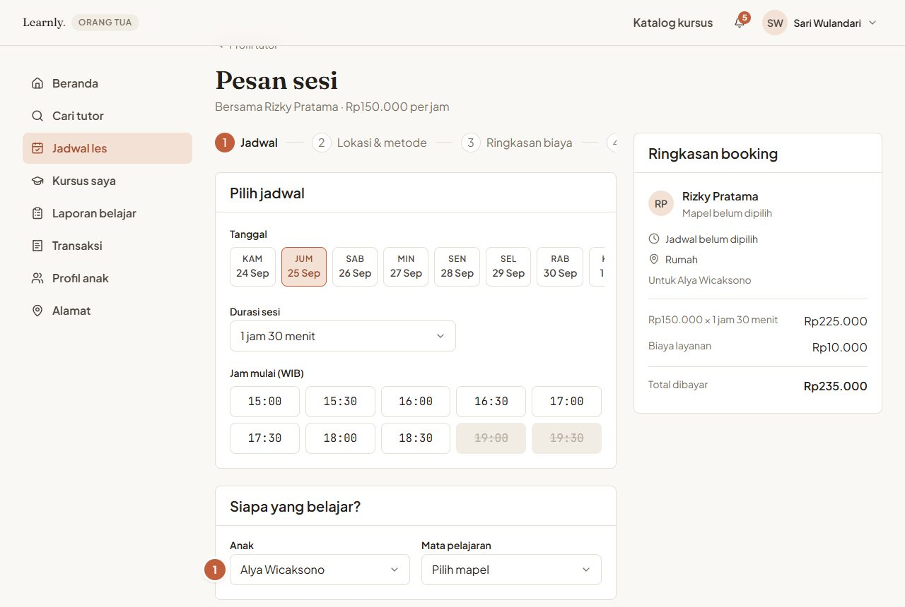
*Setiap booking atas nama satu anak.*

Tutor akan melihat nama dan jenjang anak, dan laporan sesi masuk ke riwayat anak tersebut.

---

## Cara membayar tagihan

1. Tagihan yang perlu dibayar muncul paling atas di **Beranda**, di kotak **Menunggu pembayaranmu** (1). Tekan **Bayar** (2).
2. Beranda juga menampilkan **Sesi mendatang** semua anak dan **Laporan terbaru** (3).

   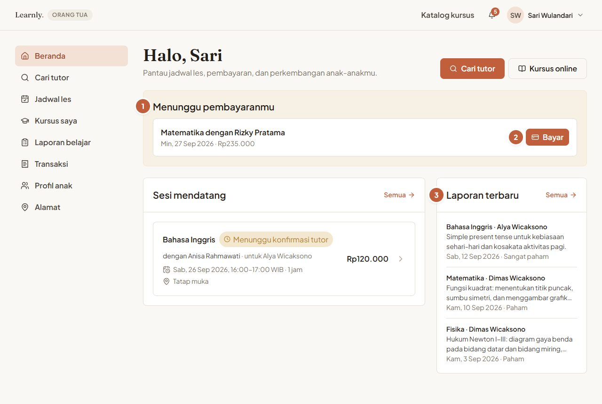
   *Beranda orang tua: tagihan, jadwal, dan laporan anak-anak.*

3. Langkah membayar (QRIS/transfer dan unggah bukti) sama persis dengan [Cara membayar](01-siswa.md#cara-membayar) di Panduan Siswa.

---

## Cara melacak tutor yang sedang menuju rumah

Untuk les tatap muka, di hari-H kamu bisa memantau tutor dari detail booking (**Jadwal les** → pilih booking).

1. Progres (1) menunjukkan tahap saat ini: **Tutor bersiap → Dalam perjalanan → Tutor tiba**. Halaman diperbarui otomatis.
2. Peta **Posisi tutor** (2) menampilkan titik alamat belajar (pin oranye) dan posisi terakhir tutor (pin biru), lengkap dengan waktu pembaruan terakhir.
3. Perlu menghubungi tutor? Tekan **Hubungi tutor** (3) di **Rincian booking**.

   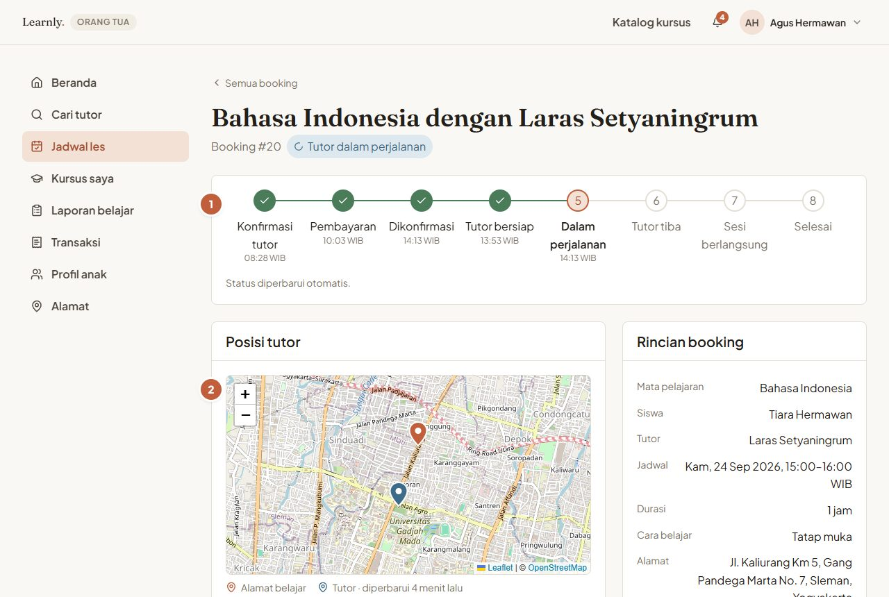
   *Tutor sedang dalam perjalanan. Posisinya terlihat di peta.*

   Di HP:

   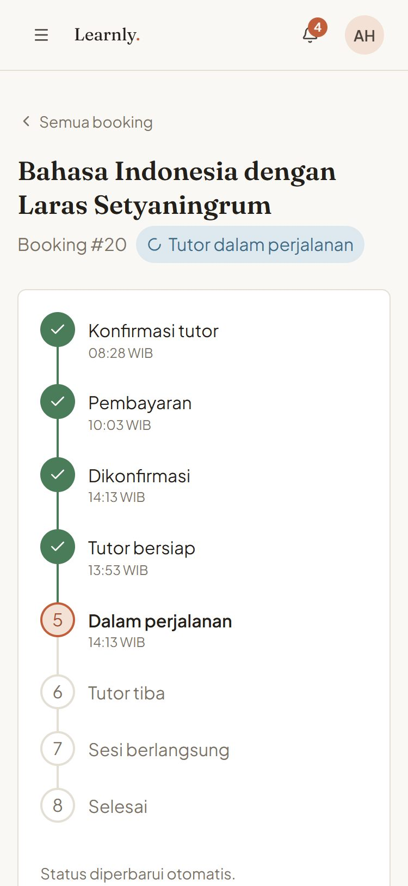
   *Progres dan status di layar HP.*

   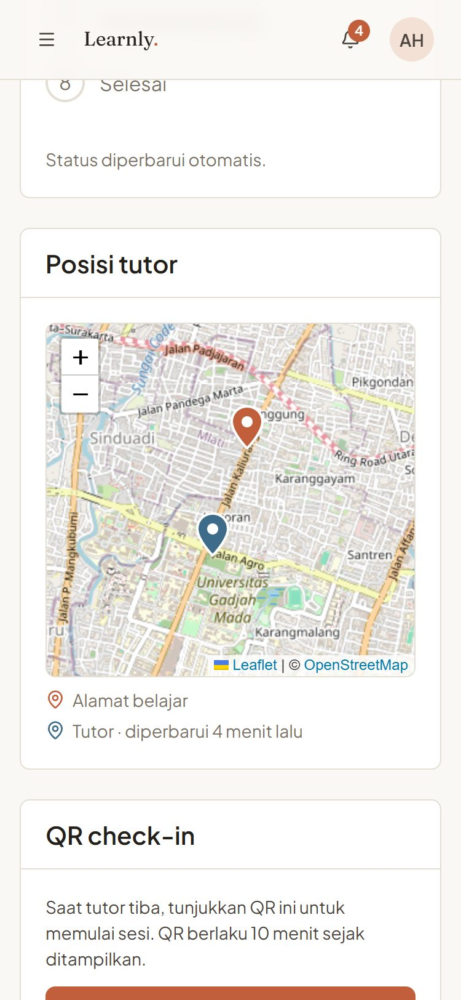
   *Peta posisi tutor di HP.*

4. Saat tutor tiba, buka booking dan tekan **Tampilkan QR check-in**, lalu tunjukkan ke tutor (lihat [QR check-in](01-siswa.md#cara-memantau-booking--menunjukkan-qr-check-in)).

> **Tips:** posisi tutor diperbarui kira-kira setiap 30 detik selama tutor membagikan lokasinya. Kalau lama tidak berubah, mungkin sinyal tutor lemah, jadi hubungi tutor langsung.

---

## Cara membaca laporan per anak

1. Buka menu **Laporan belajar**, lalu pilih **Anak** (1) dan, bila perlu, mata pelajaran.
2. Klik laporan (2) untuk membukanya: tingkat pemahaman, materi, yang sudah dikuasai, yang perlu ditingkatkan, dan pekerjaan rumah. **Lihat detail sesi** membuka booking-nya.

   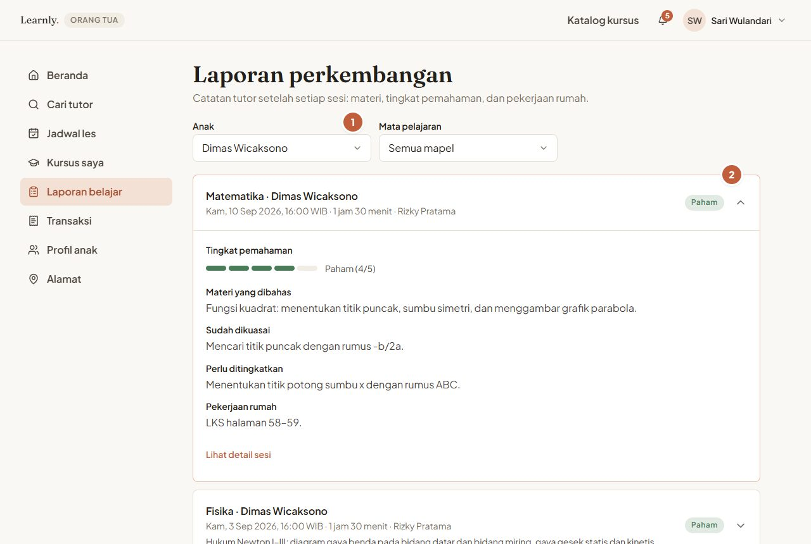
   *Riwayat laporan disaring untuk satu anak.*

Memberi ulasan untuk tutor sama seperti di [Panduan Siswa](01-siswa.md#cara-membaca-laporan--memberi-ulasan).

---

## Cara mendaftarkan anak ke kursus

1. Buka kursus di **Katalog kursus**. Di **Daftarkan untuk** (1), pilih anak, lalu tekan **Daftar gratis** (2). Untuk kursus berbayar, tekan tombol daftar lalu bayar tagihannya.

   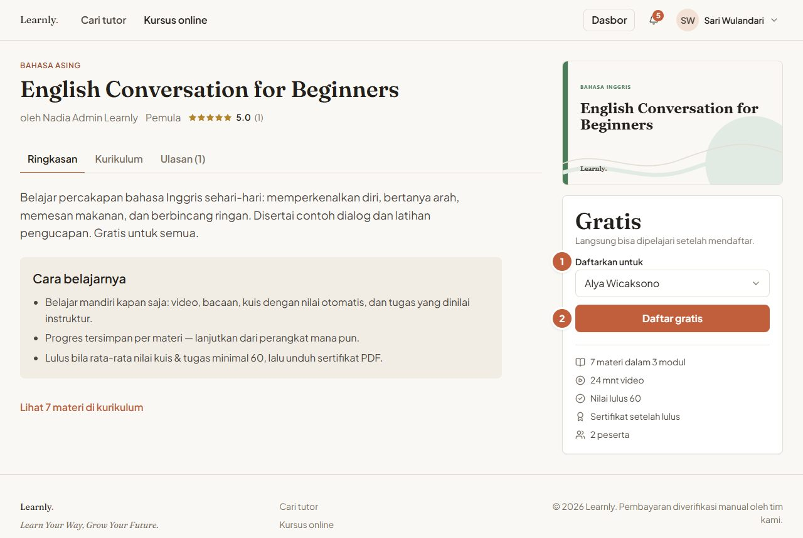
   *Pilih anak yang akan mengikuti kursus.*

2. Menu **Kursus saya** menampilkan kursus semua anak. Saring per anak (1).

   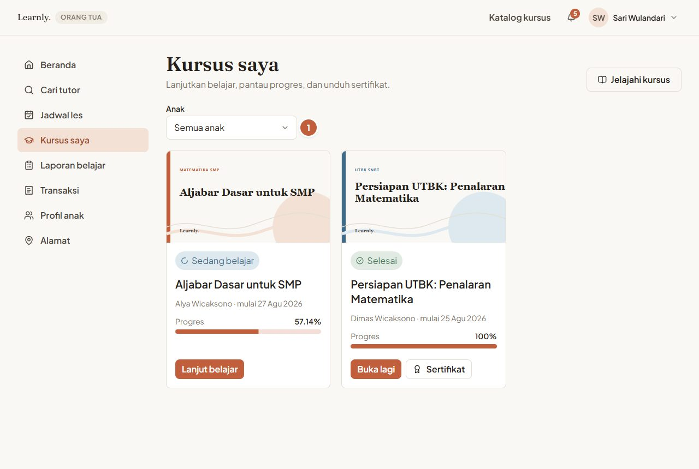
   *Kursus dan progres setiap anak.*

Cara belajar, mengerjakan kuis dan tugas, serta mengunduh sertifikat sama seperti di [Panduan Siswa](01-siswa.md#cara-ikut-kursus-online). Anak bisa belajar dengan akun orang tua di perangkat yang sama.

---

## Cara melihat riwayat transaksi

Menu **Transaksi** berisi semua tagihan les dan kursus. Pakai tab (1) untuk menyaring berdasarkan status, lalu klik tagihan untuk membuka detail atau membayar.

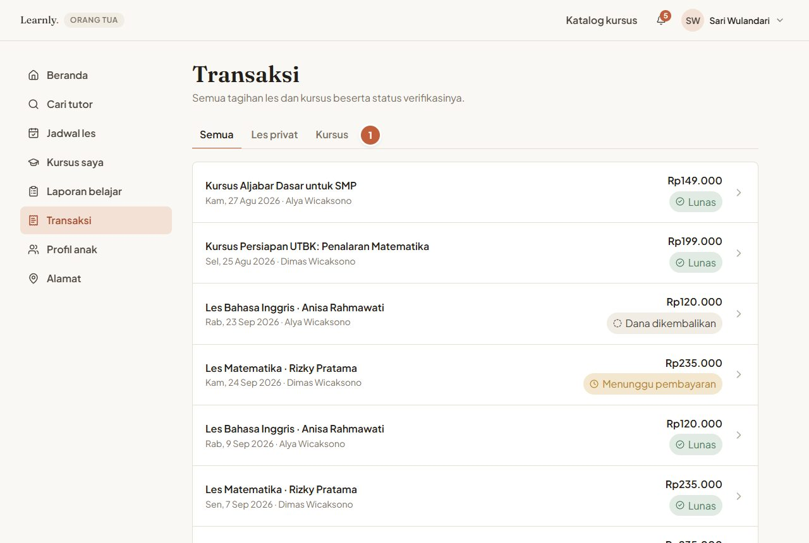
*Semua tagihan dan status pembayarannya.*

---

## Kalau ada masalah

| Masalah | Yang bisa dilakukan |
| --- | --- |
| Anak tidak muncul saat booking | Pastikan profil anak sudah ditambahkan di **Profil anak**. |
| Tidak ada tutor tatap muka di alamatku | Periksa titik alamat di peta. Coba cari tutor online, atau pilih alamat lain. |
| Tidak bisa menghapus anak / alamat | Profil anak yang sudah punya riwayat booking atau kursus, dan alamat yang sudah dipakai di booking, tidak bisa dihapus supaya riwayatnya tetap utuh. Ubah datanya saja bila salah. |
| Posisi tutor tidak bergerak | Tutor mungkin belum membagikan lokasi atau sinyalnya lemah. Tekan **Hubungi tutor**. |
| Salah memilih anak saat booking | Batalkan booking (gratis sebelum dibayar), lalu pesan ulang dengan anak yang benar. |
| Masalah pembayaran, QR, dan lainnya | Lihat [Kalau ada masalah](01-siswa.md#kalau-ada-masalah) di Panduan Siswa. |
