# Panduan Tutor

Untuk pengajar privat yang menerima booking les online dan tatap muka lewat Learnly.

Akun contoh: `rizky@demo.learnly.id` (terverifikasi, online & tatap muka), `dimasadi@demo.learnly.id` (khusus online), `fitri@demo.learnly.id` (menunggu verifikasi) · password `Demo#2026`.

Isi:

1. [Cara mendaftar sebagai tutor](#cara-mendaftar-sebagai-tutor)
2. [Cara melengkapi profil & dokumen](#cara-melengkapi-profil--dokumen)
3. [Cara mengatur jadwal, tanggal libur & wilayah](#cara-mengatur-jadwal-tanggal-libur--wilayah)
4. [Cara menunggu verifikasi](#cara-menunggu-verifikasi)
5. [Cara menerima atau menolak booking](#cara-menerima-atau-menolak-booking)
6. [Cara menjalankan sesi tatap muka di hari-H](#cara-menjalankan-sesi-tatap-muka-di-hari-h)
7. [Cara menjalankan sesi online](#cara-menjalankan-sesi-online)
8. [Cara melihat pendapatan](#cara-melihat-pendapatan)
9. [Cara membalas ulasan](#cara-membalas-ulasan)
10. [Kalau ada masalah](#kalau-ada-masalah)

---

## Cara mendaftar sebagai tutor

1. Tekan **Daftar**, pilih **Tutor** (1), isi nama, email, dan password, lalu tekan **Daftar**.

   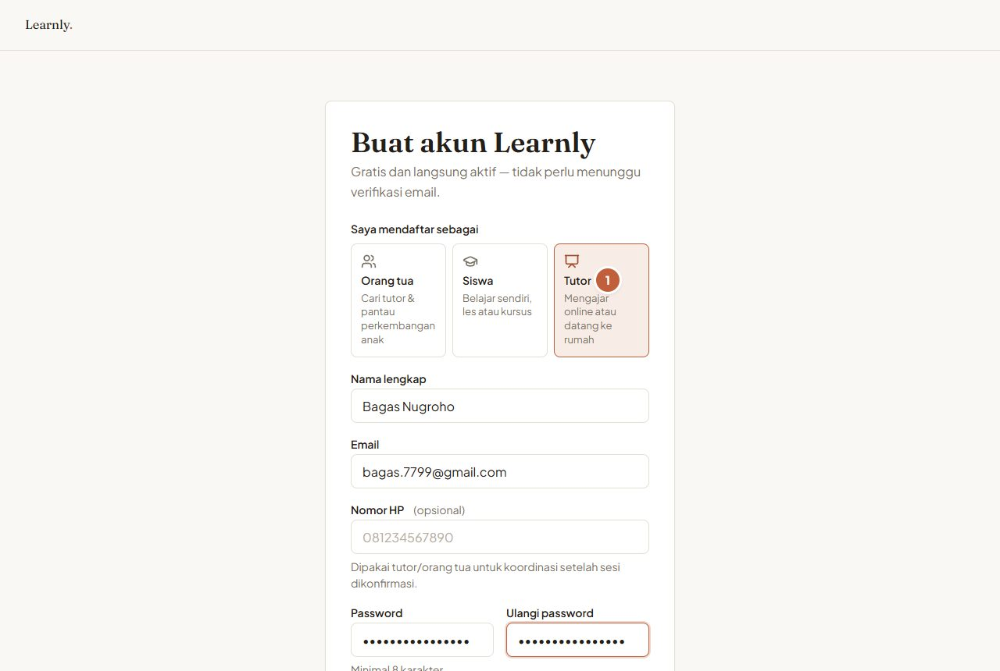
   *Pilih peran "Tutor".*

2. Kamu diarahkan ke **Profil & dokumen**. Kotak kuning **Lengkapi profil agar bisa diverifikasi** (1) berisi daftar hal yang masih kurang. Klik setiap butir untuk langsung ke bagiannya.

   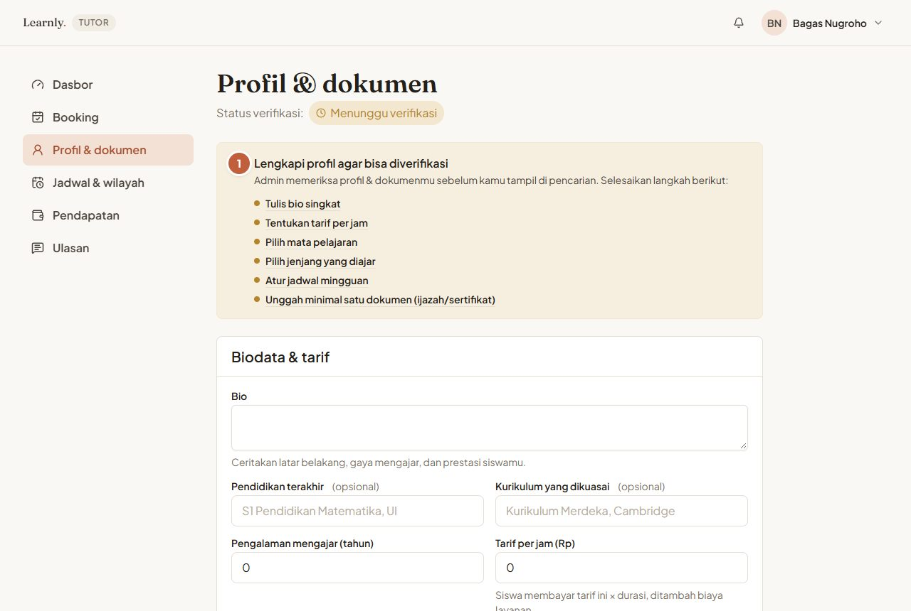
   *Checklist yang harus dilengkapi sebelum diverifikasi.*

Profilmu **belum tampil** di pencarian sampai admin memverifikasinya.

---

## Cara melengkapi profil & dokumen

### Biodata & tarif

1. Tulis **Bio** (1) minimal 30 karakter: latar belakang, gaya mengajar, dan prestasi siswa.
2. Isi pendidikan, kurikulum, dan pengalaman. Tentukan **Tarif per jam** (2). Siswa membayar tarif × durasi ditambah biaya layanan platform.
3. Pilih **Cara mengajar** (3): Online, Tatap muka, atau keduanya. Centang **Terima booking otomatis** bila ingin booking langsung diterima tanpa persetujuanmu. Tekan **Simpan biodata**.

   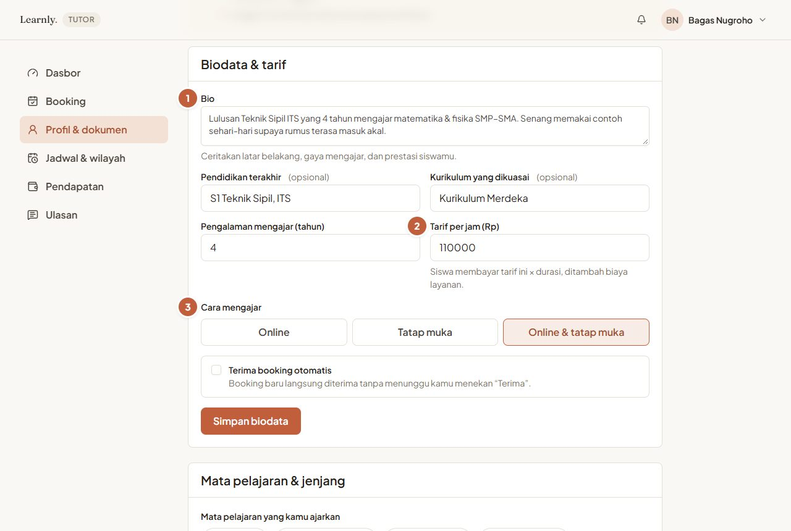
   *Biodata, tarif, dan cara mengajar.*

### Mata pelajaran & jenjang

1. Klik mata pelajaran yang kamu ajarkan (1) dan jenjang siswa (2). Yang terpilih ditandai centang. Tekan **Simpan mapel & jenjang** (3).

   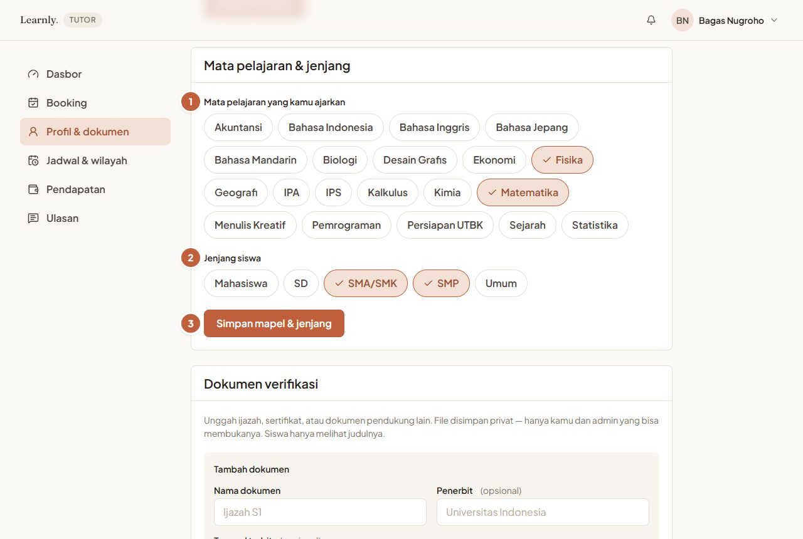
   *Pilih minimal satu mapel dan satu jenjang.*

### Dokumen verifikasi

1. Isi **Nama dokumen** (1), misalnya "Ijazah S1", serta penerbit dan tanggal (opsional).
2. Pilih file di **File dokumen** (2): PDF atau gambar. Tekan **Unggah dokumen** (3).

   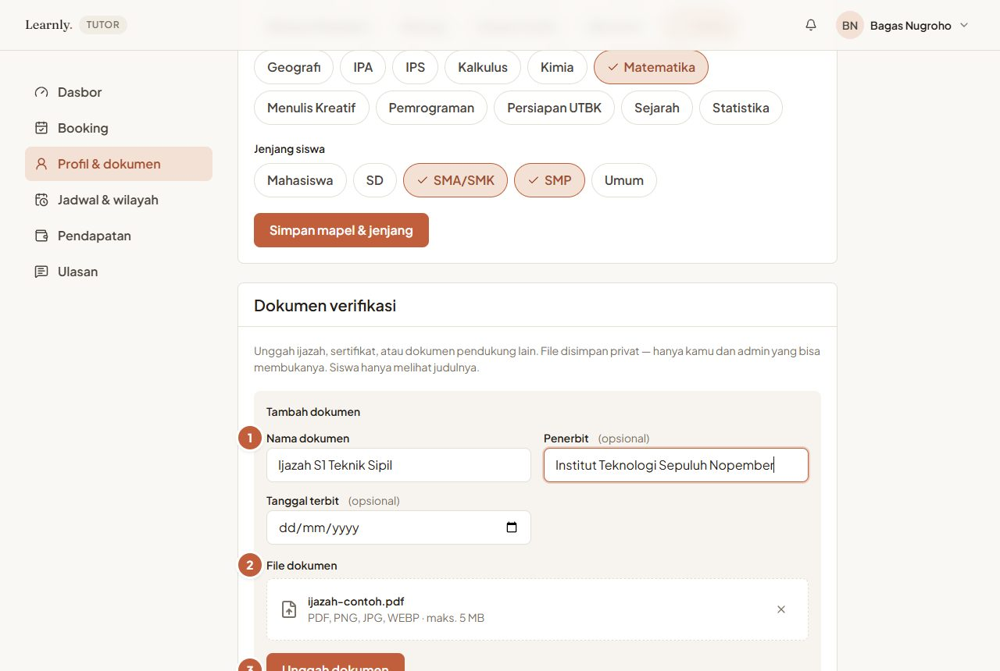
   *Unggah ijazah atau sertifikat.*

> **Tips:** file dokumen disimpan **privat**. Hanya kamu dan admin yang bisa membukanya, sedangkan siswa hanya melihat judulnya. Unggah scan yang jelas supaya verifikasi cepat.

---

## Cara mengatur jadwal, tanggal libur & wilayah

Buka menu **Jadwal & wilayah**.

### Jadwal mingguan

1. Untuk setiap hari (1), tekan **+ Rentang** (2) lalu pilih jam mulai dan jam selesai. Satu hari boleh punya beberapa rentang, misalnya pagi dan sore. Hari tanpa rentang berarti **Libur**.
2. Tekan **Simpan jadwal** (3).

   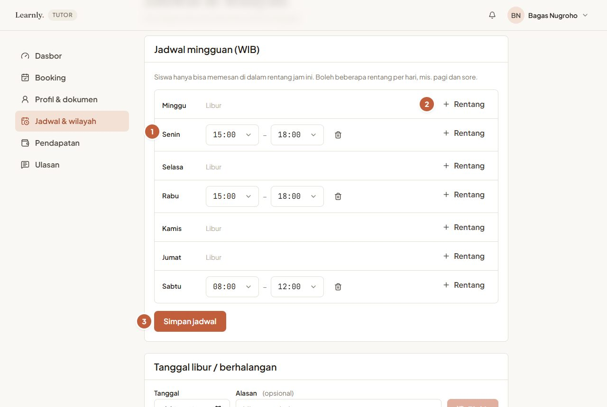
   *Siswa hanya bisa memesan di dalam rentang jam ini (WIB).*

### Tanggal libur / berhalangan

1. Pilih **Tanggal** (1), isi alasan (opsional), lalu tekan **Blokir** (2). Di tanggal itu kamu tidak bisa dipesan. Tekan **Buka lagi** untuk membatalkan.

   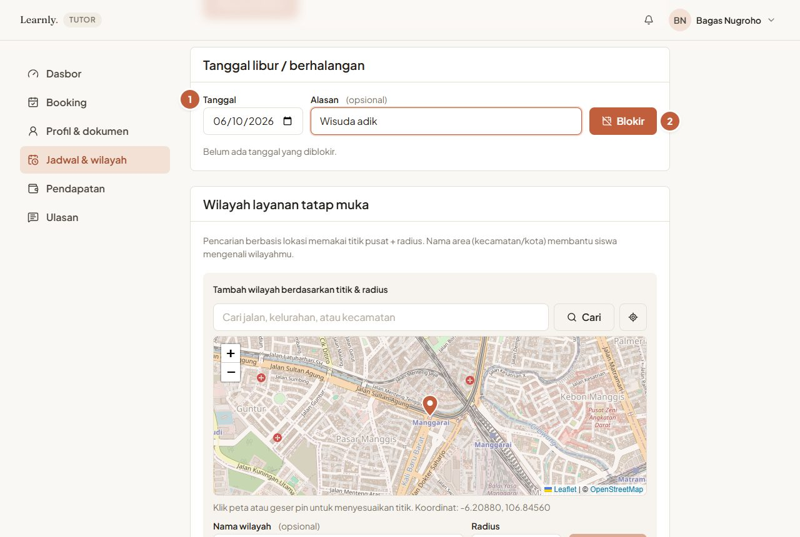
   *Blokir tanggal ketika berhalangan.*

### Wilayah layanan tatap muka

1. Tentukan titik pusat di **peta** (1): klik peta, cari nama tempat, atau pakai tombol lokasi.
2. Beri nama wilayah, pilih **Radius** (2), lalu tekan **Tambah** (3). Siswa yang alamatnya di dalam radius bisa memesanmu untuk tatap muka.

   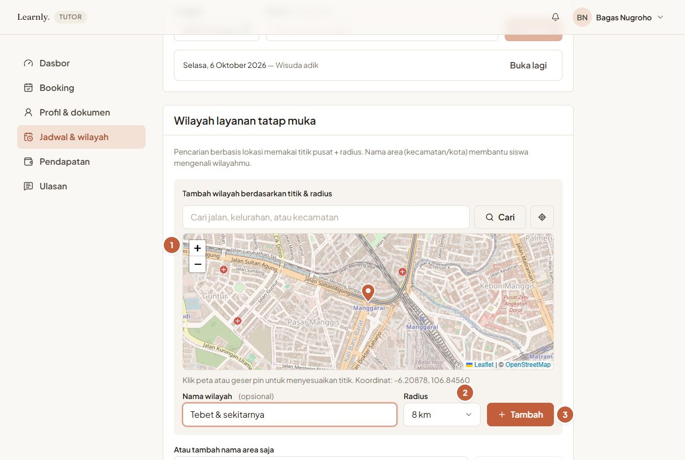
   *Wilayah layanan berdasarkan titik dan radius.*

3. Kamu juga bisa menambah **nama area saja** (misalnya "Kebayoran Baru") sebagai keterangan untuk siswa.

Tutor yang hanya mengajar online tidak perlu mengatur wilayah.

---

## Cara menunggu verifikasi

Setelah checklist lengkap, kotak status berubah menjadi **Profilmu sedang ditinjau tim Learnly** (1). Biasanya selesai dalam 1–2 hari kerja, dan hasilnya dikirim lewat notifikasi.

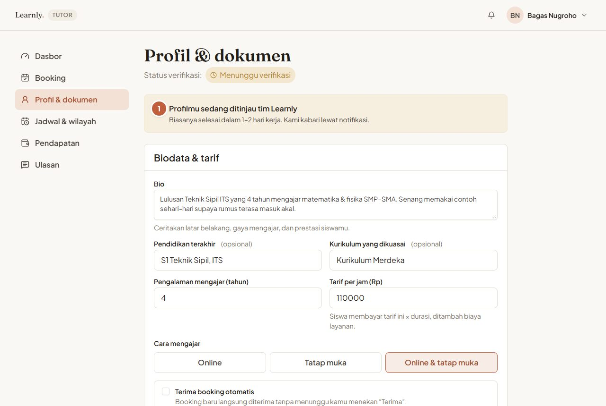
*Profil lengkap dan menunggu diverifikasi admin.*

- **Terverifikasi:** profilmu tampil di pencarian dan bisa menerima booking.
- **Perlu perbaikan:** baca catatan admin di kotak status, perbaiki bagian yang diminta, lalu simpan. Profilmu otomatis masuk antrian lagi.

---

## Cara menerima atau menolak booking

1. **Dasbor** menampilkan permintaan yang menunggu jawabanmu (1), **Sesi mendatang** (2), dan ringkasan pendapatan **Bulan ini** (3).

   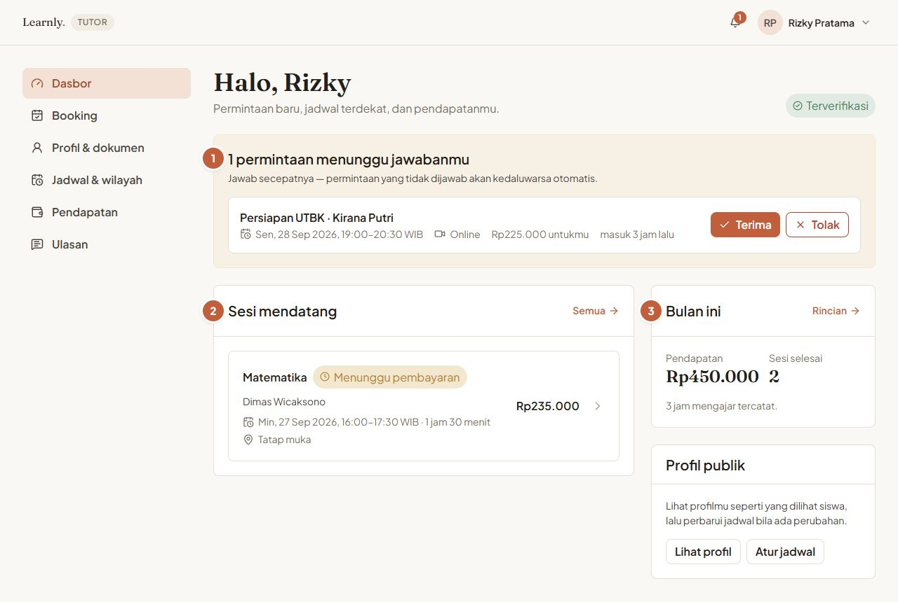
   *Dasbor tutor.*

2. Buka permintaan. Periksa jadwal, siswa, dan lokasi di **Rincian booking** (3), lalu tekan **Terima** (1) atau **Tolak** (2).

   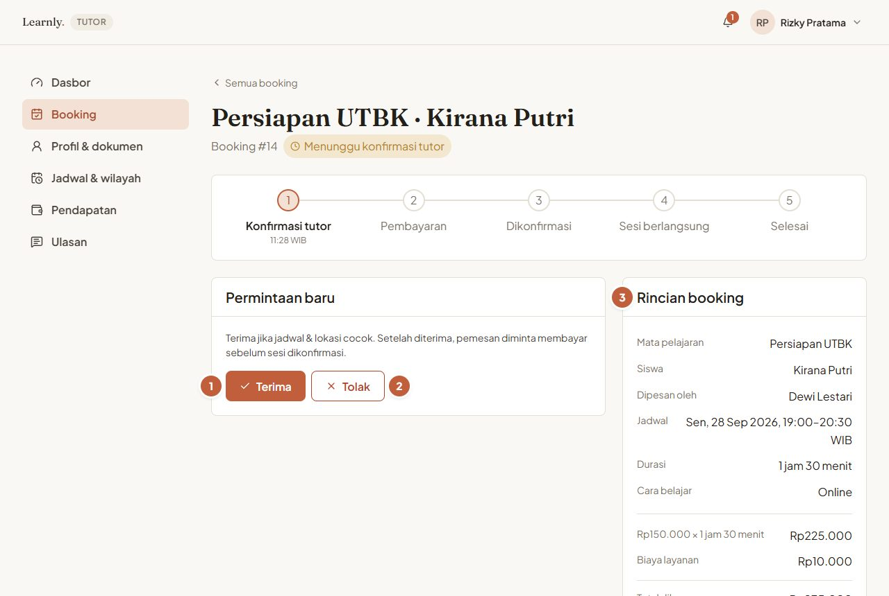
   *Permintaan booking baru.*

3. Kalau menolak, tulis **Alasan penolakan** (1). Alasan ini dikirim ke pemesan, dan slotnya terbuka lagi.

   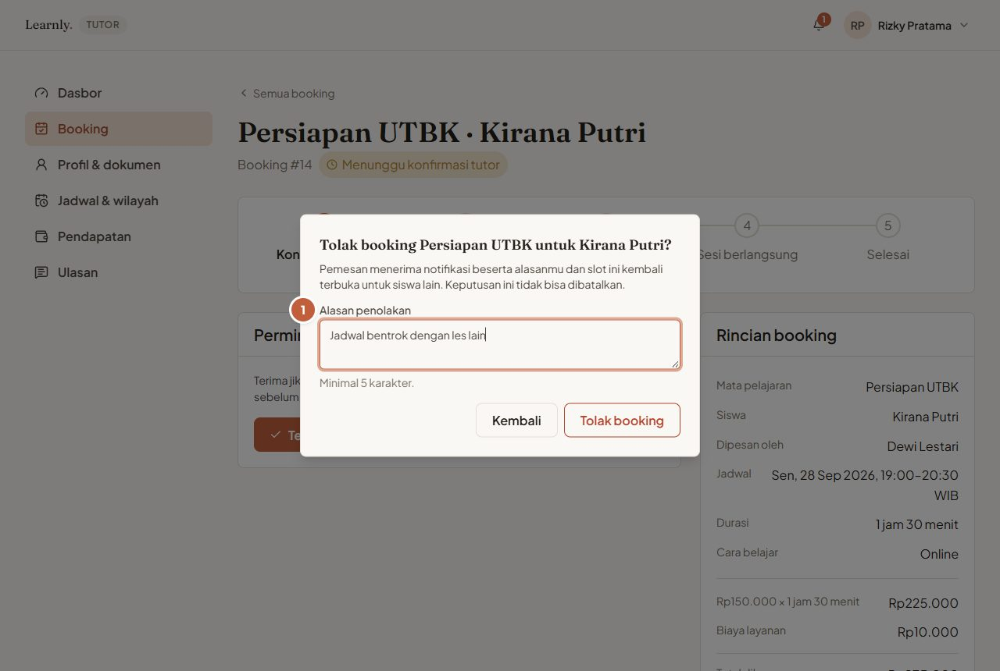
   *Tolak dengan alasan yang jelas.*

4. Setelah diterima, pemesan diminta membayar. Kamu mendapat notifikasi saat pembayaran diverifikasi admin dan booking berstatus **Dikonfirmasi**.
5. Menu **Booking** berisi semua sesi. Pakai tab (1) untuk memisahkan permintaan, jadwal mendatang, dan riwayat.

   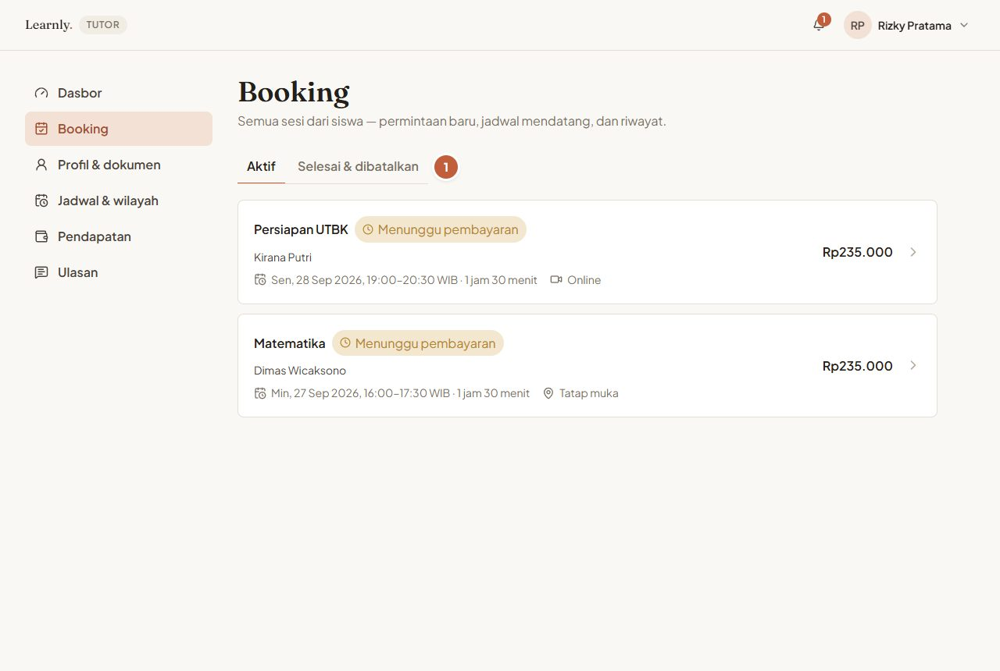
   *Semua booking tutor.*

> **Tips:** jawab permintaan secepatnya. Permintaan yang tidak dijawab dalam **24 jam** otomatis kedaluwarsa.

---

## Cara menjalankan sesi tatap muka di hari-H

Buka booking yang sudah **Dikonfirmasi** dari **Dasbor** atau **Booking**.

1. Progres (1) menunjukkan tahap sesi. Saat mulai bersiap, tekan **Saya sedang bersiap** (2). **Lokasi belajar** (3) menampilkan peta dan tautan **Buka petunjuk arah**.

   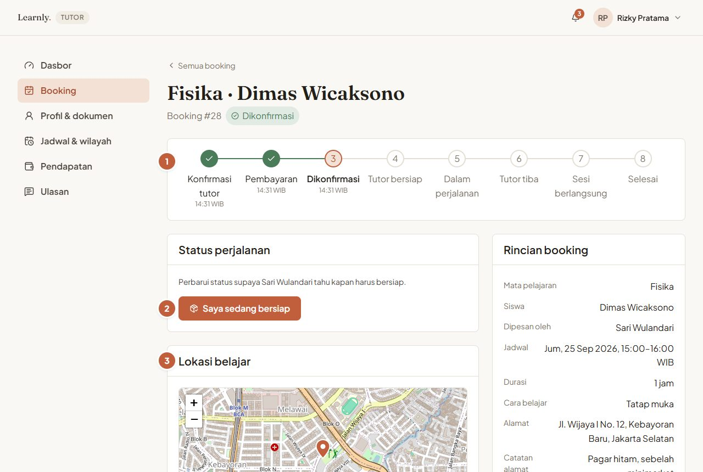
   *Booking dikonfirmasi, siap dijalankan.*

   Di HP, tombolnya ada di panel **Status perjalanan**:

   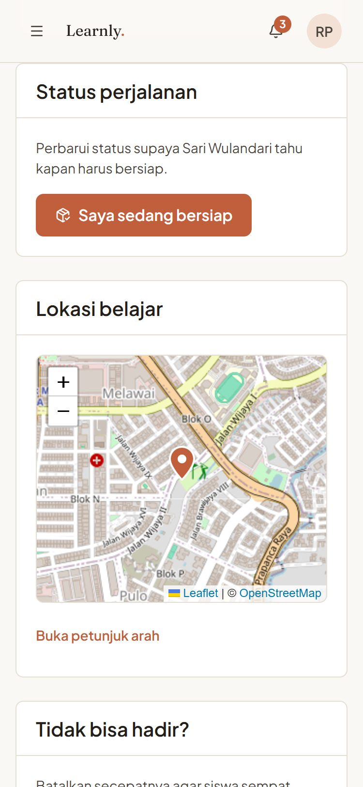

2. Saat berangkat, tekan **Berangkat sekarang**. Lalu tekan **Bagikan lokasi** (2) dan izinkan akses lokasi di browser. Posisimu terkirim otomatis kira-kira setiap 30 detik selama halaman terbuka, sehingga siswa atau orang tua bisa melihatnya di peta.
3. Setibanya di lokasi, tekan **Saya sudah tiba** (1).

   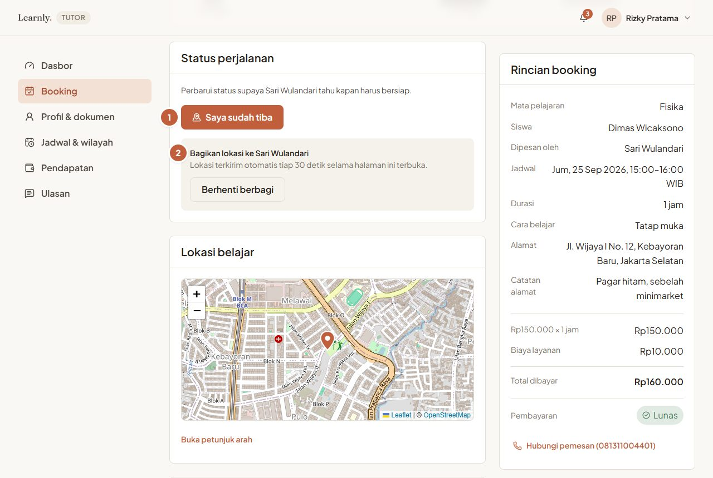
   *Berbagi lokasi saat dalam perjalanan.*

   Kalau lokasi otomatis tidak berjalan, tekan **Berhenti berbagi**, lalu pakai **Tandai posisi di peta secara manual** dan **Kirim posisi ini**.

4. **Check-in dengan QR**: minta siswa atau orang tua menampilkan QR check-in, lalu tekan **Pindai QR dengan kamera** (1) dan arahkan kamera ke QR. Kalau kamera bermasalah, minta siswa menyalin kodenya, tempel di **Kode check-in** (2), lalu tekan **Check-in dengan kode** (3). Setelah check-in, sesi resmi **berlangsung**.

   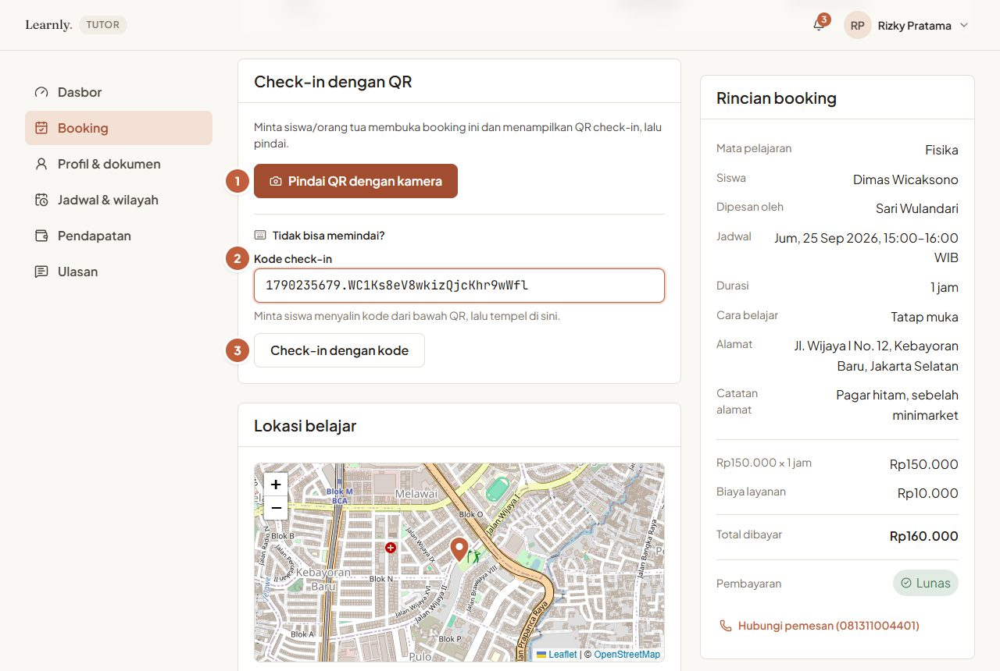
   *Check-in dengan kamera atau kode.*

   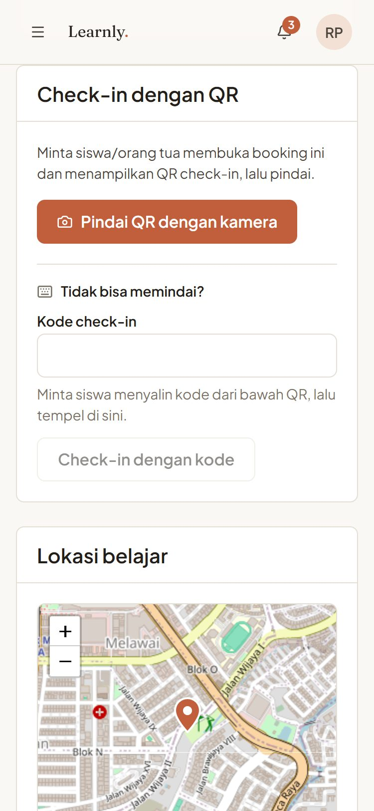
   *Panel check-in di HP.*

5. Setelah les selesai, isi laporan di **Selesaikan sesi**: **Materi yang dibahas** (1), **Tingkat pemahaman** 1–5 (2), serta yang sudah dikuasai, yang perlu ditingkatkan, pekerjaan rumah, dan saran. Tekan **Selesaikan sesi & kirim laporan** (3).

   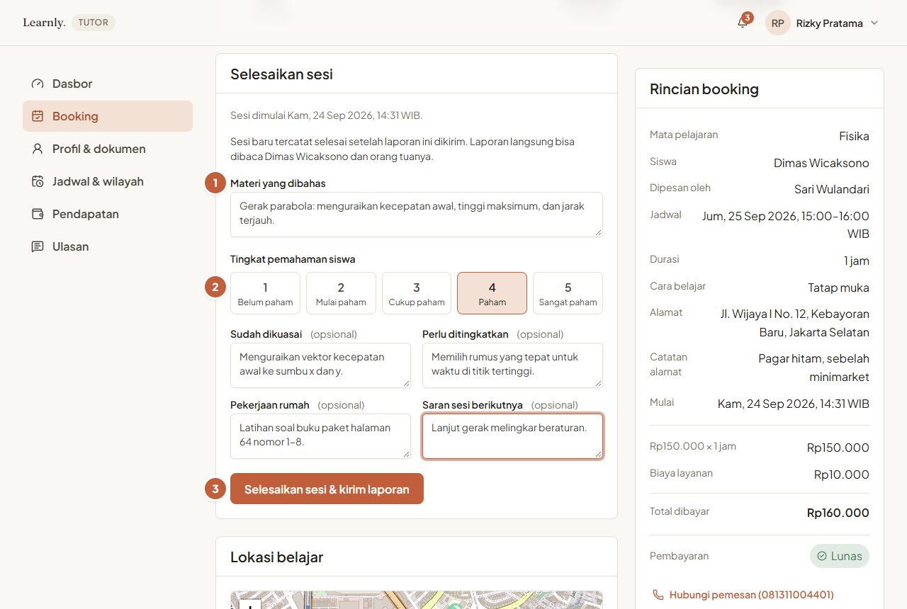
   *Laporan perkembangan dikirim ke siswa/orang tua.*

6. Sesi berstatus **Sesi selesai** (1), dan laporanmu tersimpan di **Laporan yang kamu kirim** (2).

   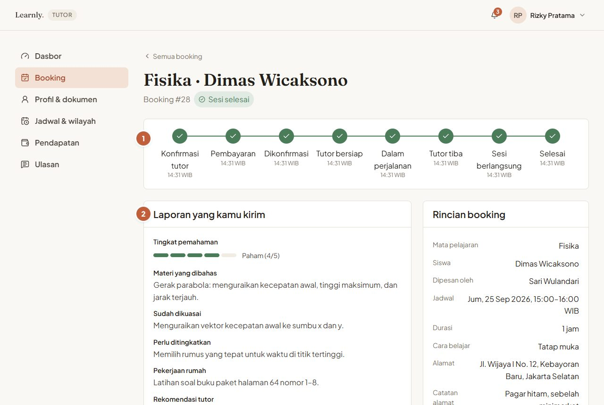
   *Sesi selesai beserta laporannya.*

> **Tips:** QR berlaku 10 menit. Kalau muncul "kedaluwarsa", minta siswa menekan **Muat ulang QR**.

---

## Cara menjalankan sesi online

1. Setelah menerima booking online, tempel link Google Meet/Zoom di **Link meeting** (1), lalu tekan **Kirim link** (2). Link dikirim ke siswa, dan kamu bisa memperbaruinya kapan saja.

   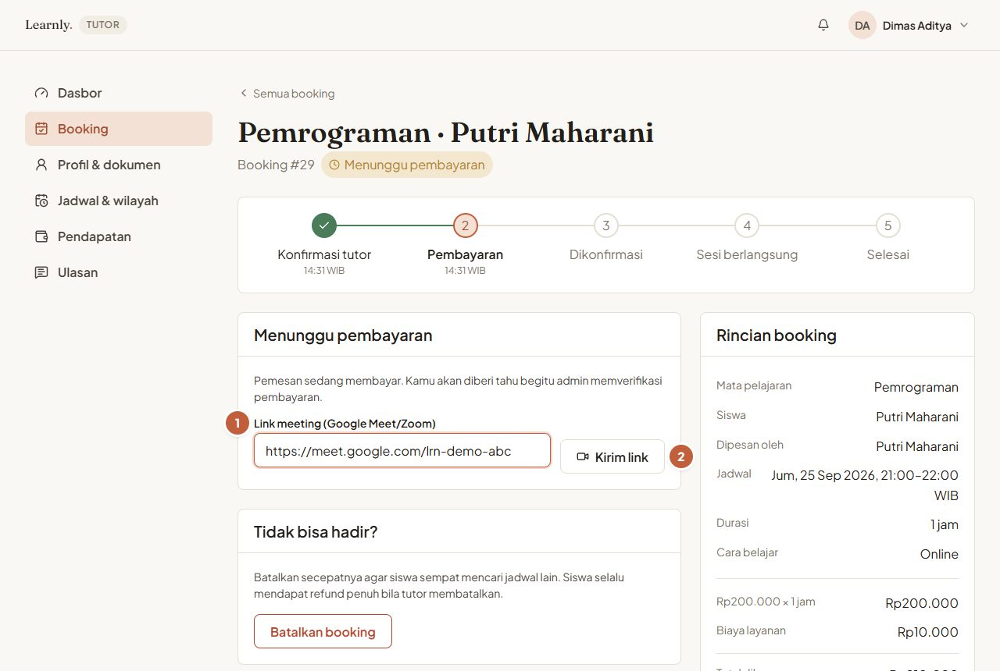
   *Mengirim link meeting untuk sesi online.*

2. Di jam sesi, buka booking, lalu tekan **Mulai sesi**. Tombol ini aktif setelah link terkirim.
3. Setelah selesai, isi laporan yang sama seperti sesi tatap muka (langkah 5 di atas).

---

## Cara melihat pendapatan

Menu **Pendapatan** menampilkan ringkasan per bulan. Pilih bulan (1) untuk melihat ringkasan (2):

- **Pendapatan sesi selesai:** tarif × durasi dari sesi yang sudah selesai.
- **Menunggu sesi berlangsung:** sesi yang sudah dibayar tetapi belum dijalankan.
- **Sesi selesai:** jumlah sesi dan total jam mengajar.

Di bawahnya ada rincian setiap sesi berbayar. Biaya layanan yang dibayar siswa adalah milik platform dan tidak dihitung sebagai pendapatanmu. Aplikasi belum punya fitur pencairan dana. Pencairan diatur langsung dengan tim Learnly.

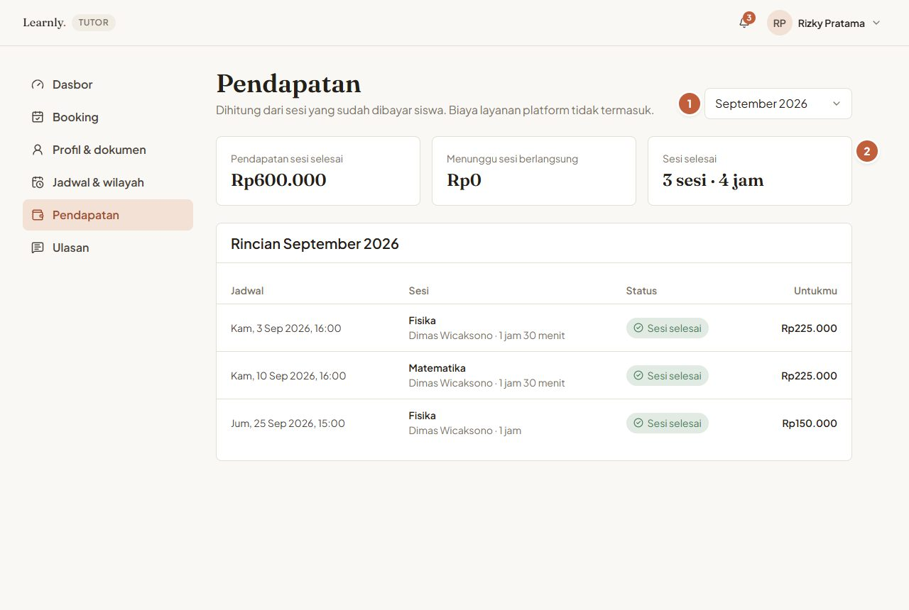
*Pendapatan per bulan.*

---

## Cara membalas ulasan

1. Buka menu **Ulasan**, lalu tekan **Balas ulasan** di bawah ulasan yang ingin dibalas.
2. Tulis balasan di **Balasanmu** (1), lalu tekan **Kirim balasan** (2). Balasan tampil publik di profilmu dan **hanya bisa dikirim sekali**.

   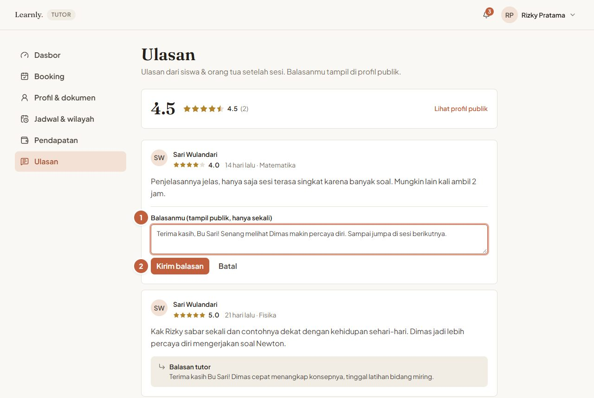
   *Membalas ulasan siswa.*

Dasbor di HP:

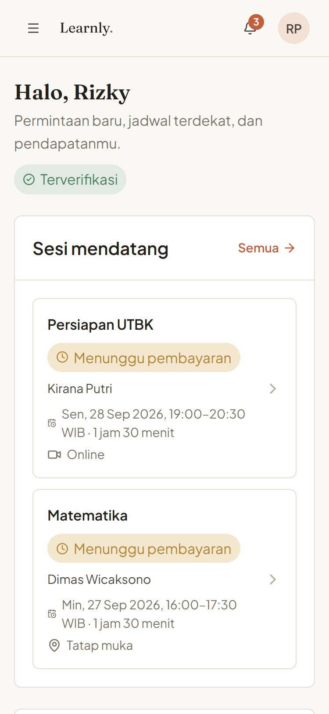

---

## Kalau ada masalah

| Masalah | Yang bisa dilakukan |
| --- | --- |
| Profil tidak muncul di pencarian | Pastikan status **Terverifikasi** dan checklist lengkap. Untuk tatap muka, wilayah layanan harus mencakup lokasi siswa. |
| Status "Perlu perbaikan" | Baca catatan admin di **Profil & dokumen**, perbaiki, lalu simpan. Profilmu otomatis diajukan ulang. |
| Siswa tidak bisa memesan jam tertentu | Jam itu di luar jadwal mingguan, tanggalnya diblokir, atau sudah terisi booking lain. |
| Izin lokasi ditolak | Aktifkan izin lokasi untuk situs Learnly di pengaturan browser, atau tandai posisi manual di peta. |
| Kamera tidak mau terbuka | Izinkan akses kamera di browser, atau pakai **Kode check-in**. |
| Tidak bisa hadir | Buka booking lalu **Batalkan booking** secepatnya. Siswa selalu mendapat refund penuh bila tutor membatalkan. |
| Tombol **Mulai sesi** tidak aktif | Kirim link meeting terlebih dahulu. |
