# Panduan Admin

Untuk tim operasional Learnly: memverifikasi tutor dan pembayaran, menangani refund dan dispute, mengelola kursus dan master data, memoderasi ulasan, menangguhkan pengguna, dan mengatur platform.

Akun contoh: `admin@demo.learnly.id` · password `Demo#2026`.

> Akun admin tidak bisa dibuat lewat halaman daftar. Admin pertama dibuat oleh seeder (`npm run db:seed`, lihat [README utama](../../README.md)).

Isi:

1. [Cara masuk & membaca dasbor](#cara-masuk--membaca-dasbor)
2. [Cara memverifikasi tutor](#cara-memverifikasi-tutor)
3. [Cara memverifikasi pembayaran](#cara-memverifikasi-pembayaran)
4. [Cara menangani refund & dispute](#cara-menangani-refund--dispute)
5. [Cara mengelola master data](#cara-mengelola-master-data)
6. [Cara membuat & menerbitkan kursus](#cara-membuat--menerbitkan-kursus)
7. [Cara mereview kursus kiriman](#cara-mereview-kursus-kiriman)
8. [Cara menilai tugas peserta](#cara-menilai-tugas-peserta)
9. [Cara memoderasi ulasan](#cara-memoderasi-ulasan)
10. [Cara menangguhkan pengguna](#cara-menangguhkan-pengguna)
11. [Cara mengatur platform](#cara-mengatur-platform)
12. [Kalau ada masalah](#kalau-ada-masalah)

---

## Cara masuk & membaca dasbor

1. Masuk dengan akun admin. Kamu langsung diarahkan ke **Ringkasan**.
2. Baris **Perlu ditindaklanjuti** (1) berisi jumlah bukti bayar yang menunggu, tutor yang menunggu verifikasi, refund tertunda, dan kursus yang perlu direview. Klik untuk langsung ke antriannya.
3. Kartu angka (2) menampilkan **GMV (lunas)**, **Pendapatan platform** (biaya layanan), **Sesi selesai**, dan **Refund** untuk periode yang dipilih di kanan atas (misalnya 30 hari terakhir).
4. **Booking per status** (3) dan **Kursus terlaris** membantu memantau aktivitas.

   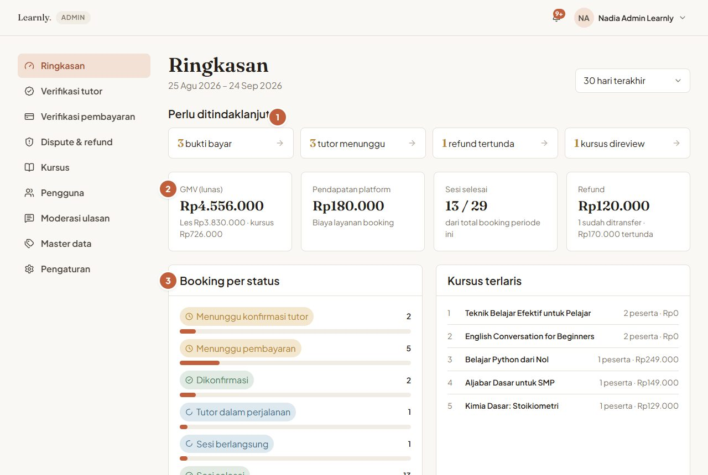
   *Ringkasan KPI dan antrian kerja.*

   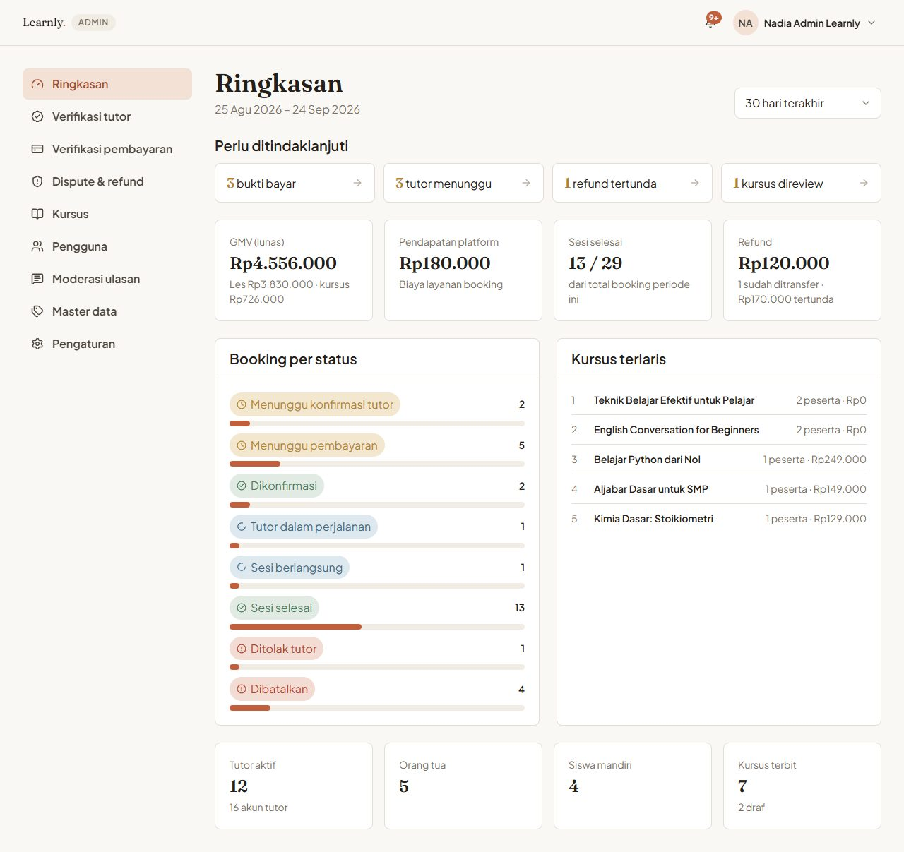
   *Dasbor lengkap, termasuk jumlah pengguna dan kursus terbit.*

---

## Cara memverifikasi tutor

1. Buka **Verifikasi tutor**. Tab (1) memisahkan **Menunggu**, **Terverifikasi**, dan **Perlu perbaikan**. Setiap baris (2) menampilkan mapel, tarif, dan kekurangan profil bila ada.

   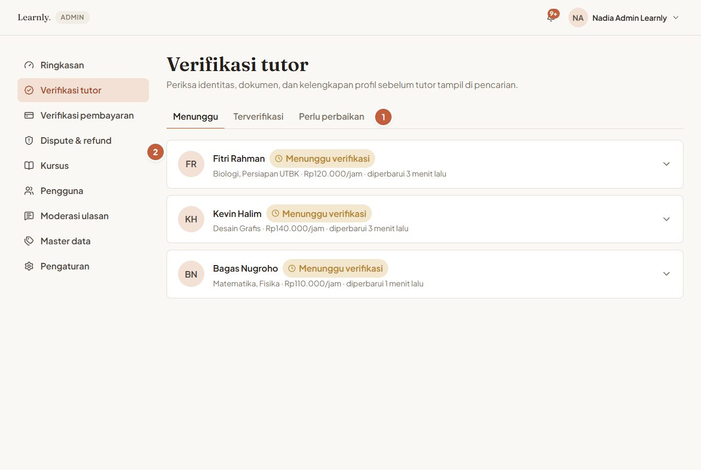
   *Tutor yang menunggu verifikasi.*

2. Klik baris tutor untuk membuka detailnya: kontak, bio, pendidikan, jadwal, wilayah, dan **Dokumen** (1). Tekan **Buka file** (2) untuk memeriksa ijazah atau sertifikat.
3. Bila semuanya sesuai, tekan **Verifikasi tutor** (3). Tutor langsung tampil di pencarian dan mendapat notifikasi.

   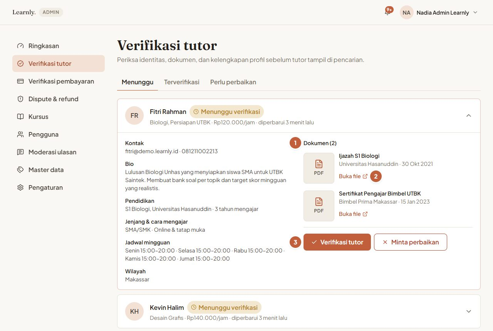
   *Periksa identitas dan dokumen sebelum memverifikasi.*

4. Bila ada yang kurang, tekan **Minta perbaikan**, tulis **Catatan untuk tutor** (1) yang jelas, lalu tekan **Kirim catatan** (2). Tutor bisa memperbaiki profil, dan profilnya otomatis masuk antrian lagi.

   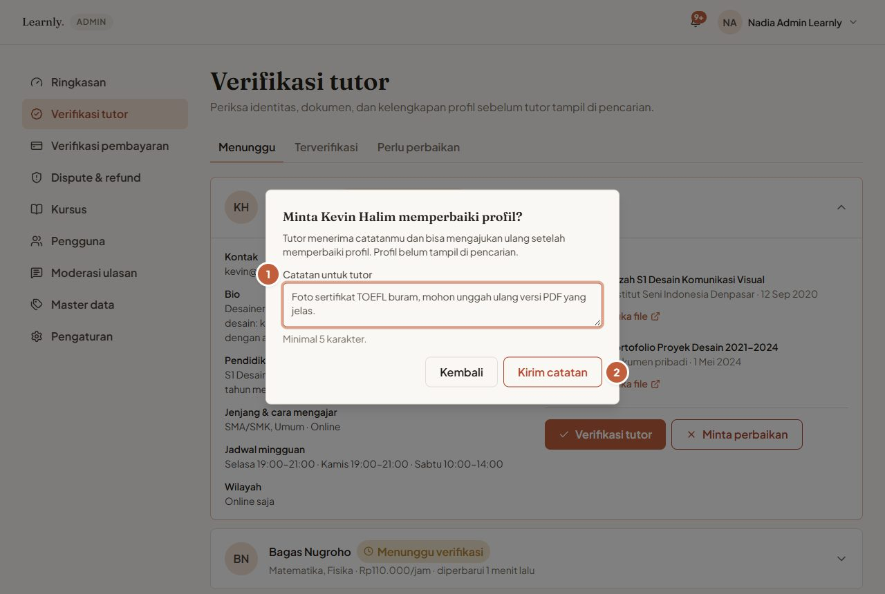
   *Catatan dikirim ke tutor.*

> **Tips:** tutor dengan profil belum lengkap tetap bisa diverifikasi, tetapi tidak muncul di pencarian lokasi sampai datanya lengkap. Untuk tutor yang sudah terverifikasi, tombolnya menjadi **Cabut verifikasi**.

---

## Cara memverifikasi pembayaran

Learnly tidak memakai payment gateway. Setiap pembayaran dicocokkan manual dengan mutasi rekening atau QRIS.

1. Buka **Verifikasi pembayaran**, tab **Perlu diverifikasi** (1). Setiap baris menampilkan nominal, untuk apa (les atau kursus), pembayar, dan jadwal sesi. Saring les/kursus lewat **Jenis**.
2. Klik gambar bukti (2) untuk memperbesarnya.

   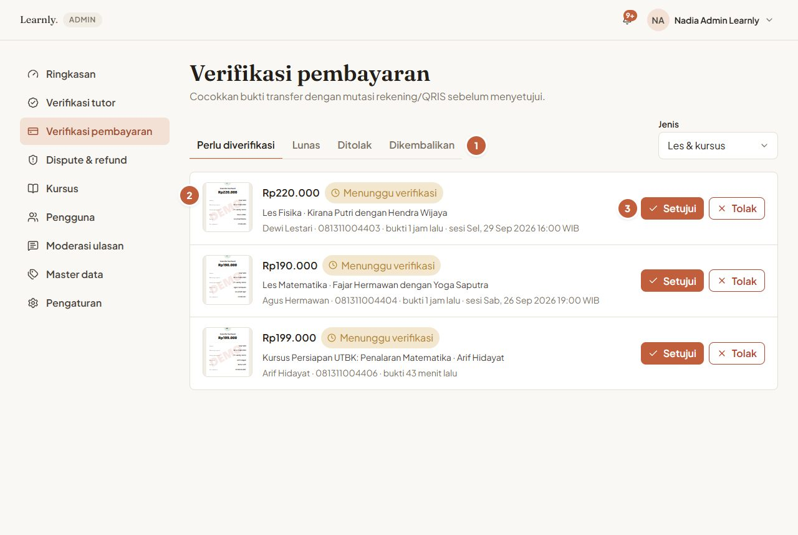
   *Bukti transfer yang menunggu dicek.*

3. Periksa **nominal**, **tanggal**, dan **rekening tujuan**, lalu cocokkan dengan mutasi rekening atau QRIS merchant.

   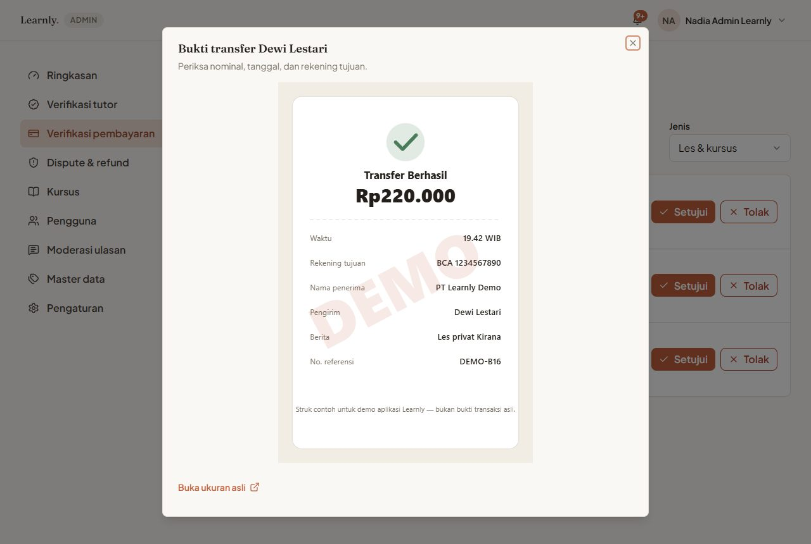
   *Bukti transfer diperbesar. Struk demo bertanda "DEMO".*

4. Kalau cocok, tekan **Setujui** (3). Booking langsung **Dikonfirmasi** (atau kursus terbuka), dan pembayar serta tutor mendapat notifikasi.
5. Kalau tidak cocok, tekan **Tolak**, tulis **Alasan penolakan** (1), lalu tekan **Tolak pembayaran** (2). Booking terkait **dibatalkan** dan slot tutor dibuka lagi.

   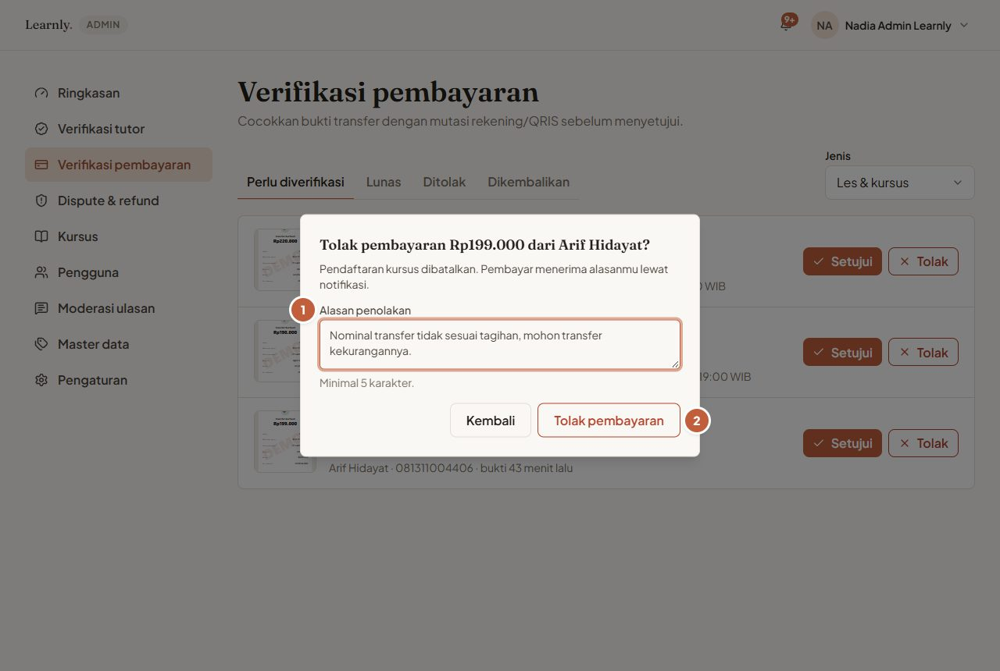
   *Penolakan selalu disertai alasan.*

   Tampilan antrian di HP:

   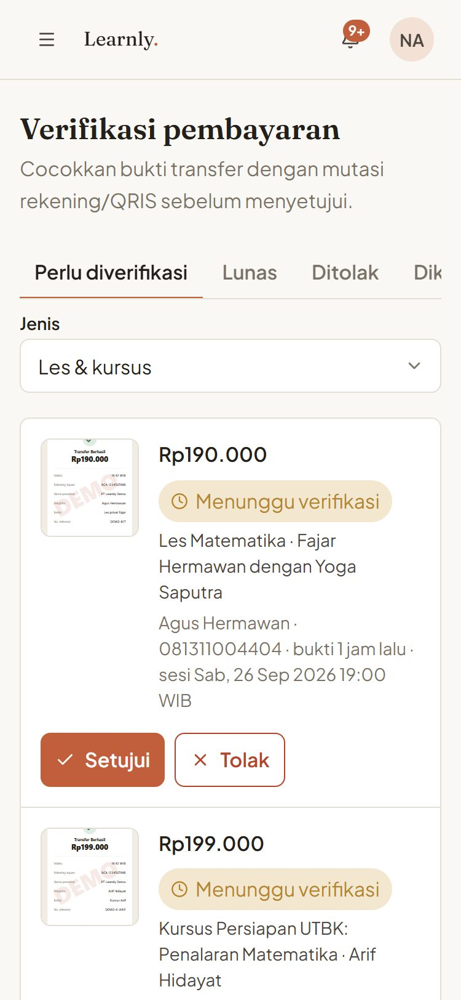

> **Tips:** tab **Lunas**, **Ditolak**, dan **Dikembalikan** berisi riwayat. Dari tab **Lunas** kamu juga bisa mencatat refund.

---

## Cara menangani refund & dispute

Menu **Dispute & refund** mengumpulkan kasus yang butuh tindakan manual. Kartu di atas (1) menghitung **Refund tertunda**, **Bukti setelah batal**, **Sesi macet**, dan **Pembayaran ditolak** (30 hari terakhir).

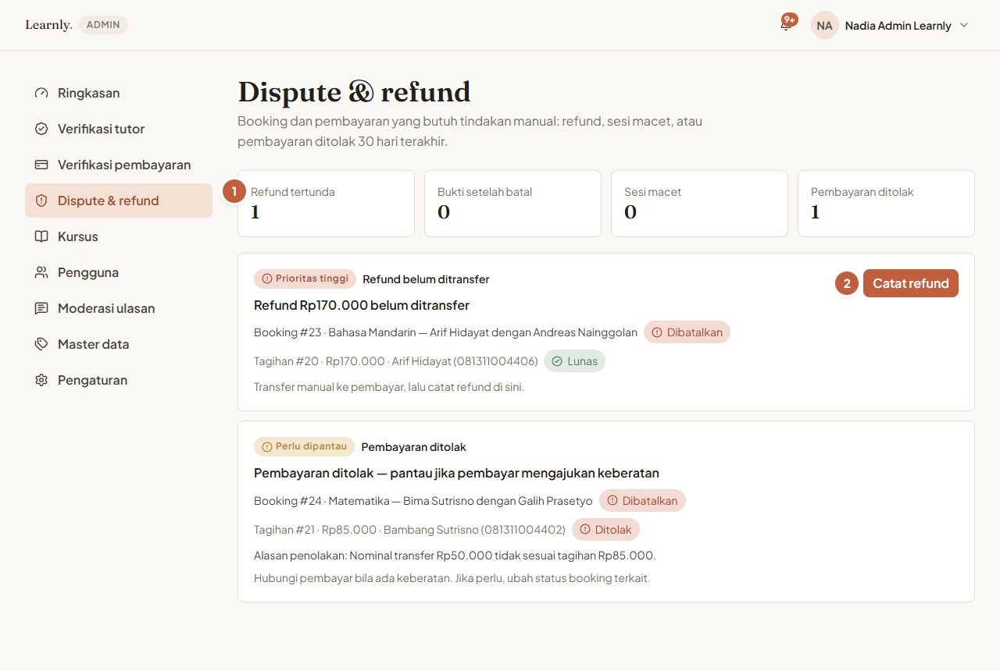
*Kasus yang perlu ditangani, diurutkan menurut prioritas.*

### Mencatat refund

Refund muncul otomatis saat booking yang sudah dibayar dibatalkan. Besarnya mengikuti kebijakan pembatalan.

1. Transfer dana ke pembayar **di luar aplikasi** (lewat mobile banking).
2. Tekan **Catat refund** pada kasusnya (nomor 2 di gambar atas). Di jendela yang muncul, **Nominal refund** (1) sudah terisi sesuai kebijakan, dan kamu bisa mengubahnya bila perlu. Isi **Catatan / nomor referensi transfer** (2), lalu tekan **Catat refund** (3).

   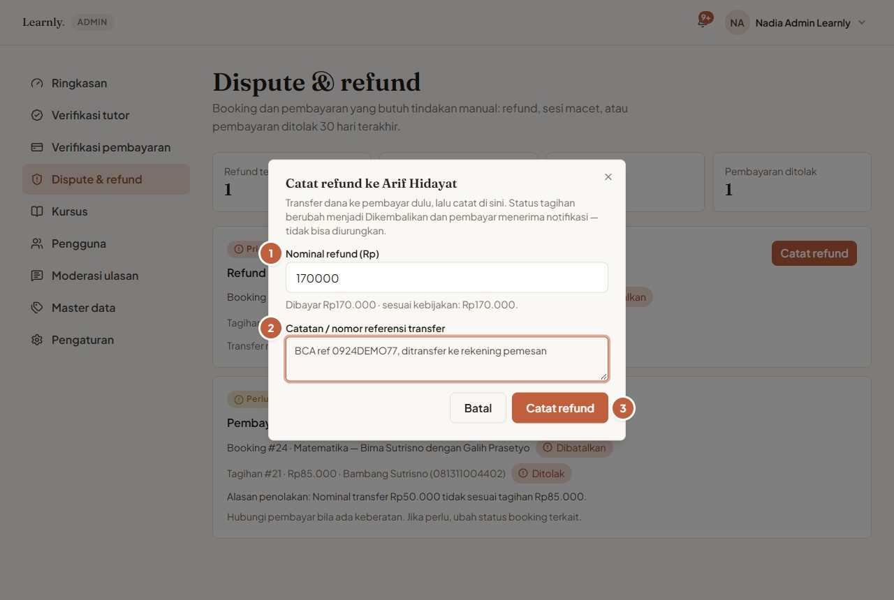
   *Status tagihan menjadi "Dana dikembalikan" dan pembayar mendapat notifikasi. Langkah ini tidak bisa dibatalkan.*

### Mengubah status booking (sesi macet)

Untuk kasus **Sesi macet** (misalnya tutor lupa check-in atau check-out), muncul tombol **Ubah status booking**. Pilih **Status baru**, tulis alasan (dicatat di riwayat dan dikirim ke pihak terkait), lalu tekan **Ubah status**. Data demo tidak berisi sesi macet, jadi langkah ini tidak bergambar.

Untuk **Pembayaran ditolak**, pantau saja. Hubungi pembayar bila mereka mengajukan keberatan.

---

## Cara mengelola master data

Buka **Master data**. Tab (1) berisi **Mata pelajaran**, **Jenjang**, dan **Kategori kursus**.

1. Ketik nama baru di kolom tambah (2), lalu tekan Enter atau tombol tambah.
2. Ikon pensil (3) mengubah nama, dan ikon tempat sampah menghapus. Data yang sudah dipakai tutor, booking, atau kursus tidak bisa dihapus.

   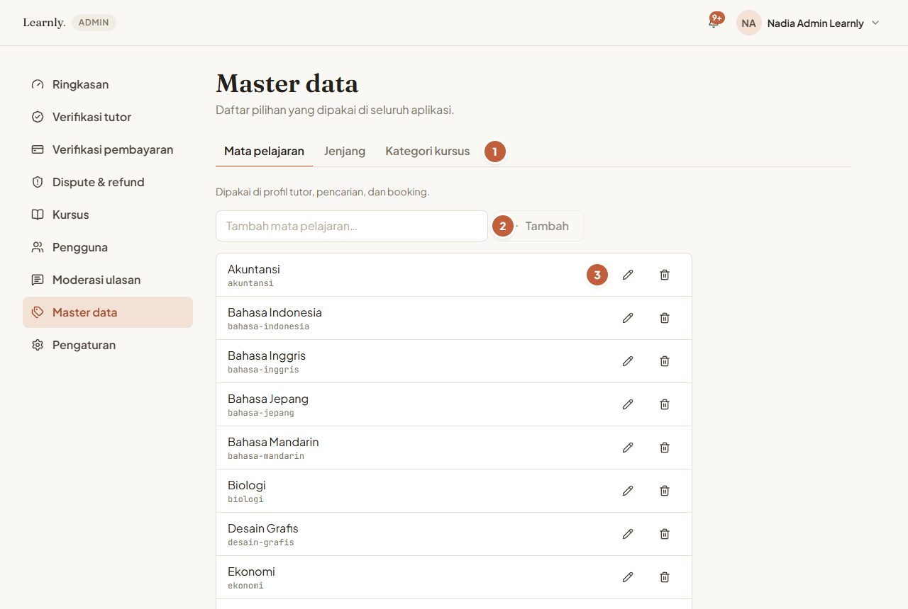
   *Daftar pilihan yang dipakai di seluruh aplikasi.*

---

## Cara membuat & menerbitkan kursus

Alur kursus: **Draf → Menunggu review → Terbit** (atau dikembalikan ke draf dengan catatan).

1. Buka **Kursus**. Tab (1) memisahkan kursus per status. Tekan **Buat kursus** (2).

   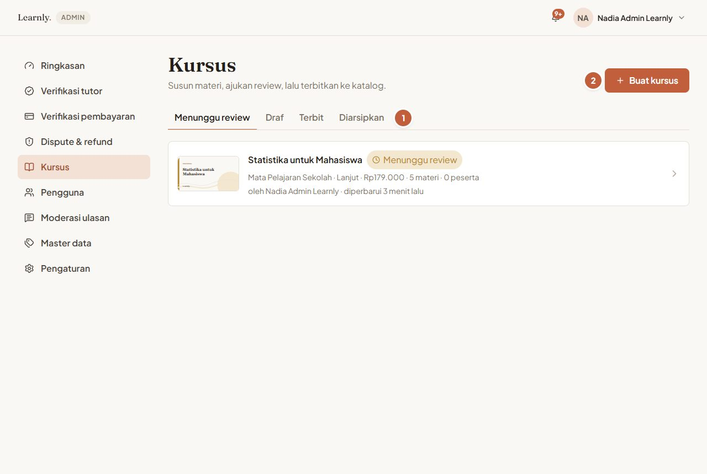
   *Kursus per status.*

2. Isi **Judul kursus** (1), deskripsi, **Kategori** (2), jenjang, dan tingkat kesulitan. Di bagian **Harga** (3), centang **Kursus gratis** atau isi harga. **Nilai lulus** boleh dikosongkan untuk memakai default platform. Tekan **Buat kursus (draf)** (4).

   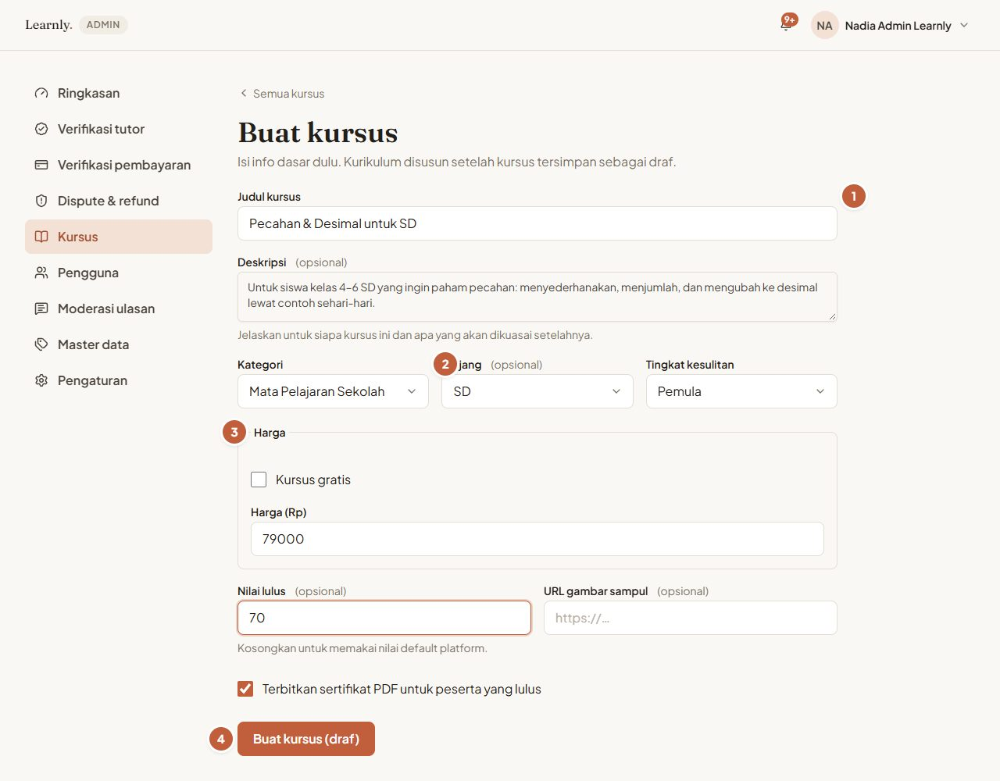
   *Info dasar kursus.*

3. Kamu diarahkan ke tab **Kurikulum**. Ketik nama modul di kolom **Nama modul baru**, lalu tekan **Tambah modul**.
4. Di dalam modul, tekan **Tambah materi**. Isi **Judul materi** (1) dan pilih **Jenis** (2):
   - **Video:** URL video (misalnya YouTube) dan durasi.
   - **Bacaan:** isi bacaan (3), plus **URL lampiran PDF** opsional.
   - **Kuis (dinilai otomatis):** soal pilihan ganda.
   - **Tugas (dinilai instruktur):** instruksi tugas. Peserta mengunggah file.

   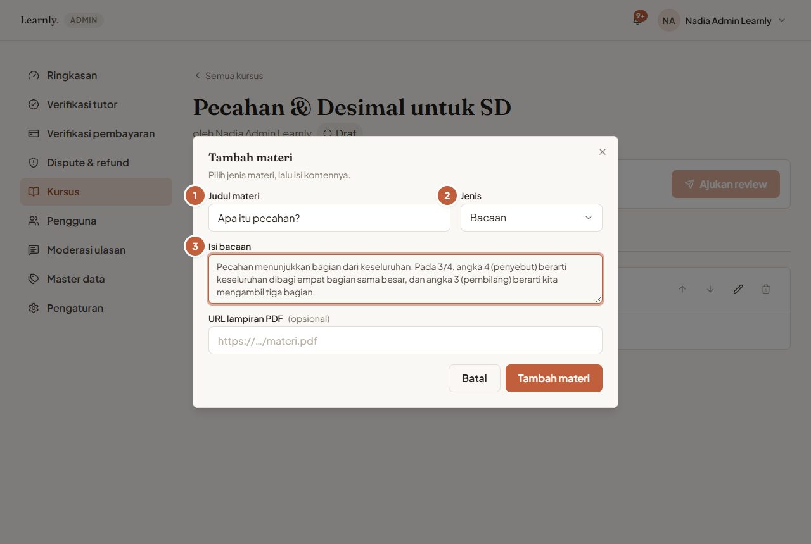
   *Menambah materi bacaan.*

5. Untuk **kuis**, tulis pertanyaan (1), isi pilihan jawaban, lalu klik lingkaran di samping jawaban yang benar (2). Tekan **Tambah soal** (3) untuk soal berikutnya dan **Tambah pilihan** untuk opsi tambahan.

   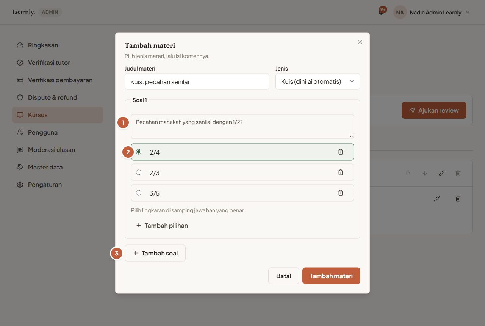
   *Menyusun soal kuis.*

6. Kurikulum tersusun per modul (1). Ubah urutan dengan panah, ubah atau hapus materi dengan ikon, dan tambah materi lagi (2). Setelah siap, tekan **Ajukan review** (3).

   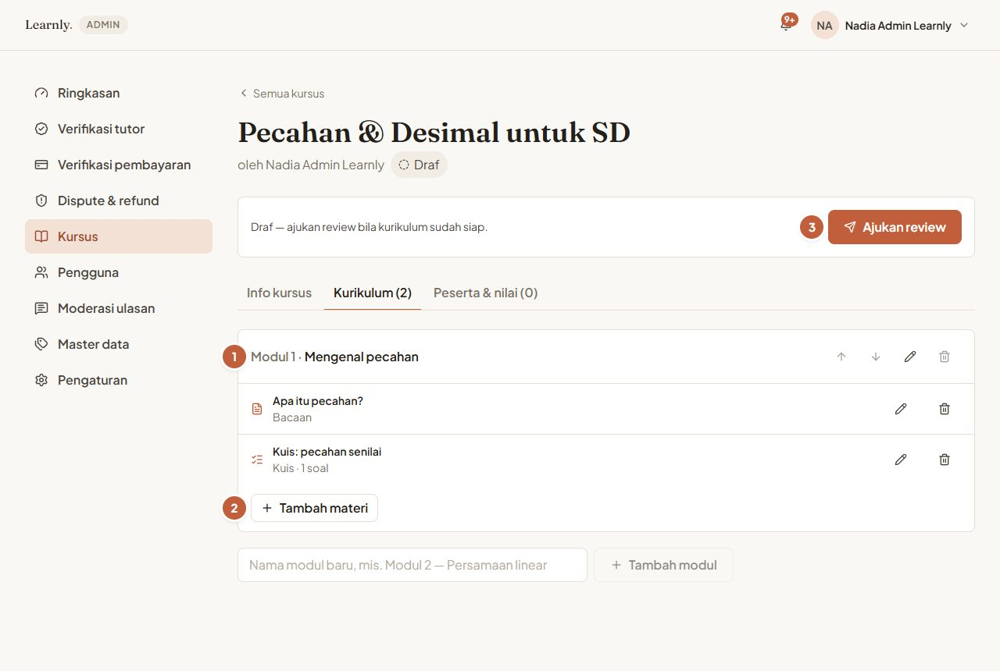
   *Kurikulum siap diajukan.*

7. Kursus berstatus **Menunggu review**. Tekan **Terbitkan**, lalu konfirmasi dengan **Terbitkan kursus** (1). Kursus langsung tampil di katalog.

   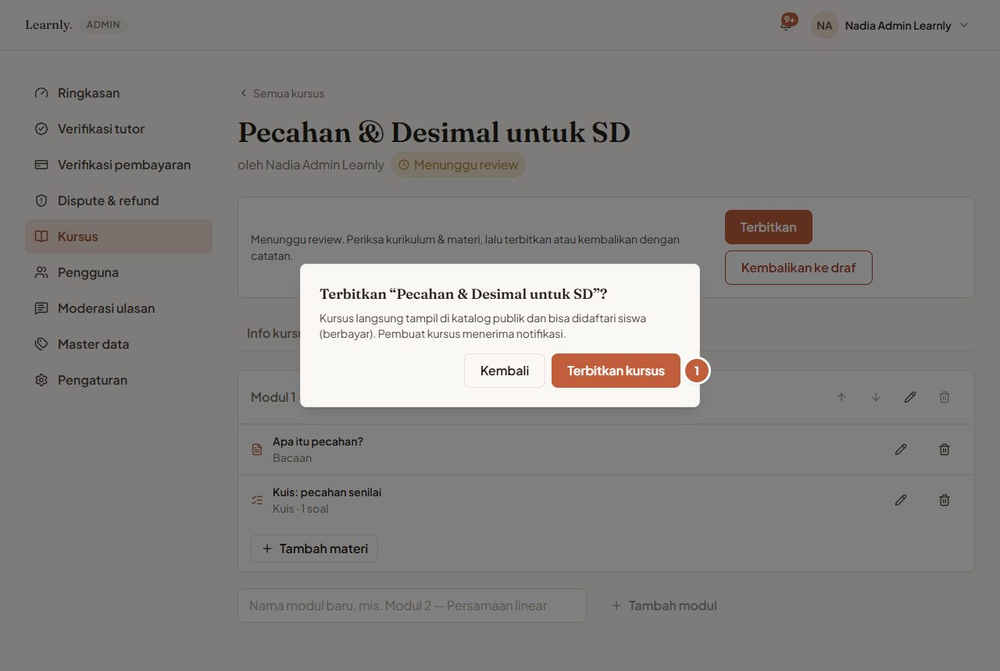
   *Konfirmasi penerbitan.*

> **Tips:** kursus yang sudah terbit tetap bisa diubah, dan perubahannya langsung terlihat oleh peserta. Hati-hati menghapus materi yang sudah dikerjakan peserta.

---

## Cara mereview kursus kiriman

1. Di **Kursus**, tab **Menunggu review**, buka kursusnya. Periksa info, kurikulum, dan setiap materi.
2. Kalau sudah layak, tekan **Terbitkan**.
3. Kalau belum, tekan **Kembalikan ke draf**, tulis **Catatan untuk pembuat kursus** (1), lalu tekan **Kembalikan dengan catatan**.

   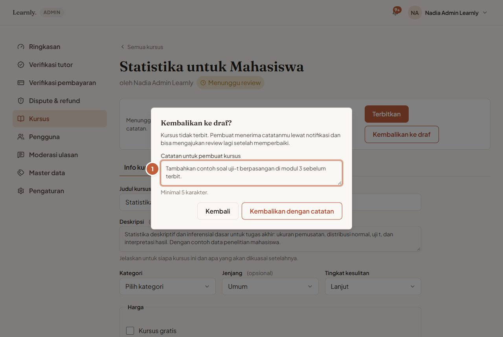
   *Kursus dikembalikan dengan catatan perbaikan.*

---

## Cara menilai tugas peserta

1. Buka kursus, lalu pilih tab **Peserta & nilai**. Setiap peserta menampilkan progres, nilai kuis, dan tugas. Tugas yang belum dinilai punya tombol **Beri nilai**.
2. Tekan **Beri nilai**, buka file lewat **Buka file tugas**, lalu isi **Nilai (0–100)** (1) dan **Catatan untuk peserta** (2). Tekan **Simpan nilai** (3).

   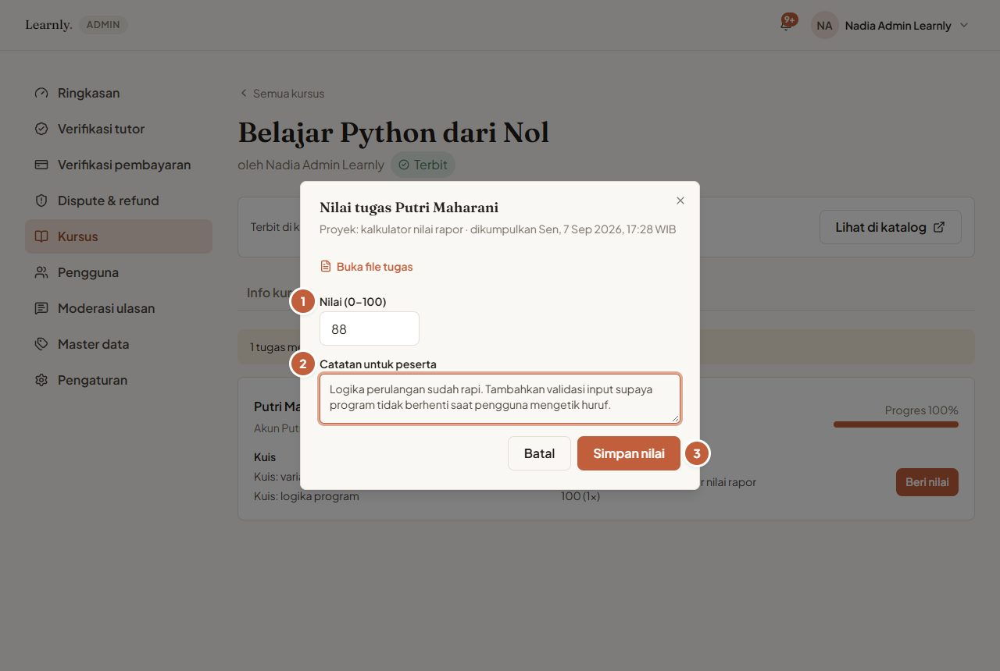
   *Menilai tugas. Peserta mendapat notifikasi.*

Setelah semua tugas dinilai dan rata-rata nilai mencapai batas lulus, sertifikat peserta terbit otomatis.

---

## Cara memoderasi ulasan

1. Buka **Moderasi ulasan**. Tab (1) berisi **Tampil**, **Disembunyikan**, dan **Semua**. Saring ulasan tutor atau kursus lewat **Jenis**.
2. Tekan **Sembunyikan** (2) pada ulasan yang melanggar aturan, misalnya berisi kata kasar atau data pribadi.

   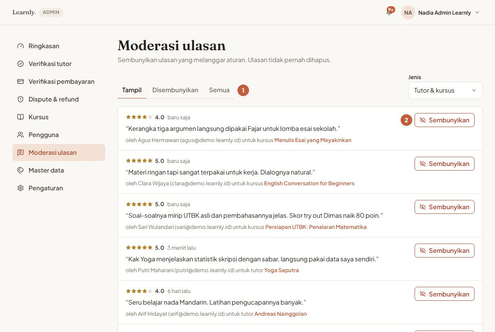
   *Daftar ulasan.*

3. Tulis **Alasan** (1). Alasan dikirim ke penulis ulasan. Tekan **Sembunyikan ulasan**.

   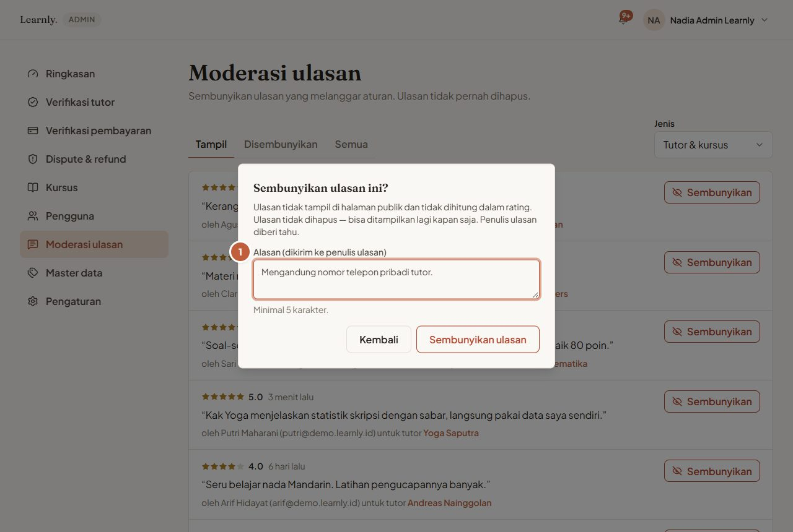
   *Ulasan disembunyikan, bukan dihapus.*

Ulasan yang disembunyikan tidak tampil publik dan tidak dihitung dalam rating. Untuk menampilkannya lagi, buka tab **Disembunyikan** lalu tekan **Tampilkan**.

---

## Cara menangguhkan pengguna

1. Buka **Pengguna**. Cari nama atau email (1), atau saring per **Peran** dan **Status**.
2. Tekan **Tangguhkan** (2) di baris pengguna.

   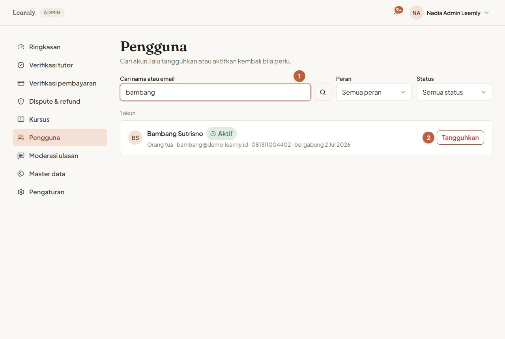
   *Mencari akun.*

3. Tulis **Alasan** (1). Alasan dikirim ke pengguna. Tekan **Tangguhkan akun** (2).

   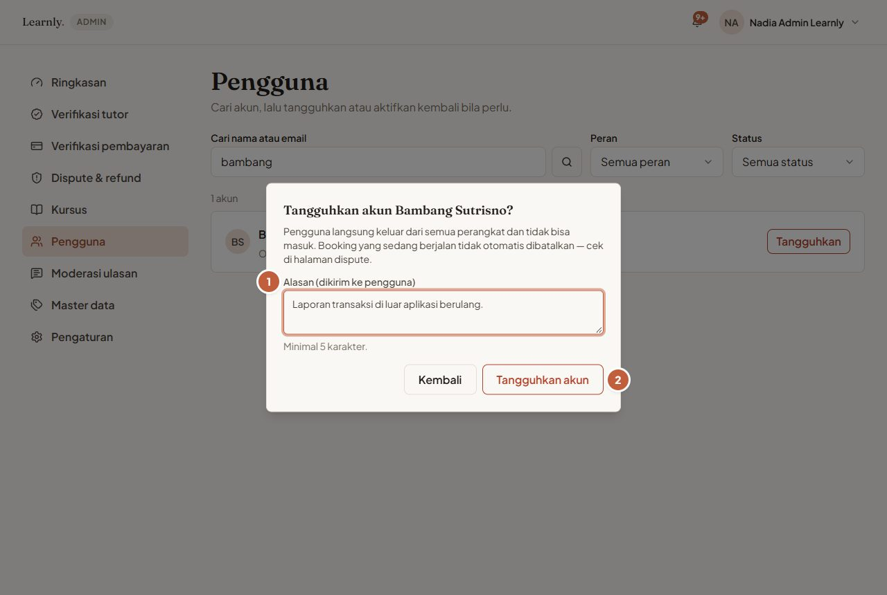
   *Konfirmasi penangguhan.*

Pengguna langsung keluar dari semua perangkat dan tidak bisa masuk. Booking yang sedang berjalan **tidak** otomatis dibatalkan, jadi cek menu dispute. Tekan **Aktifkan lagi** untuk memulihkan akun.

---

## Cara mengatur platform

Buka **Pengaturan**.

1. **Gambar QRIS** (1): gambar QR yang tampil di halaman pembayaran. Pilih file baru di **Unggah QRIS baru** (2), lalu tekan **Ganti QRIS**. Pastikan QR terbaca jelas dan nama merchant terlihat.
2. **Biaya layanan** (3): pilih jenis biaya (**Nominal tetap per booking** atau **Persentase dari subtotal**) dan besarnya.

   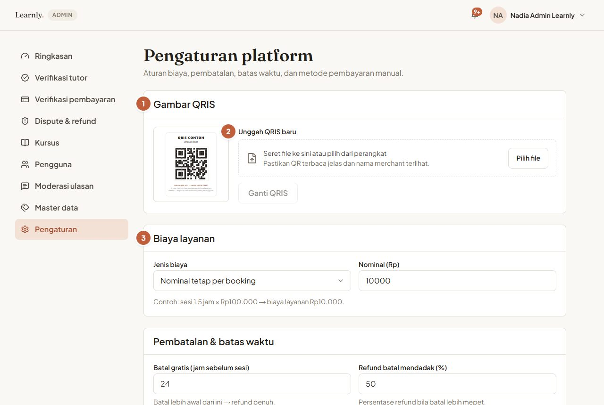
   *QRIS dan biaya layanan.*

3. **Pembatalan & batas waktu** (1):
   - **Batal gratis (jam sebelum sesi)** dan **Refund batal mendadak (%)**. Default-nya 24 jam dan 50%.
   - **Batas tutor merespons** dan **Batas pembayaran** (jam). Lewat dari ini, booking atau tagihan otomatis batal atau kedaluwarsa.
   - **Link meeting tampil** (jam sebelum sesi), **Ulasan bisa diedit** (hari), dan **Nilai lulus default kursus**.
4. **Rekening transfer** (2): bank, nomor rekening, dan atas nama untuk pembayaran transfer. Kosongkan ketiganya bila hanya menerima QRIS.
5. Gulir ke bawah lalu tekan **Simpan pengaturan**. Perubahan berlaku untuk booking **baru**.

   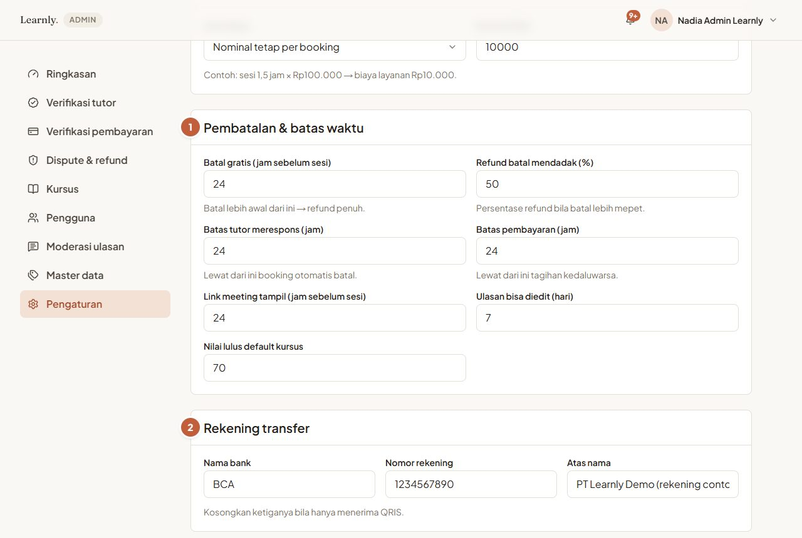
   *Aturan pembatalan, batas waktu, dan rekening.*

> **Penting:** data demo memakai rekening dan QRIS **contoh**. Sebelum go-live, ganti dengan rekening dan QRIS asli milik Learnly.

---

## Kalau ada masalah

| Masalah | Yang bisa dilakukan |
| --- | --- |
| Bukti bayar buram atau terpotong | Tolak dengan alasan "bukti tidak terbaca", atau hubungi pembayar lewat nomor di baris pembayaran sebelum menolak. |
| Pembayar mengaku sudah bayar tapi bukti ditolak | Cek mutasi sekali lagi. Booking yang terlanjur batal tidak bisa dihidupkan lagi, jadi minta pembayar memesan ulang dan catat refund bila dana sudah masuk. |
| Refund tertunda menumpuk | Transfer dananya, lalu **Catat refund** di **Dispute & refund**. Pembayar baru mendapat kabar setelah dicatat. |
| Tutor tidak muncul di pencarian walau terverifikasi | Cek kelengkapan profil (jadwal, wilayah, mapel) di detail verifikasi. |
| Tidak bisa menghapus master data | Data itu sudah dipakai. Ubah namanya saja. |
| Kursus tidak bisa diajukan review | Tambahkan minimal satu materi. |
| Salah menangguhkan akun | Buka **Pengguna**, cari akunnya, lalu tekan **Aktifkan lagi**. |
