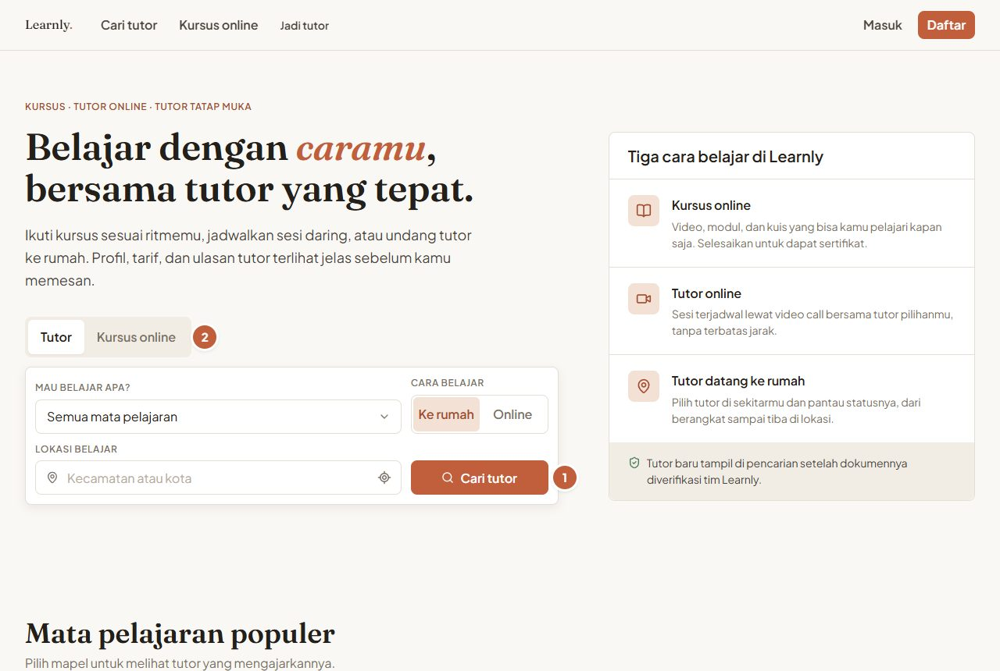
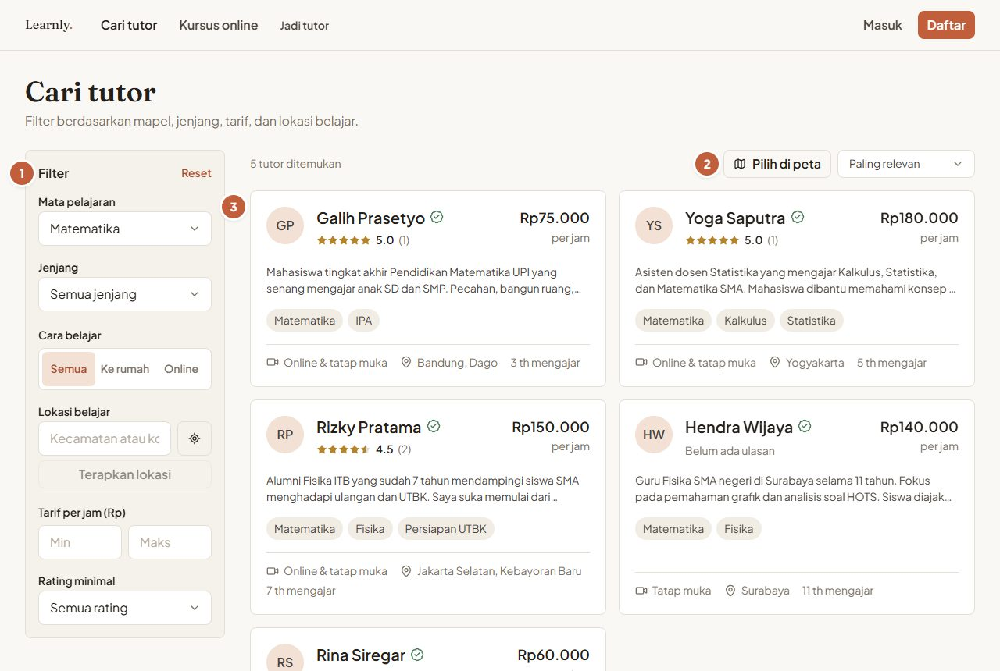
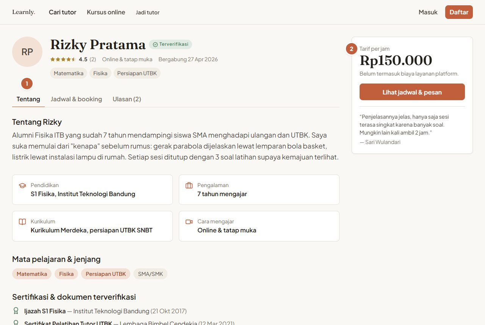
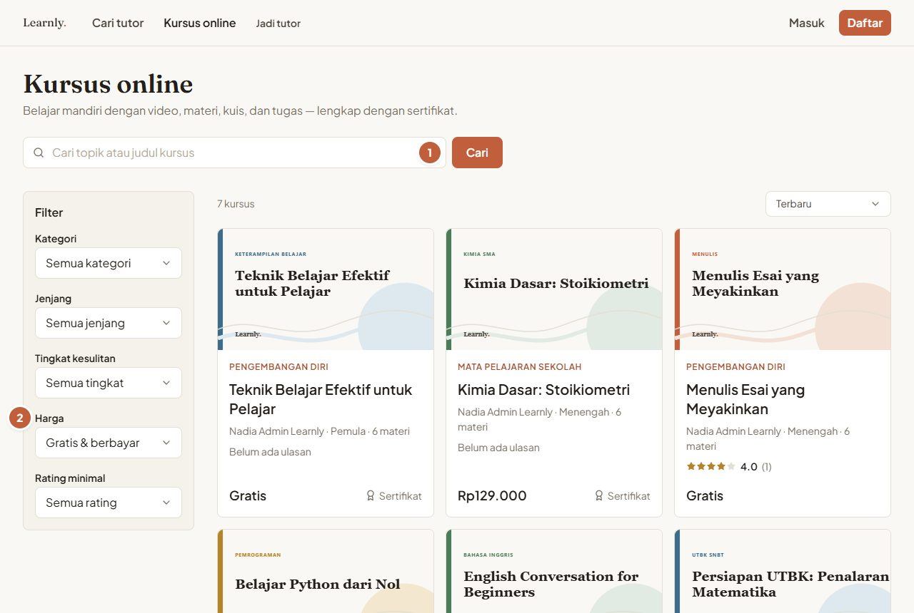
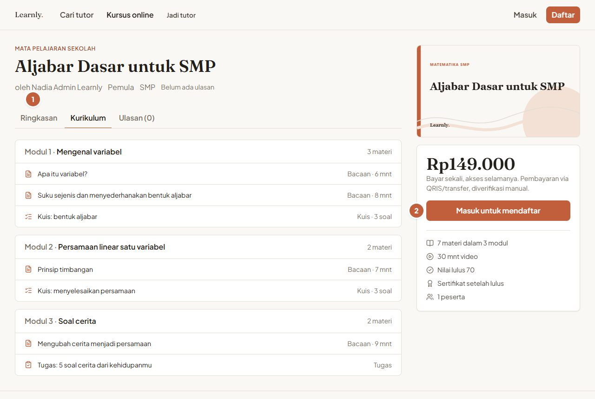

# Buku Panduan Learnly

Panduan pemakaian Learnly untuk setiap jenis pengguna. Setiap bagian ditulis per tugas ("Cara …"), langkah demi langkah, lengkap dengan gambar layar. Lingkaran bernomor oranye di gambar menunjuk tombol atau bagian yang dimaksud pada langkah tersebut.

| Panduan | Untuk siapa |
| --- | --- |
| [Umum & tamu](#umum--tamu-tanpa-akun) (di halaman ini) | Siapa saja yang baru melihat-lihat, belum punya akun |
| [01 · Siswa](01-siswa.md) | Siswa/mahasiswa yang memesan les & ikut kursus untuk dirinya sendiri |
| [02 · Orang tua](02-orang-tua.md) | Orang tua yang memesan les & kursus untuk anak |
| [03 · Tutor](03-tutor.md) | Pengajar privat yang menerima booking lewat Learnly |
| [04 · Admin](04-admin.md) | Tim operasional Learnly |

Versi PDF tiap panduan ada di folder [pdf/](pdf/).

---

## Sekilas tentang Learnly

Learnly mempertemukan siswa dengan tutor privat, baik **online** (lewat Google Meet/Zoom) maupun **tatap muka** (tutor datang ke rumah). Learnly juga punya **kursus online** berisi bacaan, kuis, dan tugas, lengkap dengan sertifikat.

Alur singkat les privat:

1. Siswa/orang tua memilih tutor & jadwal, lalu mengirim **booking**.
2. Tutor **menerima** booking.
3. Pemesan **membayar** (QRIS atau transfer) dan mengunggah bukti bayar.
4. Admin **memverifikasi** pembayaran, dan booking **dikonfirmasi**.
5. Di hari-H, tutor memperbarui status perjalanan. Untuk sesi tatap muka, tutor memindai **QR check-in** di layar siswa.
6. Setelah sesi, tutor mengirim **laporan perkembangan**, lalu siswa/orang tua memberi **ulasan**.

Pembayaran di Learnly **tidak** memakai payment gateway: semua pembayaran dicek manual oleh admin dari bukti transfer.

---

## Akun demo

Semua akun di bawah memakai password **`Demo#2026`**. Data demo (nama, alamat, nomor telepon, dokumen, bukti transfer) adalah **contoh fiktif**.

| Peran | Email | Catatan |
| --- | --- | --- |
| Admin | `admin@demo.learnly.id` | Admin operasional (Nadia) |
| Tutor | `rizky@demo.learnly.id` | Matematika, Fisika, UTBK · Jakarta Selatan · terverifikasi |
| Tutor | `anisa@`, `dimasadi@`, `siti@`, `galih@`, `maya@`, `hendra@`, `laras@`, `yoga@`, `rina@`, `andreas@`, `putu@` | Terverifikasi, tersebar di 7 kota |
| Tutor | `fitri@`, `kevin@` | Menunggu verifikasi (contoh antrian admin) |
| Tutor | `nuraini@` | Verifikasi ditolak, harus memperbaiki profil |
| Orang tua | `sari@demo.learnly.id` | 2 anak (Dimas SMA, Alya SMP) · Jakarta |
| Orang tua | `bambang@`, `dewi@`, `agus@` | Masing-masing punya anak & alamat tersimpan |
| Siswa | `putri@demo.learnly.id` | Mahasiswi · punya booking, kursus, & sertifikat |
| Siswa | `arif@`, `clara@` | Siswa mandiri |

Semua email berakhiran `@demo.learnly.id`.

---

## Cara menjalankan aplikasi untuk demo

Dibutuhkan Node.js 20+ dan MySQL 8 (lihat [README utama](../../README.md) untuk instalasi lengkap).

1. Siapkan data demo. Perintah ini **menghapus semua data lama** lalu mengisi ulang data demo yang rapi:

   ```bash
   cd api
   npm run db:reset:demo
   ```

   Untuk menambah/menyegarkan data demo **tanpa** menghapus data lain, pakai `npm run db:seed:demo`.
   Di server production kedua perintah ini ditolak, kecuali `ALLOW_DEMO_SEED=true` di-set dengan sengaja.

2. Jalankan API: `npm run dev` (di folder `api`, port 4000).
3. Jalankan web dalam mode production (seperti yang dipakai untuk gambar di panduan ini):

   ```bash
   cd web
   npm run build
   npm run start          # http://localhost:3000
   ```

   `web/.env.local` cukup berisi `NEXT_PUBLIC_API_BASE_URL=/api/v1` dan `API_PROXY_TARGET=http://localhost:4000`. Web meneruskan semua panggilan API lewat alamat yang sama (same-origin).

4. Buka <http://localhost:3000> dan masuk memakai salah satu akun demo.

> **Tips:** tanggal di data demo dihitung relatif dari saat seeding. Booking "menunggu konfirmasi" otomatis kedaluwarsa setelah 24 jam, dan tagihan yang belum dibayar kedaluwarsa setelah batas waktu bayar. Jalankan ulang `npm run db:reset:demo` sebelum presentasi supaya semua contoh status lengkap lagi.

---

## Umum & tamu (tanpa akun)

Tamu bisa melihat tutor dan kursus tanpa mendaftar. Akun baru dibutuhkan saat ingin memesan les atau mendaftar kursus.

### Cara melihat halaman depan

1. Buka alamat Learnly. Di bagian atas ada kotak pencarian: ketik mata pelajaran atau lokasi, lalu tekan **Cari tutor** (1). Pindah ke tab **Kursus online** (2) untuk mencari kursus.

   
   *Halaman depan: pencarian tutor dan kursus.*

### Cara mencari tutor

1. Di halaman **Cari tutor**, pakai panel **Filter** (1) untuk menyaring mata pelajaran, jenjang, cara belajar, lokasi, tarif per jam, dan rating minimal.
2. Tekan **Pilih di peta** (2) untuk menentukan lokasimu. Tutor tatap muka lalu diurutkan dari yang terdekat.
3. Klik kartu tutor (3) untuk melihat profil lengkapnya.

   
   *Daftar tutor lengkap dengan mapel, rating, tarif, dan jarak.*

### Cara membaca profil tutor

1. Tab di profil (1) berisi **Tentang** (bio, pendidikan, mapel, sertifikat), **Jadwal & booking**, dan **Ulasan**.
2. **Tarif per jam** (2) belum termasuk biaya layanan. Total yang dibayar selalu ditampilkan sebelum kamu mengirim booking. Tekan **Lihat jadwal & pesan** untuk mulai memesan (perlu masuk dulu).

   
   *Profil tutor: bio, mapel, wilayah layanan, jadwal, dan ulasan.*

### Cara melihat katalog kursus

1. Buka **Kursus**. Cari lewat kotak pencarian (1), lalu saring berdasarkan kategori, jenjang, dan **Harga** (2).

   
   *Katalog kursus online.*

2. Buka salah satu kursus. Tab (1) berisi **Ringkasan**, **Kurikulum** (daftar modul & materi), dan **Ulasan**. Untuk mendaftar, tekan **Masuk untuk mendaftar** (2).

   
   *Detail kursus: deskripsi, kurikulum, dan tombol daftar.*

### Kalau ada masalah

- **Peta tidak muncul atau kosong:** peta memakai OpenStreetMap dan butuh internet. Muat ulang halaman.
- **"Pakai lokasiku" tidak bekerja:** izinkan akses lokasi di browser, atau pilih titik langsung di peta.
- **Tidak ada tutor di kotaku:** longgarkan filter atau pilih **Online**, karena tutor online bisa mengajar dari mana saja.

---

## Arti status (ringkas)

Label ini muncul di badge berwarna di seluruh aplikasi.

**Booking les**

| Status | Artinya |
| --- | --- |
| Menunggu konfirmasi tutor | Booking terkirim, tutor belum menjawab. Otomatis batal bila tidak dijawab dalam 24 jam. |
| Menunggu pembayaran | Tutor setuju. Pemesan perlu membayar sebelum batas waktu. |
| Dikonfirmasi | Pembayaran sudah dicek admin. Sesi pasti berjalan. |
| Tutor bersiap / Tutor dalam perjalanan / Tutor sudah tiba | Tutor sedang menuju lokasi (khusus tatap muka). |
| Sesi berlangsung | Tutor sudah check-in, les sedang berjalan. |
| Sesi selesai | Les selesai dan laporan sudah dikirim. Pemesan bisa memberi ulasan. |
| Ditolak tutor | Tutor tidak bisa mengambil jadwal itu. Tidak ada biaya. |
| Dibatalkan | Booking dibatalkan oleh pemesan, tutor, admin, atau sistem (misalnya tidak dibayar). |

**Pembayaran**

| Status | Artinya |
| --- | --- |
| Menunggu pembayaran | Tagihan belum dibayar / bukti belum diunggah. |
| Menunggu verifikasi | Bukti sudah dikirim dan sedang dicek admin. |
| Lunas | Pembayaran diterima. |
| Ditolak | Bukti tidak sesuai (misalnya nominal kurang). Booking terkait dibatalkan. |
| Kedaluwarsa | Tidak dibayar sampai batas waktu. |
| Dana dikembalikan | Refund sudah ditransfer admin. |

**Lainnya:** *Menunggu verifikasi / Terverifikasi / Perlu perbaikan* (status tutor), *Draf / Menunggu review / Terbit / Diarsipkan* (status kursus), *Sedang belajar / Selesai* (status peserta kursus), *Aktif / Ditangguhkan* (status akun).
